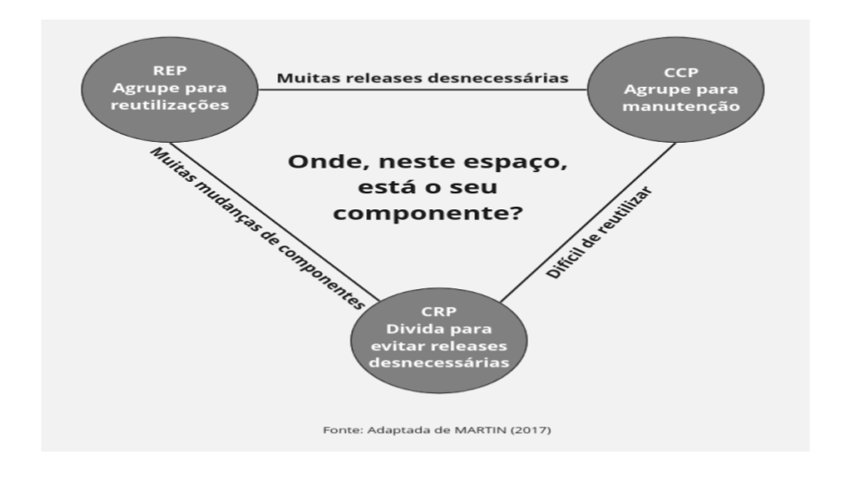
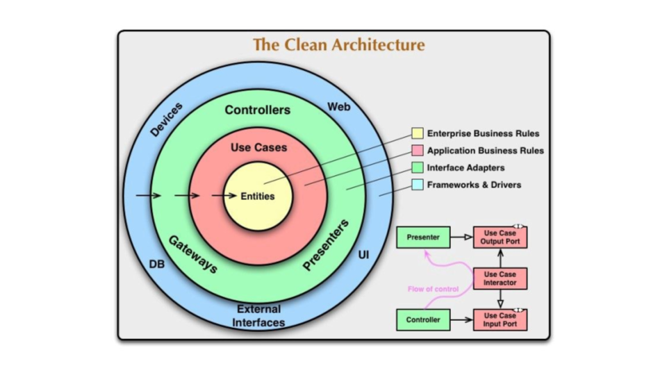

## 

1. ## **ROBERT C. MARTIN \- ARQUITETURA LIMPA: O GUIA DO ARTESÃO PARA ESTRUTURA E DESIGN DE SOFTWARE**

1. ### **PARTE I: INTRODUÇÃO**

1. #### *CAP. 1 \- O QUE SÃO DESIGN E ARQUITETURA?*

* Não há diferenças entre design e arquitetura  
* “O objetivo da arquitetura de software é minimizar os recursos humanos necessários para construir e manter um determinado sistema”.  
* Fazer uma bagunça é sempre mais lento do que manter tudo limpo.  
* “É isso que abordo no livro: irei descrever arquiteturas e designs limpos e eficientes para que os desenvolvedores de software possam criar sistemas que tenham vidas longas e duradouras”.

2. #### *CAP. 2: UM CONTO DE DOIS VALORES*

* **Dois valores fundamentais \-** comportamento \[fazer a máquina se comportar de determinada maneira\] e estrutura \[“produto suave”; as arquiteturas devem ser tão agnósticas em sua forma quanto práticas\].  
* Lute pela arquitetura.

2. ### **PARTE II \- COMEÇANDO COM OS TIJOLOS: PARADIGMAS DA PROGRAMAÇÃO**

1. #### *CAP. 3: PANORAMA DO PARADIGMA*

* Um paradigma diz quais estruturas de programação usar e quando usá-las. Existem três.  
* **Paradigma da Programação Estruturada \-** A programação estruturada impõe disciplina sobre a transferência direta do controle.  
* Removem funções *goto.*  
* **Paradigma da Programação Orientada a Objetos \-** A programação orientada a objetos impõe disciplina sobre a transferência *indireta* do controle  
* Removem ponteiros de função.  
* **Paradigma da Programação funcional \-** A programação funcional impõe disciplina sobre a atribuição.  
* Removem atribuições.  
* Alinhamento com as três principais preocupações da arquitetura: função, separação de componentes e gerenciamento de dados.

2. #### *CAP. 4: PROGRAMAÇÃO ESTRUTURADA*

*  **Natureza das teorias e leis científicas \-** elas são refutáveis e não comprováveis.  
* A programação estruturada nos força a decompor um programa recursivamente em um conjunto de pequenas funções comprováveis  
* É essa habilidade de criar unidades de programação que podem ser testadas pela negação do correto, que faz da programação estruturada um modelo importante atualmente.   
* Isso explica por que as linguagens modernas não suportam normalmente declarações *goto* irrestritas.   
* Além disso, no nível arquitetural, esse é o motivo de ainda considerarmos a *decomposição funcional* como uma das nossas melhores práticas.

3. #### *CAP. 5: PROGRAMAÇÃO ORIENTADA A OBJETOS*

* Compreensão e aplicação dos princípios do design orientado a objetos (OO).  
* **Comumente definida por três palavras** \- encapsulamento, herança e polimorfismo.  
* Encapsulamento:  
* Herança: redeclaração de um grupo de variáveis e funções dentro de um escopo fechado.  
* Polimorfismo: é uma aplicação de ponteiros em funções.  
* Isso não está 100% correto.   
* Muitas linguagens OO tem pouco ou nenhum encapsulamento forçado.  
* É possível dizer que existia um grupo de herança muito antes de a OO ser inventada, o que não é totalmente verdadeiro. Tratava-se de apenas um truque.  
* A OO não inventou o polimorfismo, mas os tornou muito mais seguros e convenientes.  
- Uma linguagem OO torna o polimorfismo trivial.  
* Em 1950, descobriram que os programas deveriam ser independentes dos dispositivos  
* A linguagem OO permite que a arquitetura plug-in seja usada em qualquer lugar e para qualquer coisa.  
* **Inversão da Dependência \-** no início, as dependências do código fonte seguiam inexoravelmente o fluxo de controle \[primeiro funções main, funções de alto nível, funções de nível médio, etc.\].  
* Isso oferecia pouca ou nenhuma opção ao arquiteto de software.  
* Quando o polimorfismo entra em jogo, ao inserir uma interface, ocorre uma inversão de dependência, que aponta para a inversão contrária ao fluxo de controle.  
* Qualquer dependência de código fonte, não importa onde esteja, pode ser invertida.  
* Cria a implantação independente e o desenvolvimento independente.  
* **Conceito de OO \-** É a habilidade de obter controle absoluto, através do uso do polimorfismo, sobre cada dependência de código fonte do sistema.

4. #### *CAP. 6: PROGRAMAÇÃO FUNCIONAL*

* Os conceitos da programação funcional são anteriores à própria programação.  
  * Variáveis em linguagens funcionais **não variam.**  
* Todas as condições de corrida \[*race conditions\],* condições de impasse (deadlock conditions) e problemas de atualizações simultâneos decorrem das variáveis mutáveis.   
  * Você não pode ter um problema de condição de corrida ou de atualização concorrente se nenhuma variável for atualizada.  
* **Uma das concessões necessárias \-** segregar a aplicação, ou os serviços contidos na aplicação, em componentes mutáveis e imutáveis  
  * Memória transacional \[trata as variáveis na memórias do mesmo jeito que um banco de dados trata registros no disco\].  
  * Algoritmos compare e troque.  
* **Event sourcing \-** quanto maiores forem a memória e a velocidade das nossas máquinas, menos precisaremos de um estado mutável.  
  * Event sourcing é uma estratégia em que armazenamos as transações, mas não o estado.   
  * Quando este for solicitado, aplica-se todas as transações desde o início. Nada nunca é deletado ou atualizado.  
* **CONCLUSÃO \-** A programação estruturada é a disciplina imposta sobre a transferência direta de controle (1),  
  * A programação orientada a objetos é a disciplina imposta sobre a transferência indireta de controle (2),  
  * A programação funcional é a disciplina imposta sobre a atribuição de variáveis (3),  
  * O software é composto de sequências, seleções, iterações e indireção, nada mais, nada menos (4).

3. ### **PARTE III \- PRINCÍPIOS DE DESIGN**

1. #### *CAP. 7: SINGLE RESPONSIBILITY PRINCIPLE, SRP*

* Os princípios SOLID \-   
1. SRP: Single Responsibility Principle  
2. OCP: Open-Closed Principle  
3. LSP: Liskov Substitution Principle  
4. ISP: Interface Segregation Principle  
5. DIP: Dependency Inversion Principle  
* **SOLID tem como princípios fazer com que os softwares \-**   
  * (1) Tolerem mudanças,  
  * (2) Sejam fáceis de entender,  
  * (3) Sejam a base de componentes que possam ser usados em muitos sistemas de software.  
* **SRP: Single Responsibility Principle \-**   
  * Historicamente descrito como:  
    - Um módulo deve ter uma, e apenas uma, razão para mudar ⇒ ⇒  
    - Um módulo deve ser responsável por um, e apenas um, usuário ou stakeholder ⇒ ⇒  
    - Um módulo deve ser responsável por um, e apenas um, ator \[VERSÃO FINAL\].  
* Em algumas linguagens, um módulo é apenas um conjunto coeso de funções e estruturas de dados.  
* ***Observando os sintomas:***  
  - Duplicação Acidental são problemas que ocorrem porque aproximamos demais o código do qual diferentes atores dependem.  
  - Fusões é o que ocorre quando várias pessoas mudam o mesmo código-fonte por diferentes razões.

2. #### *CAP. 8: OPEN/CLOSED PRINCIPLE, OCP*

* **Definição \-**   
  * Um artefato deve ser aberto para extensão, mas fechado para modificação.  
  * Um bom arquiteto deve reduzir a quantidade de código que deve ser mudado para o mínimo possível.  
* No exemplo apresentado, todos os relacionamentos entre os componentes são unidirecionais.  
  * Os arquitetos separam a funcionalidade com base em:  
    - Como\[1\], por que \[2\] e quando \[3\] da mudança   
  * Em seguida, organizam essa funcionalidade separada em uma hierarquia de componentes.   
    - Os componentes de nível mais alto são protegidos das mudanças feitas em componentes mais baixos.

3. #### *CAP. 9: LISKOV SUBSTITUTION PRINCIPLE, LSP*

* **Definição \-** O que queremos aqui é algo como a seguinte propriedade de substituição

  Se, para cada objeto o1 de tipo S, houver um objeto o2 de tipo T, de modo que para todos os programas P definidos em termos de T, o comportamento de P não seja modificado quando o1 for substituído por o2, então S é um subtipo de T.

* Uma simples violação da capacidade de substituição pode contaminar a arquitetura do sistema com uma quantidade significativa de mecanismos extras.

4. #### *CAP. 10: INTERFACE SEGREGATION PRINCIPLE, ISP*

* **Definição \-** Depender de algo que contém itens desnecessários pode causar problemas inesperados.  
  * A ISP depende inteiramente da linguagem utilizada.  
  * Em geral é prejudicial depender de módulos que contenham mais elementos do que você precisa.

5. #### *CAP. 11: DEPENDENCY INVERSION PRINCIPLE, DIP*

* **Definição \-** Queremos evitar depender dos elementos concretos voláteis do nosso sistema.  
  * Reduzir a volatilidade das interfaces.  
* **Práticas que rege o Design de Software 101 \-**   
  * Não se refira a classes voláteis \[1\],   
  * Não derive de classes concretas voláteis \[2\],   
  * Não sobrescreva funções concretas \[3\],   
  * Não mencione o nome de algo que seja concreto e volátil \[4\].   
* Limites arquitetônicos que separam o volátil do concreto são necessários.  
* **As dependências de código-fonte estão invertidas em relação ao fluxo de controle \-** É por isso que nos referimos a esse princípio como Inversão da Dependência.

4. ### **PARTE IV \- PRINCÍPIOS DOS COMPONENTES**

1. #### *CAP. 12: COMPONENTES*

* Componentes são unidades de implantação, são as menores entidades que podem ser implantadas como parte de um sistema.  
* Quando bem implantados, podem ser implantados e desenvolvidos independentemente.  
* O nascimento dos *linking loaders.*   
  * Em seguida, os linkers foram desenvolvidos.

2. #### *CAP. 13: COESÃO DE COMPONENTES*

* **Possui três princípios \-**  
  * ***Reuse/release Equivalence Principle \[REP\]:*** A granularidade do reúso é a granularidade do release  
    - As classes e módulos formados em um componente devem pertencer a um grupo coeso.  
  * ***Common Closure Principle \[CCP\]:*** Reúna em componentes as classes que mudam pelas mesmas razões e nos mesmo momentos. Separe em componentes diferentes as classes que mudam em momentos diferentes e por diferentes razões.  
    - Possui semelhanças com o SRP \- Reúna tudo que muda ao mesmo tempo pelas mesmas razões. Separe tudo que muda em tempos diferentes por razões diferentes.  
  * ***Common Reuse Principle \[CRP\]:*** Não force os usuários de um componente a dependerem de coisas que eles não precisam.  
    - Nos diz mais sobre as classes que não devem ficar juntas.  
    - Relação com o ISP \- Não dependa de coisas que você não precisa.  
* Os três princípios de coesão tendem a lutar um com o outro, mas o equilíbrio tende a ser dinâmico.

****  
**Os três princípios de coesão de componentes**

3. #### *CAP. 14: ACOPLAMENTO DOS COMPONENTES*

* **Acyclic Dependencies Principle \[ADP\] \-** Não permita ciclos no grafo de dependência dos componentes. É necessário que esta seja um Directed Acyclic Graph.  
  * Para isso, é necessário particionar o ambiente de desenvolvimentos em componentes passíveis de release.  
  * ***Quebrando o ciclo:*** aplique o Princípio de inversão de dependência (DIP) \[1\]; crie um novo componente \[2\].  
  * A estrutura de componentes não pode ser projetada de cima para baixo.  
* **Stable Dependency Principle {SDP} \-** Depende na direção da estabilidade.   
  * Um componente difícil de mudar não deve depender de qualquer componente que esperamos que seja volátil.  
  * Estabilidade não está diretamente relacionada à frequência da mudança. Relaciona-se à sua dificuldade de mudar.  
  * Componentes responsáveis devem ser independentes, componentes irresponsáveis devem ser dependentes.  
  * ***Métricas de estabilidade:***  
    -  Instabilidade \[I\] \= Fan-out, (Fan-in \+ Fan-out) → varia de \[0,1\].  
  * É necessário que existam componentes **estáveis** e **instáveis** na arquitetura.  
* **Stable Abstractions Principle \[SAP\] \-** Um componente deve ser tão abstrato quanto estável.  
  * Juntos, o SDP e o SAP formam o DIP aplicável aos componentes, ou seja, as dependências devem apontar na direção da abstração.  
  * Zona da Dor e Zona da Inutilidade no gráfico (Abstrações, Independência).  
  * ***Distância da sequência principal:*** D \= |A \+ I \- 1|.  
  * A variação pode ser usada para estabelecer “limites de controle” com o objetivo de identificar componentes que sejam “excepcionais” em comparação com os demais. 

5. ### **PARTE V \- ARQUITETURA**

1. #### *CAP. 15: O QUE É ARQUITETURA?*

* A estratégia por trás da facilitação da Arquitetura de Software é deixar o máximo possível de opções abertas, pelo máximo de tempo possível.   
  * O objetivo final é minimizar o custo da vida útil do sistema, e não maximizar a produtividade do programador.  
  * Quanto maior o custo do deployment, menos útil será o sistema.  
* Uma boa arquitetura de software comunica as necessidades operacionais do sistema.  
  * Pode ser decomposta em dois elementos principais: política e detalhes.  
* *Um bom arquiteto deve maximizar o número de decisões não feitas*.

2. #### *CAP. 16: INDEPENDÊNCIA*

* Os casos de uso serão bem visíveis dentro da estrutura do sistema. Os desenvolvedores não precisarão caçar comportamentos, pois esses comportamentos serão visíveis no nível superior do sistema.  
* Regras que mudam em ritmos diferentes por razões diferentes devem ser separados para que possam ser modificados independentemente.  
  * O desacoplamento dos casos de uso e camadas também atribui um alto grau de flexibilidade à implantação.  
  * **Modos de desacoplamento \-** Nível de fonte; nível de implementação; nível de serviço.  
* A duplicação geralmente é algo ruim no software, mas existem casos e casos \[verdadeiras ou falsas\], e, em alguns momentos, ela pode ser boa.

3. #### *CAP. 17: FRONTEIRAS, ESTABELECENDO LIMITES*

* O acoplamento a decisões prematuras prejudica o trabalho do arquiteto.  
* A história da tecnologia de desenvolvimento de software é a história de como criar plug-ins de maneira conveniente para estabelecer uma arquitetura de sistema escalonável e sustentável.  
* Devem existir relacionamentos profundamente assimétricos como os demonstrados, no qual determinados módulos são imunes a outros.

4. #### *CAP. 18: ANATOMIA DO LIMITE*

* O monolito é apenas um único arquivo executável.  
* **Modo de desacoplamento no nível de implantação \-** A representação física mais simples de um limite arquitetural é uma biblioteca dinamicamente ligada.  
  * Não envolve compilação.  
* **Processos locais \-** são componentes físicos mais fortes.  
  * A comunicação através de limites de processos locais envolve chamadas de SO, organização de decodificação de dados e trocas de contexto entre processos, que são moderadamente caros.  
* **Serviços \-** são os componentes de desacoplamento mais fortes, no qual toda a comunicação ocorre pela rede \[níveis altos de latência\].

5. #### *CAP. 19: POLÍTICA E NÍVEL*

* Separar cuidadosamente cada uma das políticas e reagrupá-las com base na forma como mudam \[razões diferentes ou mesmas razões\].  
  * Grafos acíclicos direcionados.  
* Componentes de nível mais baixos são feitos para dependerem dos de nível mais alto.  
* Queremos que as dependências de código-fonte sejam desacopladas do fluxo de dados e acopladas ao nível.

6. #### *CAP. 20: REGRAS DE NEGÓCIO*

* Existem as ***Regras Cruciais do Negócio*** e os ***Dados Cruciais do Negócio.***  
  * Geralmente estão indissociavelmente ligados, portanto são bons candidatos a serem objetos.  
* A ***Entidade*** é puro negócio e nada mais.  
  * Nem todas as regras de uso são tão puras quanto as entidades.  
  * Os conceitos de alto nível, como as Entidades, não sabem nada sobre os conceitos de nível mais baixo, como os casos de uso. Mas os casos de uso de nível mais baixo sabem sobre as Entidades de nível mais alto.

7. #### *CAP. 21: ARQUITETURA GRITANTE*

* As arquiteturas não se resumem aos frameworks, estes são só ferramentas à nossa disposição.  
* Uma boa arquitetura enfatiza os casos de uso e os desacopla das preocupações periféricas.

8. #### *CAP. 22: ARQUITETURA LIMPA*

* O cenário ideal é quando a sua arquitetura possui: independência de frameworks; testabilidade; independência da UI; independência de banco de dados; independência de qualquer agência externa.  
* A ***Regra da Dependência \-*** As dependências de código-fonte devem apontar apenas para dentro, na direção das políticas de nível mais alto.

****  

9. #### *CAP. 23: APRESENTADORES E OBJETOS HUMBLE*

* Padrão de projeto originalmente identificado como uma maneira de ajudar os testadores de unidade a separar os comportamentos difíceis de testar dos comportamentos fáceis de testar.   
* Separe os comportamentos em dois módulos ou classes;   
  * Humble e o outro  
  * A separação do comportamento em partes testáveis e não testáveis muitas vezes define um limite arquitetural.  
* **Limites \-** Service listeners; mapeadores e gateways de banco de dados; Apresentadores e visualizadores

10. #### *CAP. 24: LIMITES PARCIAIS*

* Limites arquiteturais completamente desenvolvidos são caros.  
  * *Uma forma* de desenvolver um limite arquitetural parcial é realizar todo o trabalho necessário para criar componentes independentemente compiláveis e implantáveis para, então, simplesmente mantê-los reunidos no mesmo componente.  
* **Padrões \-** strategy tradicional; facade; pular o último passo.

11. #### *CAP. 25: CAMADAS E LIMITES*

* Simplificadamente, existem três principais componentes: UI, regras de negócio e banco de dados. Na prática, existem muitos mais.  
* Como arquitetos, devemos “prever o futuro”, por meio da observação. Avaliar os custos de implementar os limites em comparação aos custos de ignorá-los, e revisar esta decisão frequentemente.

12. #### *CAP. 26: O COMPONENTE MAIN*

* O componente MAIN é a política de nível estrutural mais baixo. “O mais sujo dos componentes sujos”.  
* Nada, além do sistema operacional depende dele.

13. #### *CAP. 27: SERVIÇOS GRANDES E PEQUENOS*

* Serviços são apenas chamadas de função realizadas entre processos e/ou limites de plataformas. Alguns são arquiteturalmente significativos, outros não.  
* Os serviços não precisam ser pequenos monólitos; podem se basear na estrutura SOLID, recebendo uma estrutura de componentes que suporte a inclusão de novos componentes sem que se alterem os componentes já existentes dentro do serviço.

14. #### *CAP. 29: ARQUITETURA LIMPA EMBARCADA*

* “Embora o software não sofra desgastes, o firmware e o hardware se tornam obsoletos, o que exige modificação no software”.  
* O limite entre o software e o firmware não é tão bem definido quanto o dó código para o hardware → Para mitigar isto, é necessário o HAL \[Hardware Abstraction Layer\], entre o firmware e o software.  
* Isola o software do S.O. com uma OSAL \[Operating System Abstraction Layer\].

| SOFTWARE |
| :---: |
| **OSAL** |
| **OPERATIONAL SYSTEM** |
| **HAL** |
| **FIRMWARE** |
| **HARDWARE** |

2. ## **MARTIN FOWLER \- REFATORAÇÃO: APERFEIÇOANDO O PROJETO DE CÓDIGO EXISTE**

1. Se você tiver de acrescentar uma funcionalidade em um programa, mas o código não está estruturado de modo conveniente, refatore-o antes para que seja mais fácil acrescentar a funcionalidade, e então a acrescente (p. 21).  
2. Antes de começar a refatorar, certifique-se de que você tenha um conjunto de testes robustos. Esses testes devem ser conferidos automaticamente (p. 23).  
3. A refatoração altera os programas em passos pequenos, de modo que, se você cometer um erro, será fácil localizar o bug (p. 27).  
4. Qualquer tolo consegue escrever código que um computador possa entender. Bons programadores escrevem códigos que os seres humanos podem entender (p. 28).  
5. Quando programar, siga a regra do acampamento: sempre deixe a base de código mais saudável do que estava quando você a encontrou (p. 55).  
6. O verdadeiro teste para um bom código é a facilidade com que ele pode ser alterado (p. 67).  
7. Se alguém disser que seu código apresentava falhas durante alguns dias enquanto estava refatorando, pode ter certeza de que essa pessoa não estava refatorando (p. 69).  
8. Você deve refatorar quando se deparar com um código feio, mas um código excelente também precisa de muitas refatorações (p. 76).  
9. O principal propósito da refatoração é fazer com que programemos mais rápido, agregando mais valor com menos esforço (p. 80).  
10. Quando sentir necessidade de escrever um comentário, experimente refatorar o código antes, de modo que qualquer comentário se torne supérfluo (p. 112).  
11. Garanta que testes sejam totalmente automatizados e que verifiquem os próprios resultados (p. 114).  
12. Uma suíte é um detector de bugs eficaz, que reduz o tempo necessário para encontrar bugs (p. 114).  
13. Sempre garanta que um teste falhará quando deve falhar (p. 120).  
14. Execute frequentemente. Execute os testes que exercitam o código com o qual você está trabalhando, pelo menos com um intervalo de alguns minutos; execute todos os testes no mínimo uma vez por dia (p. 120).  
15. É melhor executar testes incompletos do que não executar testes completos (p. 122).  
16. Pense nas condições limites nas quais algo pode dar errado e concentre ai os seus testes (p. 126).  
17. Não deixe que o medo de os testes não capturarem todos os bugs impeça você de escrever testes que capturem a maioria dos bugs (p. 128).  
18. Ao receber o relatório de um bug, comece escrevendo um teste de unidade que exponha o bug (p. 129).
