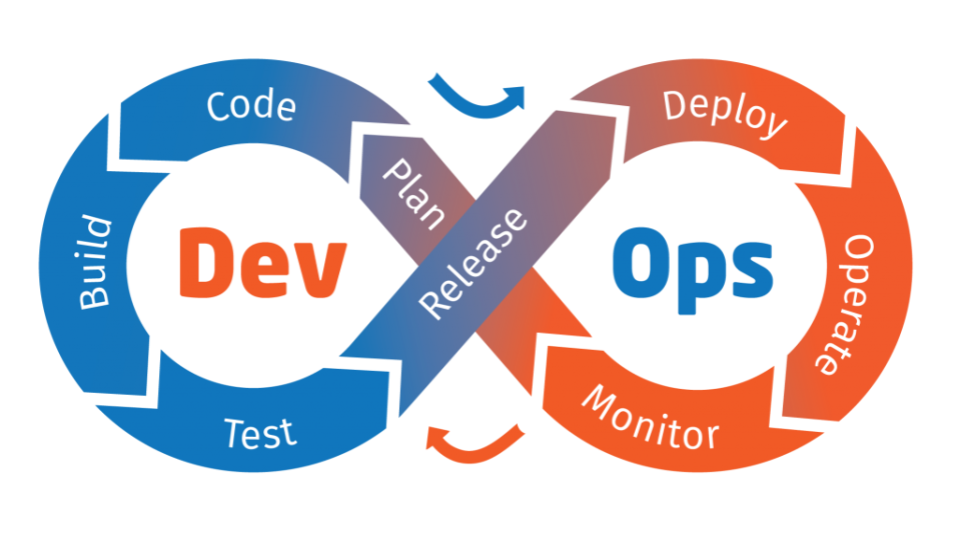
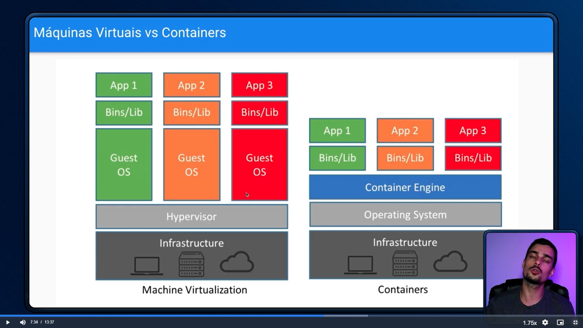
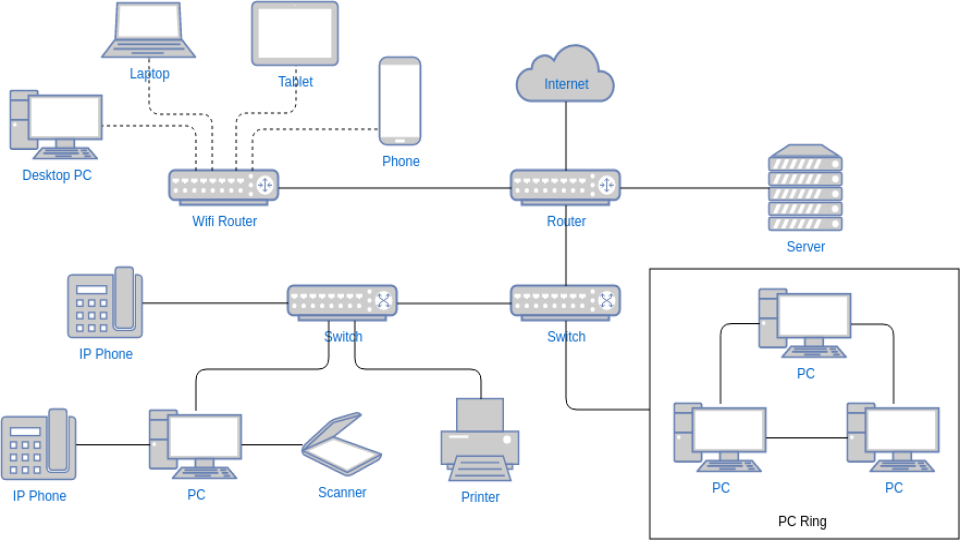
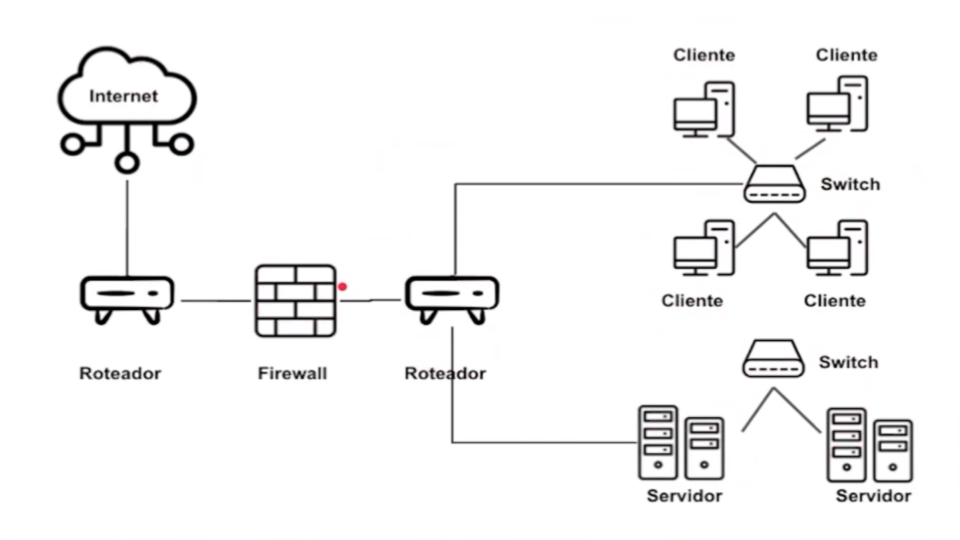
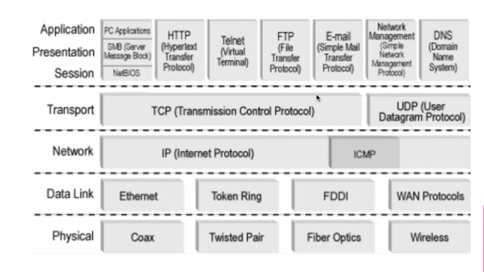

# **CURSOS ALURA DEVOPS**

1. ## **O que é esse movimento/cultura DevOps? Entendendo o que é DevOps.**

***Desenvolvimento \+ Operações***

* O objetivo deste movimento é conseguir derrubar o “muro” que existe entre estas duas áreas apontadas.   
* Este muro existe devido à impressão de que a área de desenvolvimento é muito mais maleável e flexível, ao passo que a de operações é muito mais rígida.  
* ***Vantagens \-***  
1. Misturar as equipes \[melhorar colaboração\];   
2. Melhorar a qualidade do serviço;  
3. Diminuir o tempo de entregas;  
4. Entregas mais seguras.  
* **Conhecimentos importantes para o profissional de DevOps:**   
* Saber codar, deploys, etc., e também partes de operação, funcionalidades.  
* Conhecimentos de rede e de sistemas são importantes.   
* Escolher uma linguagem de programação e estudá-la a fundo é essencial.

1. ### **Arquitetura de computadores: por trás de como o seu programa funciona**

* **O curso irá explicar \-** Como o computador lê o seu programa  
* Como o computador executa o seu programa (SSD/HD; RAM; CPU); Multi Core, Dispositivos de I/O e Memória CACHE  
* Como os dados são armazenados

* **Linguagem de alto nível X Código de máquina \-**  
* Ao escrever códigos, utilizamos uma linguagem de alto nível (palavras do dia);  
* O computador não entende isso, e utiliza apenas somas, guarda coisas, compara, etc. \[CÓDIGO DE MÁQUINA\].

**Exemplo**

| Linguagem de alto nível (Código Fonte) | Código em máquina |
| :---: | :---: |
| let a \= 7; let b \= 3; let c \= a \+ b; if (c \!== 0){   c++; } | guarda 7 em a guarda 2 em b pega a soma b guarda em c compara c e 0 se\_igual\_pula 1 linha incrementa c Isso será transformado em um código binário. |

* Não é exatamente esta sequência de ações que o computador usa; ele usa o *código binário* (1 \[quando o fio está recebendo energia\] ou 0 \[quando o fio não está recebendo energia\])*.*  
* **bit** é a menor unidade possível para o armazenamento de informação.  
- 8 bits (b) → 1 byte (B)  
* O computador irá dividir os caracteres, e irá tentar identificar cada uma delas. Procura nome de variáveis, declarações, atribuições; a partir disso, ele começa a produzir o código de máquina (primeira etapa da tabela).  
- Depois de finalizado, transforma isso em código binário, agrupa tudo e finaliza.  
* Isso pode ser feito:  
1) **Compilador \[C; Rust; GO\] \-** Código fonte → tradutor → Código de máquina → executar no computador o CdM  
- Execução mais rápida  
- Verifica erros antes de executar  
- Tempo extra para executar  
- Executa em uma máquina  
2) **Interpretador \[JS; Python; php; Running\] \-** Código Fonte → Tradutor traduz uma linha de código → executa no computador o CdM (isso irá se repetir para todas as linhas de códigos, uma por uma)  
- Execução mais lenta  
- Só verifica erros executando  
- Começa a executar na hora  
- Executa em máquinas diferentes  
3) **Casos Intermediários entre Compilação e interpretação \-** Just in Time Compilation: tenta resolver o problema do tempo de execução.  
- **Java:** tenta resolver o problema de poder compilar o código e rodar e várias máquinas diferentes.  
* Os programas compilados trazem uma grande vantagem que os interpretados não tem: a performance/rapidez de execução do programa (os em C++ costumam ser mais rápidos que Python).  
* Uma mesma linguagem pode ser escrita tanto como compiladora ou como interpretadora; o que ocorre é que, em geral, deixa-se um específico para cada linguagem.

* **Como um computador executa o seu programa?**  
* Os códigos de máquina gerados provavelmente ficam armazenados em um sistema de pastas.  
* ***Memória não volátil \-*** Guarda informações mesmo que o computador esteja desligado. Existem dois tipos, basicamente, que são chamadas de memória secundária:  
1. HD \[Hard Disk\]: possui grande capacidade e é relativamente barato; é lento e frágil.  
2. SSD \[Solid State Drive\]: é composto por chips eletrônicos. É menor, mais rápido e resistente; são mais caros e têm limitação de escrita.  
3. Memória ROM \[Read-Only Memory\]: Ela é um tipo de memória não-volátil com baixo armazenamento, bem diferente da RAM ou HD/SSD.  
* ***Memória de trabalho/volátil \-*** É a memória RAM \[Random Access Memory\]; aqui que os dados que o computador está executando naquele momento são armazenados. Todos os dados armazenados aqui são apagados quando o computador desliga \[é uma tabela com vários índices, na qual cada índice armazena um byte\].  
* ***CPU \[Central Process Unit\] \-*** Recebe as instruções da memória RAM e vai executá-las. Dividida em 3 partes:  
1. UC \[Unidade de controle\]: pega as instruções, interpreta bit a bit, e tenta entender elas.  
2. ULA \[Unidade Lógico Aritmética\]: vai manipular a maioria dos dados.  
3. Registradores: irão armazenar valores intermediários entre os processamentos. Recebe instruções como instruções atuais, posição das instruções atuais, valores intermediários.

* Todas essas instruções do computador são executadas na mesma **sequência cíclica de passos** \-   
1) BUSCAR \[o computador olha para a memória RAM e busca a instrução\], ele pega isso no registrador,  
2) Que apresenta um contador; essa informação é mandada para a unidade de controle,  
3) Que vai registrar e executar essa informação →

**BUSCAR \- DECODIFICAR \- EXECUTAR**

* O computador possui um CLOCK \[como se fosse um metrônomo\], para sincronizar essas ações. Os “tics” são medidos por HERTZ.

* **Como um computador executa vários programas?**  
* **Melhorias do processador moderno \-** uma execução a cada ciclo de clock, ao invés de uma execução a cada três ciclos \[PIPELINE DE INSTRUÇÕES\].  
- É possível duplicar o pipeline, para chegar a duas execuções a cada ciclo de clock.  
- Isso seria o NÚCLEO \[CORE\] do computador. Um computador DUAL-CORE possui dois desses pipelines duplicados. Existe o QUAD-CORE também.

* **Dispositivos de Entrada e Saída \[i/o\] \-** Entrada costuma ser o teclado, o mouse, webcam, microfone, etc.  
- Saída costuma ser a tela, o som, uma impressora.  
- HD/SSD também são considerados dispositivos de entrada e saída.  
- É por meio dos DRIVERS DE DISPOSITIVO que as várias especificidades de cada um dos dispositivos de entrada e saída são abstraídos.

* **Como a memória funciona?**  
* Para otimizar ainda mais o tempo do computador, existem dois tipos de memória:   
1. DRAM \[Dynamic RAM\]: mais barata e mais lenta;  
2. SRAM \[Static RAM\]: menor, mais cara e mais rápida.   
- A SRAM será colocada junto com os outros três componentes internos da memória do computador \[UC, ULA, regist.\], sendo conhecida como memória **cache**.  
- A memória cache é dividida em várias partes no processador: cache L1, cache L2 e cache L3.  
* **Hierarquia de memória \-**    
1. 1º Lugar: registradores \[500bytes/máx\],   
2. 2/3/4º lugares: memória cache \[4MB/máx no cache L3\],   
3. 5º lugar: RAM \[8GB/máximo\],   
4. 6º lugar: SSD \[500GB/máx\],   
5. 7º lugar: HD \[4TB/máx\].  
* **Princípio da Localidade \-** localidade temporal; localidade espacial.  
* **Processador de 32 ou 64 bits \-** Refere-se ao *tamanho de informação* que pode ser processado pelo computador em um ciclo de clock.

* **Como os dados são armazenados?**  
* ***ASCII \[American Standard Code for Information Interchange\] →***  
- Latin1 \- após a evolução do ASCII de 7bits para 8bits (1byte), alguns programas acrescentaram caracteres. Este apresenta caracteres acentuados e mais símbolos.  
- Unicode \- surgiu como uma tentativa de ser uma tabela universal para a comunicação de todas as línguas. É apenas para números, ou seja, este símbolo será tal número.   
- Ocupa memória de 3bytes, 2 bytes a mais que o ASCII e o Latin1, o que gerou um problema.  
- UTF-8 \- não tem um número específico de bytes \[caracteres de tamanho variados\].  
* O diferente conceito de passar um número e passar uma lista é algo muito importante para a computação. No primeiro (número), está sendo passado o valor como argumento da função, já no segundo (lista), ocorre a passagem de referência como argumento da função.

2. ## **O que existe no oceano DevOps?**

1) ### **Shift Left em DevOps \-** 

* O modelo cascata era o mais comum.   
* A partir dos anos 2000, com a ascensão das “Metodologias Ágeis”, isso mudou, de certa forma, com os *sprints*, gerando um “encaixotamento” das etapas, o que levou a problemas   
* Espera; sobrecarga de trabalho; atrito entre os times.  
* Uma possível solução para estes problemas que são gerados foi o Shift Left.  
* Trata-se de um conceito de “passar para a esquerda” algumas etapas finais, principalmente as de testes, as de segurança e as de deploy.   
* ***Vantagens \-***   
1. Aumenta a integração;   
2. Evita o retrabalho;   
3. Melhora/agiliza as entregas;   
4. Planejamento prévio.

2) ### **Cloud e Infraestrutura \-** 

* Uma nuvem pode ser entendida como um conjunto de aplicações, armazenamento e computação que tem a internet como base e plataforma de funcionamento.  
* Existem várias funções para a Nuvem, sendo algumas delas:   
1. Armazenamento de dados \[garante backups e recuperação de dados\];  
2. Compartilhamento de arquivos;   
3. Processamento de dados;   
4. Hospedagem de aplicativos \[Amazon Web Service; Microsoft Azure\].  
* Os arquivos armazenados na nuvem ficam localizados em servidores remotos que são mantidos por provedores de serviços em nuvem \[grande infraestrutura de *data centers\]*.  
* **Aplicativo Cloud \-** Essas aplicações são softwares executados em servidores remotos na nuvem.   
* ***Vantagens \-*** acessibilidade e flexibilidade; escalabilidade; redução de custos; ambientes colaborativos.  
* Historicamente, os setores de operações (infra) e desenvolvimento tiveram uma relação um tanto antagônica, e é nesse cenário que surge a cultura DevOps, que tem por objetivo quebrar possíveis barreiras entre essas duas equipes para proporcionar uma maior colaboração e ao final, entregar um produto ou serviço de qualidade para o cliente, visto que o objetivo é sempre esse.  
* Associando as ideias e princípios Devops ao Cloud, podemos criar um cenário com maior integração, adotando melhores práticas e ferramentas ao ponto de podermos pensar em uma infraestrutura de TI que automatiza processos de desenvolvimento.

3) ### **Git Flow versus Trunk-based development**

* **Sistema de controle de versão \-**  
  * ***Git Flow:*** é composto pelos *Branches* (com commits) abaixo

Master → Develop/Hotifixes→ Feature → Release

* Quando o GitFlow funciona melhor?  
  - Quando você executa um projeto de código conjunto/aberto; Quando você tem muitos desenvolvedores juniores; Quando o  tempo não é uma restrição.  
  * ***Trunk-based Development:*** É composto por bem menos Branches, sendo que a maior parte das coisas acontece no “Master” (tronco).

Master → Features \[de curto prazo\] → Releases

* Quando o Trunck-based Development funciona melhor?  
  - Quando você está apenas começando; Quando você precisa iterar rapidamente; Quando você trabalha principalmente com desenvolvedores seniores.

* **Git Flow versus Trunk-based development \-** O desenvolvimento baseado em tronco é uma prática necessária para a Integração Contínua

4) ### **O que é Infraestrutura como Código (IaC)?**

* Todas as aplicações precisam de um local (ambiente) para serem criadas, armazenadas/testadas e publicadas.  
  * Um ambiente trata-se de um conjunto de elementos, que precisam de manutenção periódica. Logo, é trabalhoso criar um ambiente.  
* Na abordagem tradicional, os serviços de manutenção das aplicações é feito manualmente, o que gera grandes despesas e está suscetível ao erro.  
  * Além disso, *hardwares* são caros e subutilizados.  
* Uma alternativa para este tipo de trabalho é a **virtualização** →  
  * Reduz a quantidade de máquinas que precisam ser utilizadas.  
  * Isso gera uma economia de dinheiro e de espaço.

5) ### **O que é DevSecOps?**

* Sec significa segurança.   
  * No fluxo original de DevOps, é necessário adicionar segurança a este fluxo.  
* **Pilares DevOps \-**  
  * Velocidade (1),   
  * entrega rápida e contínua (2),   
  * confiabilidade (3).   
    - Neste caso, na possibilidade de existir um arquivo malicioso adicionado em sua pipeline, ela vai rodar normalmente.  
* **Pilares DevSecOps \-**   
  * Segurança em primeiro lugar (1),   
  * Velocidade (2),   
  * Entrega rápida e contínua (3),   
  * Confiabilidade (4).  
* **Algumas ferramentas CI/CD \-** GitLab CI / GitHubActions; Circle CI; Jenkins; CodePipeline.

6) ### **O que é Observabilidade?**

* O problema inicial é o de monitoramento de aplicações e servidores em sistemas distribuídos.  
* Atualmente, a estratégia de *Deploy* é de Microservices.   
  * Você muda de uma aplicação com uma máquina potente executando todo o seu código (monolito) para diversas aplicações executando partes de seu código.  
* O grande desafio dos microsserviços é *observar* as mudanças de códigos.  
  * O desafio é agir proativamente ou reativamente em métricas e logs distribuídos.  
* **Pilares de observabilidade:**   
  * Metrics \[Instrumentação com Prometheus, visualização com Grafana\],   
  * Distributed tracing \[Instrumentação e visualização com Jaeger\] e  
  * Logs \[configuração de logs, instrumentação no console que a aplicação está rodando, exportação Sidecar/Logging Agent/Shell Script, visualização com Graylog\].  
* Em sistemas distribuídos, a observabilidade é crucial, e existem muitas ferramentas no mercado (OSS e proprietárias).

7) ### **O que são Feature Flags ou Feature Toggles?**

* Feature Flag ou em tradução livre, alternância de recursos, é uma técnica que permite, dentre outras coisas:   
  * Que seja possível ativar ou desativar uma funcionalidade em produção em tempo real sem fazer deploy, além de disponibilizar uma funcionalidade para uma parte dos seus clientes para fazer experimentação;   
  * Desativar uma funcionalidade, sem precisar fazer rollback do código (o que exigiria outro deploy da aplicação);   
  * Ativar uma feature somente para testes, definindo quem vai ver a feature (que podemos escolher somente um dev, por exemplo);   
  * Permite que a pessoa QA (Quality Assurance ou analista de qualidade) faça testes na aplicação com a funcionalidade habilitada e desabilitada;   
  * E, por fim, facilita a remoção de funcionalidades que ninguém mais usa no seu sistema.  
* Antes de implementar as Feature Flags, precisamos definir ***como*** a aplicação vai se comportar quando uma flag for desabilitada.

8) ### **O que são containers?**

* Antigamente (Infraestrutura On Premise), cada uma das máquinas (apache, MySQL, mongoDB, etc) precisava de um sistema operacional gerenciando estas; para além disso, era necessário uma forma de fazer estas máquinas se comunicarem.  
  * Complexo e caro.  
* **A primeira solução:** as máquinas virtuais, que possuíam um bom servidor e um só sistema operacional; possuía um software que possibilitava o acesso ao servidor de outras máquinas.  
  * Ambiente compartilhável, passível de centralização, rápida restauração.  
* **A segunda solução:** a era dos containers.   
  * Diferenças entre Máquinas Virtuais e Containers.  
  * Não é necessário um sistema operacional novo para cada aplicação. É possível compartilhar vários recursos ao mesmo tempo em que deixa tudo isolado.  
  * Vantagens: Mais leve, sem custo de manutenção de vários SOs, mais rápido para provisionar. 

9) ### **SRE \- Engenharia de Confiabilidade de Sites**

* Como você pode assegurar que o seu software é confiável? Por meio da SRE.  
  * Resiliência, escalabilidade e confiabilidade.  
  * O primeiro ponto está na arquitetura do projeto.

3. ## **Mergulhe em Terminal e Prompt**

1) ### **Windows Prompt: utilizando o CMD**

* Ferramenta *cmd* para reorganizar pastas e arquivos no computador.  
* O diretório C: é primeiro ou mais alto diretório em uma hierarquia, o qual chamamos de **diretório raiz.**   
  * Se apertar a seta para cima do teclado, é possível voltar os comandos utilizados anteriormente  
* **Scripts \-** Script é um arquivo de texto que contém uma sequência de comandos a serem executados.  
  * Para criar um script, é possível escrever os comandos em um notepad e salvar o arquivo com a extensão *.bat*  
  * Para executar o arquivo no Prompt de Comando, é necessário chamar o nome do arquivo, ***exemplo \-*** 

C:\\Users\\Annac\\OneDrive\\Área de Trabalho\>.\\script.bat

* **Compactação de arquivos** \- tar \-cf && nome do arquivo compactado && arquivos a serem compactados  
  * O hífen atua como uma flag.   
* Para redirecionar uma mensagem, é necessário utilizar o sinal 2\> erros.txt  
  * O 0 é o início; o 1 é o *stdout*; o 2 é o inexistente, erro.  
* **Variáveis \-** uma variável é um espaço de memória temporária que o computador oferece para a gente, com o objetivo de colocar uma informação, sobrepondo elas com outras informações \[essa variável só existe no terminal em que foi aberta\].   
  * É possível utilizá-las nos scripts.  
  * O parâmetro /p permite que o usuário informe um dado e este dado seja armazenado na memória da variável.  
* Os comandos prontos que existem (cd, dir, etc), são como scripts prontos que já existem, e que estão armazenados em um local específico do computador: o Path.   
  * Também é uma variável, uma Variável de Ambientes.  
  * Para acessar esta variável, é possível fazer ou pesquisando no Windows ou pelo CMD.  
* Criação de **pasta bin** (pasta dos arquivos binários executáveis): Trata-se de boas práticas de organização.  
  C:\\Users\\Annac\\OneDrive\\Área de Trabalho\>mkdir prompt\\bin  
  move script.bat .\\prompt\\bin  
* **Diferenças entre o *set* e o *setx \-***   
  * O comando *set* atribui os valores na sessão do cmd que está aberta e morre quando ela é finalizada. Esse comando está embutido no próprio cmd e é apenas reconhecível por ele.  
  * Já o *setx* atribui os valores para todas as novas sessões do cmd que forem criadas e não os perde ao finalizar o terminal.  
* **Gerenciadores de pacotes**  
  * O gerenciador de pacotes é uma forma ágil de instalação e se preocupa com o download do software, como e onde extrair, qual é a pasta certa de instalação, qual versão e quais são as dependências.  
  * **Chocolatey, um gerenciador de pacote para Windows**  
    - O Chocolatey é uma ferramenta para a linha de comandos para instalar e administrar softwares.   
    - A diferença é que o Chocolatey é para Windows e funciona como um instalador silencioso global para aplicativos e ferramentas.  
  * **Winget**  
    - O Winget é um gerenciador de pacotes, uma ferramenta de linha de comando que permite que os usuários descubram, instalem, atualizem, removam e configurem aplicativos em computadores que vêm no pacote do Windows 11 e das versões modernas do Windows 10 por padrão.  
  * **Cmder** \[outro prompt de comando\], visa alcançar outras coisas e tem funcionalidades diferentes do CMD  
    - *Vantagens* **\-** é mais leve; se integra bem ao windows, dá para abrir mais de uma aba.  
    - *Desvantagem* **\-** é uma ferramenta de terceiros, ou seja, pode acontecer de em algum momento esta ferramenta ser descontinuada.  
* **Windows Terminal**, que também é da Microsoft.  
  - Trata-se de um emulador de terminais.  
* **WSL \- Windows Subsystem for Linux**  
  * Integra o windows ao sistema operacional linux, sem abrir uma máquina virtual.  
  * Para isso, é necessário instalar uma distribuidora Linux, que será o Ubuntu  
    - C:\\Users\\Annac\\OneDrive\\Área de Trabalho\>wsl \--install \-d Ubuntu     
    - User acvalim e senha Rio090922  
  * A pasta mnt é a pasta de montagem dos diretórios do Linux  
    - Entrando nesta pasta, irão aparecer três pastas \[c, wsl, wslg\].  
    - A pasta c faz referência à pasta do windows.  
* **APT: Gerenciador de pacotes para o Linux \-**   
  * Para instalar este gerenciador, utilizam-se as seguinte instruções

**acvalim@An-n-as:/mnt/c$** sudo apt-get install bpython

2) ### **Linux OnBoarding I \[Usando a CLI de uma forma rápida e prática\] e II \[Localizando arquivos e conteúdos\]**

* Existem mil tipos de distribuição do Linux, e o link a seguir mostra um modelo   versões \- https://distrowatch.com/  
* **Security Shell (SSH) \-** é um protocolo de rede utilizado para oferecer acesso remoto seguro a um computador ou servidor.   
  * Para isso, o SSH estabelece uma comunicação criptografada entre um cliente e um servidor, garantindo que dados sensíveis, tais como informações pessoais e senhas, sejam protegidas contra espionagem virtual.  
  * Para acessar uma conexão ssh linux pela sua máquina do windows, utilize o seguinte formato:  
    ssh \[options\] \[user@\]hostname \[command\] **\>\>\>**   
    ssh anna\_vlm@192.168.0.16  
* **Motivos pelos quais o Windows não é muito utilizado em DevOps \-**   
  * A necessidade de uma licença paga por servidor, igual temos nos computadores pessoais, porém para o Windows Server;  
  * A instabilidade, principalmente nos sistemas que ficam ligados 24 horas por dia, onde vários pequenos serviços acabam acumulando erros e forçando uma reinicialização do servidor;  
  * As atualizações constantes que dependem de uma reinicialização do sistema para serem concluídas;  
  * Não ter o código aberto, impedindo que modificações legítimas sejam feitas para correção de erros, desativação de recursos ou melhorias de desempenho, atrapalhando e dificultando a execução de certas aplicações.

* **Informações gerais sobre os comandos do Linux \-**   
  * A árvore de diretórios do Linux (***FHC*** \- File Hierarchy System) começa no /  
  * Para saber se um arquivo é um diretório, a primeira letra tem que ser d \[Exemplo: ***d**rwxrwxr-x*\]  
  * Para criar nomes de diretórios com espaço, é necessário utilizar a contrabarra **\>\>\>**  
    mkdir diretorio\\1  
* Exemplo de combinações de comando para cópias **\>\>\>** 

  cp \-r \* ../dir2

  cp \-r dir1/\* dir2

* **Redirecionando a saída padrão para um arquivo \-** O output default para o Linux vem para a nossa tela do terminal.  
* **Editores de texto e VI \-** no Default já vem o nano. para abrir:  
  * nano \[nome do arquivo que quer editar\]  
  * Para abrir o v.i., é só necessário digitar no bash.  
  * Para iniciar a linha de comando, é só digitar :  
  * Para voltar, apenas digite *esc*; para sair, digite :q /// Para inserir algo, apertar i  
  * Para trocar algum caracter, sem ser no modo de inserção, o comando é r  
  * :w xxxxx.txt salva o arquivo com outro nome.

4. ## **Chegando na Praia: Shell, Git e Redes**

1) ### **Git e GitHub: repositórios, commit e versões**

* É possível usar um atalho para utilizar o VS code na web, pelo GitHub. Simplesmente é necessário apertar a tecla “.” do computador  
* O GitHub é um site criado com a intenção de melhorar a experiência dos antigos usuários do Git.  
* Utilizado como linha de comando. Irá clonar o repositório da nuvem para o computador local  
* “Me mostra o Diff do seu Commit” – deixa eu ver o que você modificou.  
* O *main* costuma ser o projeto principal, que espera-se que não tenha erros e falhas.  
* **Criar Branches \-** git checkout \-b desenvolvimento  
* Voltar para a branch principal \- git switch main  
* Mandar uma alteração feita para a nova Branch \- git push origin desenvolvimento  
* **Para mesclar o desenvolvimento com o main** \- o nome técnico é merge

**TABELA COM ALGUNS COMANDOS DIFERENTES NO GIT**

| git log \--oneline | Mostra apenas messages |
| :---- | :---- |
| git log \-p  | Mostra as alterações ‘diff’ |
| git log \--graph | Mostra em formato de grafo |
| git log pretty format |  |
| git show *HASH DO COMMIT* | Mostra exatamente o que foi alterado |
| git diff | Mostra tudo o que foi modificado entre dois estados |
| git branch git branch \[nome da nova branch\] | Mostra quais as ramificações que existem |
| git switch \- c \[nome da branch\]git switch \[nome da branch\] | Cria uma nova branch Muda o local que você está |
| git stash git stash pop git stash list git stash clear | armazena uma alteração feita e que não foi commitada |
| git restore . | Restaura um estado anterior |
| git restore \--staged |  |
| git tag \[nome da tag\] git tag \-a  git push \--tag | Ponteiro apontado para um commit específicoAnnotaded tag, com uma mensagem |
| git blame \[nome do arquivo\] | Mostra qual foi o commit que alterou determinada linha |

2) ### **O que é TCP, UDP e quais as suas diferenças?**

* A Internet se baseia, no geral, em requisições e respostas.  
* Para descrever os passos de uma requisição, existem diversos modelos que descrevem os protocolos (isto é, as regras) por trás desse processo.   
  * Os modelos mais conhecidos são o OSI, que é dividido em 7 camadas, e o TCP/IP, que é dividido em 5 camadas.  
  * Nestes dois tipos de protocolos, existe uma Camada de Transporte, que podem ser compostas por dois componentes principais: UDP \[User Datagram Protocol\] e UTC.  
* **UDP \-** utiliza datagramas para o envio das mensagens, mas não há garantias de que as mensagens chegarão intactas.  
  * Dessa forma, com o UDP é possível enviar, pela mesma saída, dados para diversas máquinas diferentes sem problema algum.  
  * O atributo que dá muito poder ao protocolo: a velocidade.  
  * O UDP tem sua grande vantagem quando se trata de serviços cuja velocidade é fundamental e a perda mínima de dados não é muito desvantajosa.  
* **UTC \-** o TCP é voltado à conexão e tem como garantia a integridade e ordem de todos os dados.  
  * Existe, de fato, uma conexão entre servidor e cliente  
  * O nome SYN, SYN-ACK, ACK é uma resumida descrição de como esse handshake funciona.   
    - A conexão entre dois hosts começa com o primeiro enviando ao segundo um pacote de sincronização (SYNchronize).  
    - O segundo host recebe esse pacote e responde com a confirmação do sincronização (SYNchronize-ACKnowledgment).   
    - O primeiro host, por fim, manda uma confirmação (ACKnowledge) para o segundo, assim estabelecendo a conexão.

3) ### **Redes OnBoarding: Uma perspectiva prática**

* O roteador passa tudo, o firewall não passa “nada”, apenas aquilo que é especificado pelas regras.  
* **Como descobrir o meu IP \[Internet Protocol\] \-** é possível fazer isso com *ifconfig, ip addr* ou com *ipconfig* (windows)  
* **Interface de loopback \-** interface de rede virtual que vai permitir que um cliente e um servidor no mesmo host se comuniquem. Apenas funciona localmente  
* **Mac addres \-** endereço físico da sua placa de rede \[08:00:27:56:6f:00\]  
* **Net Mask \-** para melhor compreensão, é possível utilizar o ipcalculator.   
  * O /16 ou /24 dos ips estão relacionados à conversão da Net Mask em números binários \[255.255.0 \= 16 e 255.255.255.0 \= 24\]  
* **Gateway da rede \[ou roteador\] \-** comando ip route  
* RFC é o documento oficial que diz quais são os endereços reservados de rede.  
* Para filtrar informações neste caso, o comando pode tanto ser grep quanto:  
  * ip addr show xxxxx  
* **DNS \-** É uma forma de facilitar a nomeação de caminhos de internet, sem depender dos endereços IPv4 ou IPv6.   
  * Fará a resolução de nomes consultando o meu servidor dns.  
  * nslookup xxxxxxx → nslookup alura.com.br  
  * Para descobrir qual é o seu servidor dns:  
  * dig xxxxxxxx →  SERVER: 127.0.0.53\#53(127.0.0.53) (UDP)  
  * ***Ciclo do DNS:*** 

Querying Server ⇒ ***⇐***  Recursive Server ⇒ ***⇐*** Authoritative Server

* **Como forçar a resolução de nome para um servidor específico \-**  você pode fazer o *dig* perguntando @xxxxxx para um servidor específico.  
* No linux, a informação das configs do servidor de dns fica no /etc/resolve.conf   
* **Ping \-** vai mandar um datagrama, um pacote para um destino e esse destino devolve a resposta para você  
* **Traceroute \-** traceroute visual \!\!\!\! ou aws latency test  
  * É a partir do traceroute que podemos ter uma ideia de qual será a latência do nosso aplicativo.  
  * Uma latência alta pode interferir no funcionamento da aplicação mesmo que haja conectividade entre os seus componentes.  
* Para saber se o servidor está funcionando, o TELNET é uma ferramenta boa apenas para testes, pois não é seguro para fazer conexões.  
* **NAT \[Network Address Translation\] \-**   
  * Para monitorarmos uma conexão no nosso host e identificarmos ips de origem, destinos e as respectivas portas, utiliza-se o comando tcpdump 

**Imagem 1: Caminhos que a Rede pode percorrer**

**Imagem 2: Simplificação dos principais caminhos da Rede.**  

**Imagem 3: Os principais componentes da Rede.**

5. ## **Linux II: programas, processos e pacotes**

* Um processo é um programa em execução  
* O comando top serve para listar os processos do Linux.   
  * A diferença entre o top e o ps é que o top atualiza as informações de tempos em tempos.  
* O bash interpreta scripts  
* No linux, existem permissões distintas \[rwx-\] para quem é o dono do arquivo, para quem está no grupo do arquivo, e para outros usuários que estejam acessando o arquivo  
  * ???.???.???  
* As variáveis PATH de ambiente estão no diretório env  
* É possível, também, baixar um programa por meio do seu código fonte.  
  * O primeiro passo para fazer isso é confirmar se todas as configurações e dependências estão ok, por meio do diretório ./configure  
  * Em seguida utilize o comando make,para gerar o programa em questão  
  * Por fim, é necessário instalar o programa na máquina com sudo make install

## **Posfácio**

### **TABELA COM OS PRINCIPAIS COMANDOS LINUX E SUAS EXPLICAÇÕES**

| COMANDOS | EXPLICAÇÃO |
| ----- | :---- |
| ***comando  \--help ou man comando*** | Disponibiliza algumas ajudas com o comando e, no segundo caso, um manual para a utilização do mesmo |
| ***pwd***  | Onde estou? |
| ***sudo***  | Super user do → Equivalente do Linux para Executar como Administrador no Windows |
| ***ls  ls \-a  ls \-al OU ll \[atalho\]*** | List directory content; Lista todos os arquivos, até mesmo os ocultos; O l significa long list, muda o formato de exibição. |
| ***clear \[ctrl \+ l\]*** | Clear screen |
| ***cd  cd .  cd ..  cd \-  cd \~*** | Change directory; Current directory; Volta para o parent directory; Switch entre o diretório em que estou e o diretório anterior; Volta para a home area. |
| ***tab*** | Autofill |
| ***mkdir  mkdir \-p*** | Make directory; Cria subdiretórios **\>\>\>** mkdir \-p dir1/dir2/dir3/dir4 |
| ***rmdir***  | Remove directory. |
| ***rm  rm \-r  rm \-rf***  | Remove arquivos; Usa a recursividade para apagar tanto diretórios quanto arquivos de uma vez; O f significa *force*, e vai apagar TODOS os arquivos, independente do status dele; usar com cuidado. |
| ***touch xxxxxx  touch .xxxxxx***  | Cria arquivos do 0; Cria arquivos escondidos. |
| ***cp*** \[diretório de origem\] \[diretório de destino\]  ***cp \-r***  | Copy, usado para copiar arquivos. Copiar recursivamente, ou seja, irá copiar todos os arquivos que tem dentro do diretórios origem. |
| ***mv*** \[diretório de origem\] \[diretório destino\]  | Move arquivos, mas também renomeia.  É necessário tomar cuidado com isso, pois ao invés de “copiar e colar”, podemos apenas estar renomeando o arquivo antigo.  |
| ***history***  | Mostra o histórico de comando do bash. |
| ***ls \* ls ? ls \[\]*** | Seleciona todos os caracteres, e “nada” também. Substitui um caractere **\>\>\>** ls arq1? Definir o range **\>\>\>** ls ???\[1-8\] ls ???\[1-5\] \=/= ls ???\[1-5\]\* |
| **cat** \[diretório escolhido\]   | Traz todos os arquivos presentes no diretório que você quer acessar |
| ***grep*** \[string escolhida\] \[local de busca\] ***\-i (ignore case)  \-l (list directories) \-L  \-r ou \-R \-E***   ***grep \-e \== egrep*** | Retorna os locais de uma string. Procura por letras maiúsculas também. Retorna todos os diretórios que TEM a string que estamos procurando. Retorna todos os diretórios que NÃO TEM a string que estamos procurando. Incluímos os subdiretórios na busca. Expressão;   “^....” \=  início de linha;  “....$” \= final de linha; é possível juntar os dois; “^.xxxx” \= faz com que a primeira letra possa ser qualquer uma \[x-z\]xxxx \= especificar ranges |
| ***more*** \[diretório escolhido\]  | Quando o conteúdo é muito grande, maior do que a página do computador, o *more* faz a paginação, e você pode ir rolando para baixo com a seta. b de back para voltar a página e q de quit para sair. |
| ***less*** \[diretório escolhido\]  | funciona com o mesmo propósito do more, mas apenas mostra linha a linha. Mesmas funções b e q***.*** |
| ***tail*** \[caminho do diretório\]  \-n   | mostra as últimas dez linhas do caminho passado.  te ajuda a especificar o número de linhas que você quer ver: tail \-n 3 /etc/passwd |
| ***head*** \[caminho do diretório\]  | Mostra as primeiras dez linhas do caminho passado.  O \-n também funciona aqui. |
| ***find*** \[diretório a partir de onde quero iniciar a procura\] \[especificações do arquivo\] ***\-amin \[-minutos\] \-atime \[-dias\] \-size*** \[{com ou sem \+} XXXX\] |  anna\_vlm@annanote:/$ sudo find / \-name \*.conf sudo find /etc **\-maxdepth 2** \-name \*.conf   Especifica um tempo x que você quer procurar. Faz a busca por dias. Busca por tamanho de arquivo   |
| ***ls \-lh*** | Leitura humana. |
| ***wc   wc \-l*** | Faz a contagem do número de linhas dos dados que está procurando ⇒ output \[nº linhas; nº palavras; informação em bytes\] ⇒ output \= nº linhas |
| ***sort***  | ordena as saídas |
| ***cut \-d*** \[delimitador\] *“xxxx” \-fyyyy* \[campo que você precisa\] |  |
| ***\> \>\>*** | Redireciona o output do Linux. Faz um inclusão em um arquivo que já existe. grep ssh services \> listagem.txt grep 3389 services \>\> listagem.txt |
| ***|*** | Pega a saída de um COMANDO e redireciona para outro COMANDO cat /etc/passwd | grep anna cat /etc/passwd | grep anna \> listagem\_usuarios tail \-n 5 syslog | grep systemd \> \~/labs/redirecionamento/log5.txt |
| ***whoami*** |  |
| ***zip*** xxxxxxx.zip | Cria um arquivo em formato zip |
| ***unzip \-l*** xxxx.zip |  |
| ***tar \-czf*** ||| ***xzf*** xx.tar.gz xxxx/ |   |
| ***ps \-e  ps \-ef  pstree***  | Mostra todos os processo do linux Mostra muitas informações dos programas Mostra todos os processos e sua árvore |
| ***kill  kill \-9***  ***killall*** xxxx  | Fecha um programa Fecha o programa sem chances dele se recuperar Mata todo mundo que tem determinado nome |
| ***top  top \-u***  | Mostra quanto de cpu está sendo utilizado Mostra apenas as informações de algum usuário específico |
| ***jobs Ctrl+d***  | Mostra quais processos estão rodando ou parados \[devido ao Ctrl+Z\] Fecha todos os stopped jobs e faz logout da sua máquina. |
| ***bg*** \[nº do processo\]  | Faz ele voltar a rodar no background |
| ***fg***  | Foreground |
| ***sh xxxxx***  | Executa scripts |
| ***drwx*** | Directory; Reading; Writing; eXecute |
| ***chmod \+/- ???*** xxxxx | Change Mode para alterar as permissões dos usuários |
| ***locate***  | Irá procurar um programa em todo o sistema |
| ***updatedb*** |  Update Database irá atualizar toda a base de dados |
| ***su root  aduser*** xxxxx  | Irá passar o acesso do user atual para o user Root Irá adicionar outro usuário. |
| ***which*** xxxxxx | Mostra qual programa será executado se eu utilizar tal comando |
| ***apt \-get  dpkg \-i  dpkg \-r***  | Instala um programa Instala um programa Remove um programa instalado |
| ***ssh \-X xxxx@ipadress***  | Se conecta à maquina de maneira gráfica  |
| ***scp*** \[nome do arquivo\] ***xxxx@ipadress:***\[diretório que irá jogar o arquivo\] ***scp \-r*** | Copia um arquivo da sua máquina local para a máquina remota Copia de maneira recursiva |
| ***stop*** |  Para/congela o programa, ao invés de matá-lo, como kill; Isso faz parte de um script executável que encontra-se no /etc/init.d/vsftpd |

**TABELA COM OS PRINCIPAIS COMANDOS CMD E SUAS EXPLICAÇÕES**

| Comandos | Explicação |
| :---- | :---- |
| windows \+ R | Atalho |
| *dir* \[directory\] | É possível listar o conteúdo de uma pasta. |
| *cd* \[change directory\] | Muda o diretório atual |
| . ou .. | . significa o diretório atual e .. significa o diretório anterior**C:\\Users\\Annac\\OneDrive\\Área de Trabalho\>cd ..\\.. → → C:\\Users\\Annac\>** |
| *tree* | Mostra a estrutura de pastas do sistema |
| *mkdir* \[make directory\] | Cria pastas. |
| *type || more* | Mostra o que tem dentro do arquivo do computador  |
| *help \[comando\]* | Ajuda com alguns parâmetros para o comando funcionar |
| *tab*  | Autopreenchimento. |
| *copy* \[arquivo sendo copiado\] \[nome da cópia\] | Copia arquivos |
| *move* \[arquivo sendo movido\] \[destino\] | Para mover arquivos*.* **C:\\Users\\Annac\\OneDrive\\Área de Trabalho\>move descricao.txt .\\Repositorios\\JavaScript** |
| *rename* | Renomear arquivos ou diretórios |
| *del*  | Deletar |
| *cls* \[clear screen\]  | Limpa o terminal |
| *systeminfo* |  |
| *rmdir* | Remove um diretório |
| *shutdown* | Desliga a máquina |
| *date* | Cria uma variável data |
| *find* |  |
| *exit* |  |
| *tar* \-cf && Nome do arquivo compactado && Arquivos a serem compactados | Compactação e descompactação de arquivos \[parâmetro1 é \-c, parâmetro2 é \-f\] **C:\\Users\\Annac\\OneDrive\\Área de Trabalho\>tar \-cf notas.zip NF001.xml NF002.xml** |
| *.bat* | Extensão de arquivo para executar scripts |
| *pause* | Parar o fluxo do terminal, esperando uma interação do usuário. |
| *set  echo %VARIÁVEL%* | Registra o nome de uma variável a ser criada. **set mensagem=Olá Mundo\! echo %mensagem%** |
| /p | permite que o usuário informe um dado e este dado seja armazenado na memória da variável. |
| echo %path% | Acessa a variável de ambientes pelo CMD |
| *setx \[1\]*ONDE quer armazenar *\[2\]*CONTEÚDO a ser armazenado *\[3\] PARÂMETRO* | O final é para indicar que é nas Variáveis do Sistema.  **C:\\Users\\Annac\\OneDrive\\Área de Trabalho\>setx path "%path%;C:\\Users\\Annac\\OneDrive\\Área de Trabalho\\prompt\\bin" /M** |
| *wt* | Abre o Windows Terminal por baixo dos panos. |
