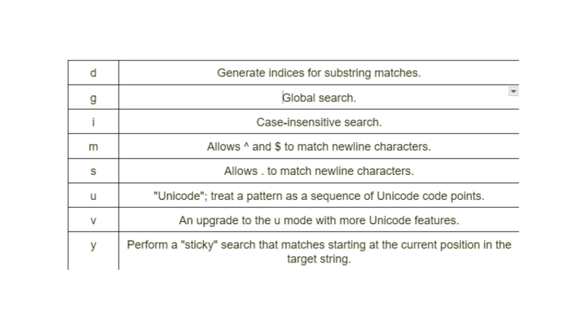

## **CURSOS ALURA HTML E CSS**

1. ### **HTML/CSS: AMBIENTES DE DESENVOLVIMENTO, ESTRUTURAS E TAGS**

* **HTML (HyperText Markup Language)**: linguagem de marcação utilizada para estruturar os elementos da página, como parágrafos, links, títulos, tabelas, imagens e até vídeos.  
* **CSS (Cascading Style Sheets)**: linguagem de estilos utilizada para definir cores, fontes, tamanhos, posicionamento e qualquer outro valor estético para os elementos da página.  
* **Javascript**: linguagem de programação utilizada para deixar a página com mais movimento \[DINÂMICA\], podendo atualizar elementos dinamicamente e lidar melhor com dados enviados e recebidos na página.  
* No HTML, são as *tags* que definem o que será um título, um parágrafo, etc.  
* Extensão é a forma com a qual o arquivo será armazenado (pdf, docs, word…)  
* Existem os conteúdos que a gente está visualizando na página e os conteúdos que não estamos vendo diretamente \[metadados\] \-   
* Por meio do botão direito do mouse, clicando em inspecionar, é possível inspecionar qualquer aba do google  
* **Quirks mode \-** é um erro das versões anteriores do html. o \<\!DOCTYPE html\> mostra que se trata da versão html.5  
* **Layout e tags semânticas \-**  
* Tags de atalho para iniciar o código html com a estrutura básica: digitar \!

\<\!DOCTYPE html\>  
\<html lang\="pt-br"\>  
\<head\>  
    \<meta charset\="UTF-8"\>  
    \<meta name\="viewport" content\="width=device-width, initial-scale=1.0"\>  
    \<title\>Portfolio\</title\>  
\</head\>  
\<body\>  
    \<header\>\</header\>  
\</body\>  
\</html\>

* \<meta charset=”UTF-8”\> é o tipo de código de teclados com maior abrangência; unicode  
* Para adicionar um botão que direciona para outro lugar, é utilizada a tag *ancora* **\[\<a\>\</a\>\].**   
* Para adicionar o hiperlink desta âncora, utiliza-se **href=“”**  
* **Estrutura básica HTML \-**   
* Primeira parte costuma ser o menu: *header*  
* Depois disso, o conteúdo principal: *main*  
* Por fim, o rodapé da página: *footer*  
* **Estilizando o projeto com CSS \-** Assim como o HTML, o CSS é formado por um conjunto de propriedades que especificam as cores, o formato, a posição, etc. dos elementos da página (estilização).  
* **Super estilizando o seu CSS \-**   
* Para mudar a representação das cores (passar de white para F6F6F6, é necessário colocar \# na frente: \#F6F6F6 \[hexaRGB\]).  
* **Roda de cores Adobe:** mostra boas combinações de cores para a criação do seu site.

2. ### **HTML/CSS: TRABALHANDO COM RESPONSIVIDADES E PUBLICAÇÃO DE PROJETOS**

* Diferenças entre  os seletores *tags* \[body, head, etc.\] e *classes*.  
* **Classe \-** é um agrupamento de tipos.   
* Pode ser utilizada, por exemplo, no lugar do strong, para destacar apenas aquela classe específica; selecionar e acessar elementos específicos através dos seletores de classe.   
* No HTML *\<strong class\="titulo-destaque"\>com um Front-end de qualidade\!\</strong\>*  
* No css \- .titulo-destaque {}  
* **Seletores básicos \-** Seletor por tag; Seletor por Classe; Seletor por ID; Seletores Universais; Seletores por atributos.  
* ***Combinadores:*** seletores de irmãos adjacentes; Seletores gerais de irmãos; Seletor de filhos; Seletor de Descendentes.  
* Pseudo-classes  
* Pseudo-elementos.  
* **Comentários \-** HTML “\<\!--  xxxx \--\>  
* CSS “Ctrl \+ K \+ C”  
* É possível criar variáveis no CSS, a partir do comando \--XXXX:  
* Para referenciar essas variáveis posteriormente: var(--XXXX);  
* No CSS, existem dois tipos de medidas:   
* ***Absolutas:*** não se alteram com as configurações de tela do navegador ou de dispositivo para dispositivo,   
* ***Relativas:*** REM é um bom exemplo \[16px \= 1rem\].  
* Outra boa unidade relativa é a porcentagem, que é sempre utilizada nas tags pais  
* “A **responsividade\!** Quando o site adapta o tamanho de suas páginas (Layout) de acordo com o tamanho da tela do dispositivo no qual ele está sendo acessado ou quando diminuímos o tamanho da janela do navegador, dizemos que este site é um site responsivo.”

## **CURSOS ALURA JAVASCRIPT**

1. ### **PONG NO SCRATCH E JAVASCRIPT**

* Alguns comandos muito utilizados \-  
* **fill() →** preencher algo/colorir algo  
* **function preload(){} →** serve para carregar um caminho que está armazenado na memória do computador, como exemplificado abaixo  
- function preload(){

                          trilha \= loadSound (“trilha.mp3”);  
                          ponto \= loadSound (“ponto.mp3”);  
                        }

* **constrain ()**→ Essa função limita um valor aos valores passados a ela.  
* **text (){}** → serve para adicionar um texto na função  
- **textSize()** → serve para alterar o tamanho do texto  
- **textAlign()** → Se escrevermos CENTER entre parênteses, o texto irá ficar centralizado.  
* **stroke()** → mexe com o contorno das figuras.  
* **xxxx.play()** → irá tocar o som que foi adicionado.  
* **xxxx.loop()** → irá tocar o som que foi adicionado em loop

2. ###  **JAVASCRIPT PARA WEB: CRIE PÁGINAS DINÂMICAS**

* **HTML \-** linguagem de marcação utilizada para estruturar os elementos da página, como parágrafos, links, títulos, tabelas, imagens e até vídeos.  
* **CSS \-** linguagem de estilos utilizada para definir cores, fontes, tamanhos, posicionamento e qualquer outro valor estético para os elementos da página.  
* **Javascript \-** linguagem de programação utilizada para deixar a página com mais movimento, podendo atualizar elementos dinamicamente e lidar melhor com dados enviados e recebidos na página.  
* ***Javascript inline \-*** escrever um código com a linguagem javascript dentro do arquivo HTML  
* **Estrutura e comandos Javascript \-** Convenção de utilizar o arquivo principal de JS como “main.js”  
* No js, uma classe é encontrada com .xxxx, um nome de tag é passado direto e um id é passado \#xxxx  
* Uma outra maneira de criar strings no JS é, ao invés de utilizar aspas simples/duplas, é com crase.  
* Se existe uma variável dentro da sua constante, é necessário utilizar o $ \[template string\]  
* No lugar de *while,* é possível utilizar o *for*, que também é uma estrutura de repetição.  
* A diferença é que o “let” pode ser declarado dentro dos próprios parâmetros do *for*.  
* **Repetição otimizada com For:** forma de incrementar um valor de variável com o operador \++.  
* Toda função precisa ter () para ser CHAMADA.  
* No JS o operador \= \[sozinho\] tem a função de **atribuir**, não de igualar.   
* Para atribuir igualdade, é possível utilizar \== ou \===.  
- O primeiro é para responder se a operação é falsa ou verdadeira, e não precisa de aspas, ou seja

1 \== 1 \[verdadeiro\]

- O segundo, com aspas, é para analisar o número e o tipo de dado (texto).

1 \=== ‘1’ \[seria falso, pois o 1 é lido como texto\]

**Advanced searching w/ Flags \-**   
****  
