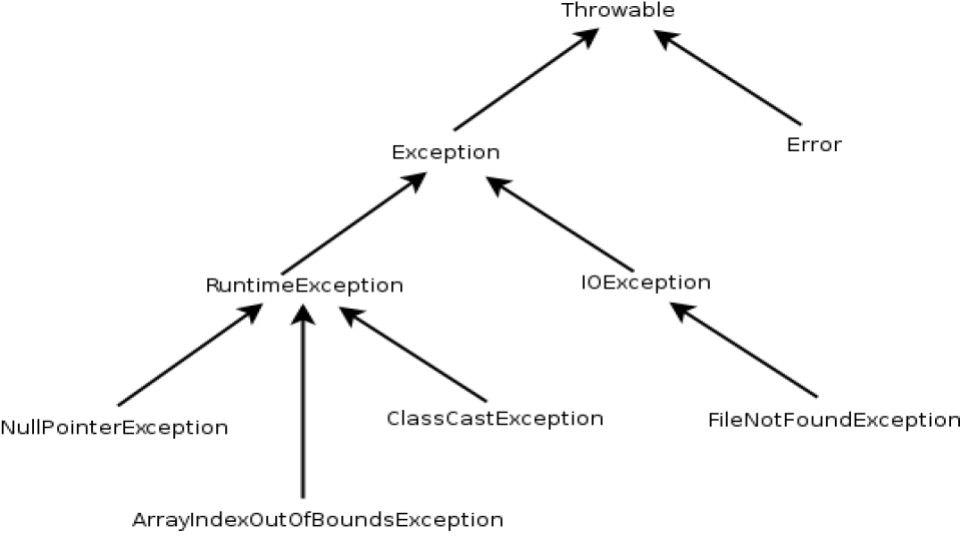
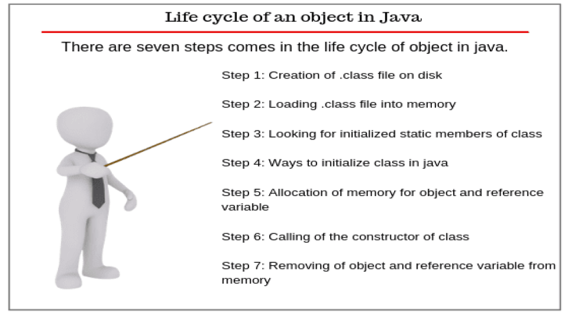
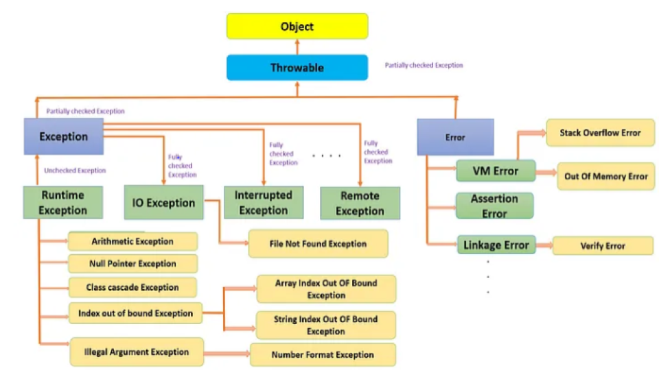
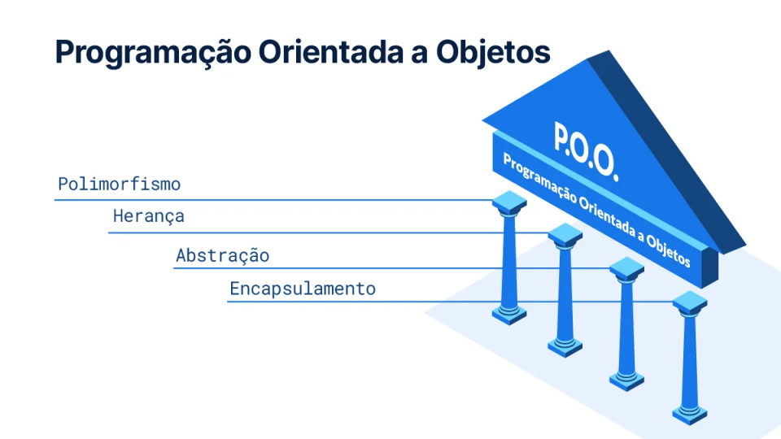
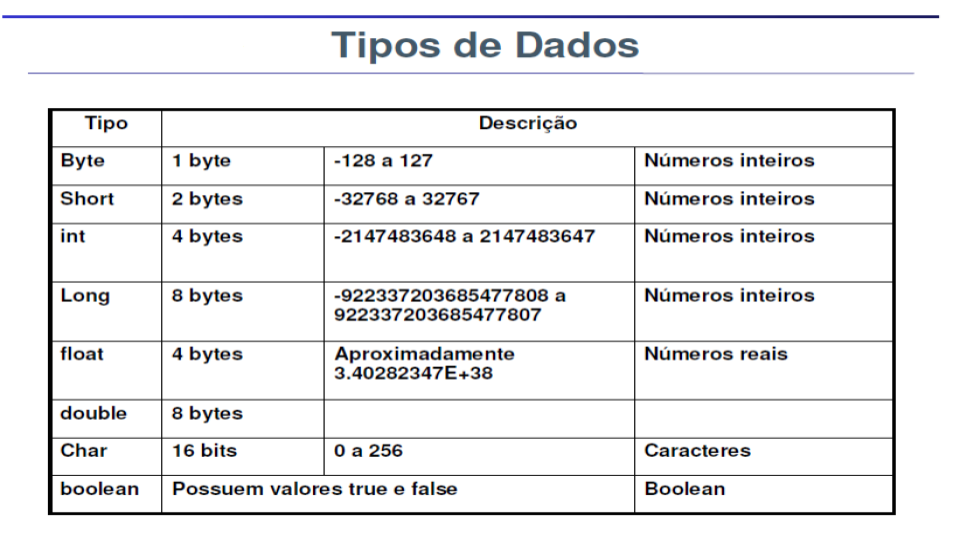
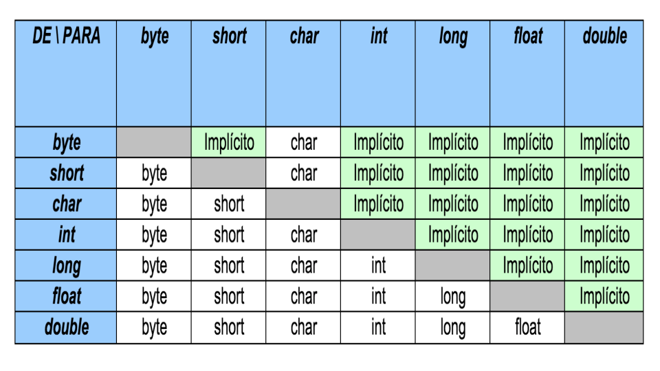

# **ALURA: CERTIFICAÇÃO JAVA SE 7 PROGRAMMER I**

1. ## **BÁSICO DE JAVA**

1. ### ***Escopo***

* **Tipos de Variáveis \-**   
  * *Variável Local:* definidas dentro de um método ou de um construtor. Vivem dentro de um bloco.  
  * *Variável de Instância:* São variáveis membro, também chamadas de atributo ou variáveis de objeto. Podem ser acessadas por qualquer membro da classe e ficam em escopo enquanto o objeto existir  
  * *Variável estática:* também chamada de variável de classe. Podem ser acessadas de qualquer lugar por causa da palavra static.  
* É possível nome variáveis com o mesmo nome dependendo do escopo a que está se referenciando \- 

	Variável Local → Variável de Instância OK  
  Variável Local →  Variável Local NÃO FUNCIONA  
  Variável Membro → Variável de Instância NÃO FUNCIONA

2. ### ***Defina a Estrutura de uma Java Class***

* **Packages \-** Pode existir apenas um. Opcional (default package).   
  * Os Pacotes servem para separar e organizar as diversas classes que temos em nossos sistemas.  
  * É sempre a primeira coisa a ser declarada.  
* **Imports \-** Vem após o package, e podem existir vários. Opcional.  
* **Class && Interface \-** Vem depois dos dois acima. Opcional.   
  * Uma classe é a forma no Java onde definimos os atributos e comportamentos de um objeto.  
  * Dentro de classes, podem existir variáveis de instância, métodos (construtores ou não), variáveis locais.  
  * Em uma interface, devemos apenas definir a assinatura do método, sem a sua implementação. Além da assinatura de métodos, também é possível declarar constantes em interfaces.  
  * Interfaces podem ter variáveis (constantes//final) e métodos (abstratos/públicos)  
* **Regras \-**   
  * *CERTO:* Um arquivo Java, vários tipos, um único público e público com nome do arquivo  
  * *ERRADO:* Um arquivo Java, vários públicos / público com nome diferente

3. ### ***Aplicações Java Executáveis***

* Para serem executáveis, o método main é obrigatório, e sempre public static void  
  * Deve receber como parâmetro um array ou *varargs* de String (String\[\] ou String...).  
  * O padrão é fazer tudo público

  public class HelloWorld {

    public static void main (String\[\] *args*) {

    	// your code goes here

    }

  }

  * Para compilar no terminal, com o padrão Oracle JDK,   
    javac nome\_package/*nome\_do\_arquivo*  
  * Para rodar no terminal, com o padrão Oracle JRE,   
    java nome.package.*nome\_da\_classe\_executando*   
* Existe uma variável chamada CLASSPATH, que define onde o compilador vai procurar as classes e os pacotes.   
  * Por padrão, é apenas o diretório atual (.), o que pode ser alterado nas variáveis de ambiente  
    - Por \-classpath ou \-cp  
  * Não é uma boa prática alterar a variável de ambiente CLASSPATH  
* Um arquivo JAR nada mais é que a pasta de nossas classes no formato ZIP mas com extensão .jar.

4. ### ***Importe outros pacotes java e deixe-os acessíveis ao seu código***

* Nesta seção, é cobrado o que é o pacote Default, quem pode acessar, como, e o import pacote  
* Se duas classes estão no mesmo pacote, uma pode referenciar a outra sem nenhum problema, apenas pelo nome do ***TIPO.*** Não é necessário importar outros pacotes e arquivos  
  * Exemplo: um atributo Endereco endereco  
* Quando você tem duas classes que não estão no mesmo pacote, é necessário referenciá-las com o import, ou com o nome da classe inteiro (não costuma ser utilizado)  
  * Nome\_do\_pacote.Nome\_da\_classe  
  * É necessário tomar cuidado com os modificadores de acesso.  
* Para a certificação, é importante saber que \-   
  * Dois imports com o mesmo nome específico não compila  
  * Se tenho um import com um nome e quiser usar na classe de um outro pacote com o mesmo nome, *fullyQualifiedName (nome do pacote seguido do nome da classe)*  
* Nunca é possível importar só uma classe do pacote default, nem mesmo especificando o *import* em cima  
* Quando se importa xxxxxxxx.\*, são importados classes, interfaces e tipos, não pacotes e subpacotes.  
* **import static \-** É possível importar diretamente uma variável ou métodos static nos imports, para não ter que escrever todo o caminho dela todas as vezes

	  
import static *modelo.Util.TAMANHO;*  
	import static *modelo.Util.maior*;  
	public void calculaTudo() {  
		int t \= TAMANHO;  
		maior(3, 10);  
}  
		

2. ## **TIPOS DE DADOS**

1. ### ***Declarar e inicializar variáveis***

* Java é uma linguagem de programação tipada, ou seja, o tipo sempre será explícito na declaração das variáveis  
  * Com o java 8, existe algumas possibilidades de ser implicito  
* **Valores padrões \-**   
  * O valor padrão (caso não seja inicializada) de uma variável padrão membro de tipo numérico é sempre 0  
  * O valor padrão (caso não seja inicializada) de uma variável padrão membro de tipo char é 0, mas o computador entende como espaço em branco  
  * O valor padrão (caso não seja inicializada) de uma variável padrão membro de tipo boolean é false  
  * O valor padrão (caso não seja inicializada) de uma variável padrão de tipo referência é sempre null  
* **Tipos primitivos no Java, que não possuem referência \-** byte; short; char; int; long; float; double; boolean  
  * Existem as letras marcadores de tipo que vão ao final dos números: f, l, d.  
  * No caso de int, existem algumas exceções importantes. São elas:  
    - Se escrever int x \= 0\_\_\_\_ o compilador entende como um número octal que vai de 00 à 07  
    - Se escrever int x \= 0x\_\_\_\[ou 0X\_\_\_\] o compilador entende como un número hexadecimal, que vai de 0 a 9 e A a F.  
    - Se escrever int x \= 0b\_\_\_\[ou 0B\_\_\_\] o compilador entende como um binário que tem 0 e 1 apenas  
* É importante saber que os valores primitivos podem receber facilmente números LITERAIS, mas valores que são referência não.  
* Existe um conjunto de palavras-chave que não podem ser utilizadas como identificadores. É necessário decorá-las.  
* **Diferença entre variáveis de referências à objetos e tipos primitivos \-**   
  * Variáveis primitivas possuem um VALOR, e sempre que atribuo uma var primitiva para outra variável, estou copiando este valor  
  * Variáveis referências para objetos armazenam ENDEREÇOS, ou seja, ponteiros que apontam para o objeto em questão. É esse endereço que é copiado para o outro objeto que atribuirmos.

2. ### ***Objetos***

* Como acessar objetos de classes, tanto para atribuição quanto para leitura.  
  * Para acessar um atributo, usamos o operador . , junto a uma variável de referência para um objeto.  
  * this.variávelMembro significa um acesso explícito. Serve como uma variável de referência para o próprio objeto onde o código está sendo executado  
* **CICLO DE VIDA \-**   
  * **Quando o objeto é criado \-** Para criar um objeto, é sempre necessário criar um CONSTRUTOR.  
  * **Quando deixa de ser referenciado \-** Se nenhuma variável aponta (direta ou indiretamente) para algum objeto, não é possível mais acessá-lo. Portanto, deixa de ser referenciado.  
    - Torna-se, portanto, um objeto inacessível.  
  * **Quando é jogado fora \[Garbage Collected\] \-** Pode ser jogado fora a qualquer instante a partir do momento em que se torna inacessível.  
* **CHAMADA DE MÉTODOS \-** É possível invocar um nome passando argumentos.  
  * Quando o método recebe argumentos, é obrigatório passar algo quando invocado.   
  * Quando o método retorna algo, não necessariamente se tem que passar algum argumento.  
  * Quando é necessário receber vários argumentos, variável, quando não se sabe, é possível passar como parâmetro (int… numeros); conhecido com ***var args*** (recebe apenas um tipo, infinito).  
    - var args é uma array, mas uma array não é necessariamente var args

3. ### ***StringBuffer e StringBuilder***

* O StringBuffer é um espaço feito para alocar uma string lá dentro  
  * É uma espécie de array   
  * StringBuffer sb \= new StringBuffer();

| .append(); | .substring(); | .insert(posição, texto); |
| :---- | :---- | :---- |
| .toString(); | .length(); | indexOf(); lastIndexOf(); |
| .trim(); | .reverse(); | .delete(início, final); |
| .charAt(); | .equals(); | .subSequence(); |
| .isEmpty(); | .toUpperCase(); .toLowerCase(); | .replace(charOldChar, charNewChar) |
| .concat(); | compareTo(); compareToIgnoreCase(); | replace(CharSequence target, charSequence replacement); |

* A diferença entre o StringBuffer e o StringBuilder é que o StringBuilder não sincroniza o acesso aos métodos.  
  * Dentro do método, apenas está acessando uma thread  
  * É possível utilizar os mesmos métodos nos dois.

4. ### ***Strings***

* **Existem duas maneiras tradicionais de criar strings \-**   
  * String nome\_da\_string \= “valor\_da\_string”;  
  * String nome\_da\_string \= new String(“valor\_da\_string”);  
  * StringBuilder  
* É possível criar, a partir de um array de chars, uma nova string.  
* Chamar o método toString() para uma string null resulta em um NullPointerException; Se concatenado com outra string, printa a palavra null  
* Strings são imutáveis, elas não mudam de valor uma vez definidas.  
  * Os métodos de alteração de string não vão mudar o valor original interno dela, eles vão alterar criar uma nova string e é necessário utilizar essa referência como for necessário.

3. ## **OPERADORES**

1. ### ***Use operadores Java***

*  Uma atribuição só funciona se a expressão do lado direito for menos abrangente do que do lado **esquerdo**  
  * Quando se trata de objetos, a atribuição é sempre por ponteiros de REFERÊNCIA àquele objeto na memória, e não por valor.  
  * No caso de valores literais, como byte, char e short, não é necessário se preocupar, pois o compilador irá verificar se o número que está sendo atribuído é válido EM TEMPO DE COMPILAÇÃO.

2. ### ***Tipos***

* **ARITMÉTICOS \-**   
  * Soma, subtração, multiplicação e divisão; módulo.  
    - É necessário saber o que ocorre quando dois números de tipos diferentes são utilizados na mesma conta.   
    - O java vai sempre devolver NO MÍNIMO um int; contudo, devolverá o maior dos tipos dos dois números em questão.  
  * Divisão por zero int da erro de execução  
    - Divisão por número com ponto flutuante existe, então compila normal.  
* **COMPARAÇÃO \-**   
  * Retornam booleans.  
  * Uma comparação não leva em consideração os tipos primitivos numéricos do que está sendo comparado.  
  * Quando se trata de variáveis de referência, só existem duas operações, \== ou \!=.  
    - O que está sendo comparado é se a referência que você tem é para o mesmo objeto.  
    - Não podemos misturar os três: booleans, valores primitivos numéricos e valores por referência.  
* **LÓGICOS \-** Existe o AND \[&\], o OR \[ | \], o EXCLUSIVE OR \[ ^ \], e o NOT \[ \!(....)\]  
  * Short Circuit: No caso do && e do ||, é uma forma de dizer para o compilador que, caso o primeiro valor conferido for true, não é necessário olhar o próximo.  
    - Isso faz diferença quando o que vem depois é um método

  public static boolean metodo(String msg) {

      System.out.println(msg);

      return true;

  }

  public static void main(String\[\] args) {

      System.out.println(1 \== 2 & metodo("oi")); 

      // imprime oi, depois false

      System.out.println(1 \== 2 && metodo("tchau")); 

      // não imprime tchau, imprime false

  }

### 

* **INCREMENTO E DECREMENTO \-**   
  * Importante se atentar para o fato de que o operador que vem após da var \[a++\], primeiro é devolvido o valor original, e depois a operação é realizada (PÓS-DECREMENTO)  
    - O contrário ocorre com o operador que vem antes da variável \[++a\], o que é chamado de PRÉ-DECREMENTO  
* **Operador Ternário \-** 

  condição ? caso\_verdadeira : caso\_falsa

  * Só funciona se os tipos forem compatíveis  
* **Operador de Referência \-** É o ponto.  
* **Operador de Concatenação \-** Apenas a classe String possui o caracter \+ como forma de concatenação  
  * Não é possível adicionar essa funcionalidade a outras classes.

3. ### ***Casting***

* Não podemos atribuir a uma variável de um tipo um valor que não é compatível com ela  
  * Compatível é quando um tipo cabe em outros, ou seja, ele só cabe se o alcance dele for mais amplo que o do outro.

byte \-\> short \-\> int \-\> long \-\> float \-\> double  
char \-\> int

* Se estamos indo da direita para a esquerda, precisamos do *casting*  
* O casting é a maneira que usamos para moldar uma variável de um tipo em outro.

4. ### ***Teste a igualdade entre Strings e outros objetos usando \== e equals()***

* O java só consegue colocar as Strings no *pool* quando é utilizado os literais. Quando o objeto é INSTANCIADO, não é possível.  
  * Aspas duplas são o literal de string.  
* Para conseguir fazer uma comparação com o CONTEÚDO de uma String, ao invés de apenas o endereço apontado, é necessário usar o equals()  
* Quando duas strings literais são concatenadas, o resultado é um literal também  
  * Quando você faz uma concatenação, mas, no meio dela existe uma referência, o Java não coloca dentro do *pool*  
* Se o método que está sendo invocado altera o comportamento da String, é criado um novo objeto.   
  * Se o método que está sendo invocado retorna exatamente a MESMA COISA, nenhum objeto é criado e é retornado o mesmo.  
* Não é permitido sobrescrever a assinatura do método equals

	public boolean equal (Object XXXXXXX) {}

5. ### ***If e if/else***

* Serve para controle de fluxo  
* Se o seu código possuir apenas uma instrução, é possível omitir as chaves, tanto do if quanto do else  
* **PEGADINHAS DA PROVA \-**   
  * Tomar muito cuidado com a indentação.  
  * Lembrar que todos os caminhos possíveis tem que possuir um retorno

6. ### ***Switch***

* Parece um if muito aninhado  
* O tipo que existe dentro do case tem que bater com o tipo da variável que está sendo comparada no switch  
  * Qualquer tipo inteiro MENOR OU IGUAL a int pode ser passado;  
  * Strings também   
  * Para o dia, é importante saber que enums também, mas não cai na prova  
* Só pode passar uma variável caso esta seja final.  
* O default pode aparecer em qualquer lugar da estrutura

4. ## **ARRAYS E ARRAYLIST**

1. ### ***Declare, instancie, inicialize e use um arrays***

* Os quatro pontos importantes sobre arrays são:  
  * Declarar  
  * Inicializar  
  * Acessar  
  * Percorrer  
* Ao realizar a instanciação do array, é obrigatório dizer quantas variáveis do tipo especificado irão caber nele  
* Quando inicializado, o Java dá valores default para todas as posições do array, dependendo do tipo especificado  
* Arrays de referência \- são arrays que armazenam variáveis de referência  
* O valor default para um array de referências é null, portanto é necessário tomar cuidado para inicializar ele antes de imprimir um valor, se não pode dar NullPointerException  
* Podemos generalizar a ideia de array para construir arrays de duas dimensões, em outras palavras, array de arrays. Analogamente, podemos definir arrays de quantas dimensões quisermos.

2. ### ***Declare e use uma ArrayList***

* Uma coisa que restringe o trabalho com arrays é o fato de que é obrigatório declarar quantos espaços serão necessários, e nem sempre isso é possível.  
* Para mitigar isso, foi criado o ArrayList.  
  * Não é um pacote default do Java, então é necessário fazer o import java.util.ArrayList  
  * Seu tamanho vai aumentando dinamicamente.  
  * Métodos úteis: .add(); .remove(); .contains(); .size(); .toArray(); .addAll(); .get(); .set(posição, valor)  
* As coleções do Java possuem uma forma padronizada de percorrer o que existe ali dentro.   
  * O problema é que nem todas possuem métodos de acesso em uma certa posição  
  * Devido à isso, existe o método .iterator(); que é um objeto que sabe percorrer por todos o conteúdo de uma coleção  
    - O ideal para utilizar ele é o while.

    import java.util.Iterator;

    Iterator\<String\> it \= exemplo.iterator();

    while (it.hasNext()){

    	String atual \= it.next();

    	System.out.println(atual);

    }

    - Possui um .remove();   
  * É possível utilizar, também, o for each, também denominado *enhanced-for*

5. ## **LAÇOS**

1. ### ***Laços while***

*  Tomar cuidado, pois pode entrar em loop infinito  
* Se houver apenas uma linha de comandos, pode ser escrito sem as chaves

2. ### ***Laços for e enhanced for***

* O enhanced for funciona para quando existe algo passível de iteração que precisa ser analisado todos os elementos \- enums, arrays, ArrayLists, etc  
  for (tipo *declaração\_de\_var\_temporária* : coleção\_iterada) {…}  
  * Apenas consegue iterar do primeiro até o último  
  * Não é possível pular elementos de lá, e remover elementos é instável, portanto não é recomendado.

3. ### ***Laços do…while***

* Neste caso, a condição apenas é verificada após a primeira iteração do bloco de comandos

4. ### ***Use break e continue***

* Servem para controlar melhor os laços.  
* O break chama o laço mais próximo que existe perto dele.  
* O continue volta ao início da condição, ou seja, a condição que está ao lado do continue não tem os seus comandos executados.  
  * Todo laço pode ter um label, com a seguinte sintaxe \- 

  nome\_do\_laço: for (){...}

* De maneira mais geral, qualquer STATEMENT pode possuir um label.

6. ## **MÉTODOS E ENCAPSULAMENTO**

1. ### ***Crie métodos com argumentos e valores de retorno***

* Todo método tem uma assinatura e um corpo  
  * Com exceção de métodos abstratos  
* Se o método retorna algo, é necessário existir o tipo de retorno ou jogar alguma Exception  
  * Não é possível existir linhas de código depois do return.  
* Modificadores vem antes do tipo  
  * Com relação ao modificadores de acesso, só pode existir um  
    - public, private, protected  
  * Com relação aos modificadores de métodos, podem ser declarados vários  
    - Final, abstract, static, native, synchronized, strictfp  
* Não é possível, para o java, ter um valor padrão para parâmetros.  
  * Com exceção de final  
* Regras de polimorfismo e as regras de promoção de tipos primitivos continuam valendo para métodos

2. ### ***Static em métodos e campos***

* A palavra static faz com que variáveis virem da CLASSE, não do objeto/instância  
* Para acessá-la, é feito diretamente pelo nome da Classe.

		Nome\_Da\_Classe.Variavel\_Estatica

* É possível ter métodos estáticos, também.  
* Uma variável estática não acessa outra variável estática que vem depois  
  * Um método estático, contudo, pode acessar uma variável estática que vem depois  
* Se existe um método estático com determinado nome, não pode existir um método membro com o mesmo nome, pois dá erro de compilação.  
  * Mesmo que seja utilizado herança  
* Não é possível acessar this dentro de um contexto estático

3. ### ***Métodos sobrecarregados***

* Significa que um método com o MESMO NOME possui tipos ou número de parâmetros diferentes  
* Se você está passando uma versão de um método, e existem duas versões (ou seja, método sobrecarregado), ele chamará primeiro a mais específica  
  * É possível, contudo, forçar a chamada da mais genérica

4. ### ***Diferença entre o construtor padrão e construtores definidos pelo user***

* O modelo de construtor padrão herdado em toda classe object é  
  class A {  
  	A() {  
  		super();  
  	}  
  }  
* No momento em que você define o seu construtor, o padrão deixa de existir.  
  * Primeiro são feitas as inicializações das variáveis membros, depois o construtor é declarado.  
  * É importante tomar cuidado ao declarar métodos que a variável ainda não foi inicializada  
  * Não é muito bom colocar métodos nos construtores  
* Construtores podem entrar em looping infinito  
* **NÃO** tem tipo de retorno. Se tiver, passa a ser um método

5. ### ***Crie e sobrecarregue construtores***

* É possível criar vários construtores em uma mesma classe, sobrecarregando-os  
  * Ou seja, é necessário que tenham assinaturas diferentes \[o nome da variável não faz parte da assinatura\] 

6. ### ***Princípios de Encapsulamento a uma classe***

* **public \-** qualquer um acessa  
* **protected \-** qualquer um que herda, está no mesmo pacote ou está dentro dele acessa  
* **default (sem nada escrito) \-** tem que estar no mesmo pacote ou dentro dele para acessar  
* **private \-** tem que estar dentro dele para acessar  
  * Binding (???) de private é feito em tempo de compilação  
    - A exceção é sobrescrita de métodos  
* A ideia de encapsulamento está relacionada a esconder como as coisas são feitas, apenas expondo o que pode ser feito pela interface.  
* Encapsulation e information hiding são nomes que isso pode aparecer na prova  
* **Referência X Valor \-** efeito que ocorre com referências a objetos e a tipos primitivos quando passados a outros métodos  
  * É importante observar/acompanhar a pilha de execução  
    - Modelo de desempilhamento  
  * No caso de primitivos, o valor é copiado  
  * No caso da passagem de objetos, o que está sendo passado é uma referência a um objeto e acessando uma variável membro deste objeto.  
  * No caso de trocar a referência de uma variável local, não funciona, trocou a referência de uma variável local, trocou só daquela variável local.  
    - A outra variável que eu tinha continuava referenciando o mesmo objeto que ela referenciava antes.

7. ## **RELAÇÕES ENTRE CLASSES**

1. ### ***Implementando Herança***

* TODAS as classes no Java extends Object  
* Não é possível herdar de duas classes diretamente, apenas de forma indireta  
* Todos os construtores DEFAULT, por padrão, chama o construtor da classe mãe, ou seja, super();  
  * Além da classe ser acessível, o construtor da classe também precisa ser acessível à uma classe que está herdando de outra  
  * Por padrão, chama o construtor sem argumentos, super();  
* Não existe herança com métodos estáticos, mas eles podem ser REFERENCIADOS  
  * O binder de um método estático é feito em tempo de compilação  
  * Métodos abstract não podem ser static, dá erro de compilação

    Não importa que em tempo de execução o objeto seja do tipo Z, para métodos estáticos o binding é feito em tempo de compilação, portanto não importa o objeto que esteja referenciando em tempo de execução. Quando eu chamar o método, ele vai chamar no método que eu tinha compilado. Isso é, ele vai chamar em W. Eu compilo e ele chama em W.

* Método toString, por padrão, devolve o tipo do objeto, e o ponteiro da região da memória do mesmo.  
  * Nos mostra que estamos sempre herdando de object, ganhando a implementação padrão no método toString sempre.

2. ### ***Polimorfismo***

* Sobrescrita é diferente de method overload, e é possível de ser feito na classe filha, mudando o método que existia originalmente na classe mãe,  
  * Em tempo de execução, o Java sempre vai olhar na memória e vai perguntar qual é o TIPO desse objeto  
* Um exemplo de polimorfismo seria o código a seguir  
  Veiculo h1 \= new Helicoptero();  
* A visibilidade do filho tem que ser PELO MENOS igual a da mãe  
  * Só pode jogar exceptions que a mão joga, ou menos \[subclasses\]  
* Quando se está sobrescrevendo, o tipo de retorno tem que ser um tipo compatível com a mãe, ou mais específico.  
* Um método polimórfico é um método que herda um tipo, e todo mundo herda aquele tipo, então não é possível saber qual ele está recebendo.  
  * É a interface de comunicação que importa o resto está encapsulado.

3. ### ***Diferencie tipo de uma referência e tipo de um objeto***

* O compilador só consegue entender as referências, ou seja, o tipo das variáveis.  
  * Isso significa que só é possível acessar métodos e variáveis-objeto que estejam definidas no tipo de referência.  
* Polimorfismo é a capacidade de chamar um objeto de diversas formas

8. ## **HANDLING EXCEPTIONS**

1. ### ***Diferença entre exceções do tipo checked, runtime e errors***

* A classificação desses erros é toda baseada em uma estrutura de classe, em uma hierarquia de classes  
  * ***Throwable:*** Classe Principal  
    - Error \- São gerados por situações muito anormais; não existem soluções fáceis para errors  
    - Exception \- São mais fáceis de criar uma solução  
      1. Exception Checked exigem sempre um tratamento por parte do compilador  
      2. Exception Unchecked todas as classes que são filhas de RuntimeException. O compilador ignora

****
**Título \-** Árvore herança Throwable

2. ### ***Blocos try-catch e exceções alterando o fluxo normal do programa***

* O primeiro cenário de uso do try é tentar executar determinada coisa, MAS, caso dê algum erro, o programa deve continuar  
  * Serve para controlar o fluxo normal de um programa  
  * Irá cair dentro do bloco catch somente se for aquele tipo de exception definida nos parâmetros do catch, ou alguma outra classe que possua herança  
* É possível colocar um Try-Catch de qualquer tipo que seja RuntimeException ou de um tipo Throwable.  
* Se uma exception ocorre, a linha seguinte à exception dentro do try não irá ser executada

3. ### ***Métodos que jogam exceção***

* Se chamamos um método que dá uma Exception e ele não trata essa Exception, ela vaza para mim,   
  * É necessário colocar um try catch, porque ou eu trato ou ela vaza.   
  * Se ela vazar do método main mata o programa.  
* try-catch tenta pegar uma exception.  
  * O **throw** JOGA uma exception  
* Quando você tem uma linha de código, uma expressão que pode jogar uma **Runtime Exception**, não precisa colocar try-catch, não precisa especificar o que tem que ser feito.  
* No **Checked Exception**, quando você tem uma linha de código ou uma expressão que pode jogar um checked Exception, você tem que colocar um try-catch ou tratar esse erro de alguma maneira  
  * É possível ou tratar o checked exception, ou JOGAR o próprio checked exception  
* A ordem que as exception são tratadas é muito importante

4. ### ***Classes de exceções comuns e suas categorias***

* **ArrayIndexOutOfBoundsException:** acessar posição inválida de Array   
* **IndexOutOfBoundsException:** acessar posição inválida de ArrayList  
* **NullPointerException**  
  * Quando tentamos invocar um método, ou acessar uma variável membro, um atributo, etc., de uma referência com um objeto que, na verdade, está referenciando nulo, não está referenciando nada  
* **ClassCastException**  
* **NumberFormatException**  
* **IllegalArgumentException**  
* **IllegalStateException**  
* **ExceptionIninitializerError**  
* **StackOverflowError**  
* **OutOfMemoryError**

9. ## **CONTEÚDO ALÉM DA PROVA**

1. ### ***Trabalhando com saída no console***

System.out.print();   
System.out.print(“...\\n”);   
System.out.println();

* Qualquer objeto que seja passado para impressão pelo console invoca o construtor default    
  public String toString()  
  * Arrays são, por si só, um objeto.   
    - Contudo, quando manda imprimir um array de char, é o único caso em que o Java não chama o objeto toString  
* Para formatar a saída do console, existe

System.out.format(); OU System.out.printf();

* Ambos funcionam exatamente da mesma maneira  
  * Existem alguns caracteres de marcação que controlam estes métodos  
  * Ordem de chamada: percent → índice → flags → tamanho → precisão → tipo

2. ### ***Classes Wrapper***

* Wrappers são objetos que representam primitivos  
* Todos os primitivos que representam tipos numéricos tem dois construtores  
  * Representação em número e em string  
    - Se a string não puder ser transformada em número, gera um NumberFormatException  
* O wrapper de Boolean também possui dois construtores, um para o valor literal (true, false) e outro para string  
  * Apenas vai rodar true se você escrever exatamente true. Todo o resto roda false  
* tipoDoPrimitivo***Value();*** \- converte os valores de wrapper para primitivo  
* Todos os wrappers tem um método static que pega o que foi passado em String e devolve em formato do primitivo que você quer

***parse***TipoDoPrimitivo();

* Para passar de  string para wrapper, ou é necessário utilizar o construtor, ou o método abaixo

valueOf();

* Existe também um método que torna tipos numéricos primitivos em String

toString();

* Até o Java 1.4, para somar ou realizar operações com um Wrapper, é necessário transformá-lo em um primitivo.  
* A partir do Java 1.5, foi criado o AutoBoxing, ou seja, a desempacotação e empacotação passou a ser feita pelo próprio compilador.

3. ### ***Classes do pacote java.time***

import java.time.\*

* **LocalDate \-** data sem hora  
  * xxxxx.now();  
* **LocalTime \-** Hora  
  * xxxxx.now();  
    - Para fuso-horários diferentes, é possível usar a classe ZoneId.of();  
  * LocalTime.of();  
* **LocalDateTime \-** Data com hora  
  * xxxxx.now();  
* Passar um valor inválido em qualquer um dos campo irá criar uma exception  
* Todos os objetos desta nova API, depois de criados, são imutáveis  
* Para transformar um objeto do tipo LocalDateTime em um objeto do tipo LocalDate ou para LocalTime existe o método   
  * xxxx. toLocalDate();  
  * xxxx. toLocalTime();  
* Para fazer a conversão da API antiga para a API nova, é sempre com o auxílio/intermediação do método .toInstant(i, ZoneId.systemDefault());  
* Para fazer a conversão da API nova para a API antiga, é sempre com o auxílio/intermediação do método .toInstant(ZoneOffset.UTC); 

4. ### ***Plataforma Java: Independência de plataforma, OO e encapsulamento***

* A Orientação à Objetos é um paradigma da programação em que o código é criado em pequenas estruturas, chamadas métodos  
  * Muito útil para o reuso  
* **Encapsulamento \-** Esconder os detalhes de implementação para que, quando algo for alterado, não seja necessário realizar as alteração em todo o sistema  
  * ***A maneira mais fácil:*** colocar private nos atributos de uma classe  
  * Somente é necessário criar um getter e um setter se FOR NECESSÁRIO

# **GUPTA OCA STUDY GUIDE: SUMMARIZED REVIEW NOTES**

1. ## **CHAPTER 1 \- JAVA BASICS**

| OCA REQUIREMENTS JAVA BASICS |
| ----- |
| Define the scope of variables |
| Define the structure of a Java class |
| Create executable Java applications with a main method; Run a Java program from the command line; Produce console output |
| Import other Java packages to make them accessible in your code |
| Compare and contrast the features and components of Java such as: platform independence, object orientation, encapsulation, etc. |

* Java Source File \- .java  
* Java bytecode Files \- .class  
* ***Possible*** **components of a java Class \-** 	  
  * Package and imports;  
  * Nested Classes, nested interfaces, enums; Variables, Constructors;  
  * Class Declarations and Class Definitions  
  * Comments and annotations.  
* For a class to be executable in the JVM, it has to define a main method with the signature 

public static void mains (String\[\] xxxx){} ou public static void main (Strings… xxxx){}

* **Packages \-** You can use packages to group together a related set of classes and interfaces  
  * An import statement allows the use of simple names for packaged classes and interfaces defined in different packages  
    - Can’t use the wildcard character \*  
* **Java access levels \-** public, protected, default, private  
* **Java Nonaccess modifiers \-** abstract, final and static  
  * ***Abstract:*** when prefixed to the definition of a concrete class, can change it to an abstract class, even if it doesn’t define any abstract methods.  
    - An abstract class can’t be instantiated.  
    - Interface is implicitly abstract  
  * ***Static:*** modifier can be applied to inner classes, inner interfaces, variables, and methods.  
    - A method can’t be defined as both abstract and static.  
    - Static attributes are also known as class fields or class methods because they’re said to belong to their class, not to any instance of that class.  
    - A static method or variable can’t access non-static variables or methods of a class. But the reverse is true: non-static variables and methods can access static variables and methods.  
* **Components of Java \-** Object orientation; Abstraction; Encapsulation; Inheritance; Polymorphism; Type safety; Aut. Memory Management; Multithreading and concurrency.

2. ## **CHAPTER 2 \- WORKING WITH JAVA DATA TYPES**

| OCA REQUIREMENTS JAVA DATA TYPES |
| ----- |
| Declare and initialize variables (including casting of primitive data types) |
| Differentiate between object reference variables and primitive variables |
| Know how to read or write to object fields |
| Explain an Object's Lifecycle (creation, "dereference by reassignment" and garbage collection) |
| Develop code that uses wrapper classes such as Boolean, Double, and Integer  |

* **Primitive types defined in Java \-** char; byte; short; int; long; float; double; boolean  
  * ***Boolean:*** can store true or false  
  * ***Numeric:*** can store integers (byte, shor, int, long) or decimal numbers (float, double)  
    - Can also be stored in binary (0 or 1), octal (0 to 7\) or hexadecimal (0 to 9 \+ A to F) number formats  
  * ***Character:*** can store a single 16-bit Unicode character (defined in hexadecimal)  
    - From \\u000 to \\ufff  
    - Always can be represented by a ***positive*** integer  
* A literal is a fixed value that doesn’t need further calculations to be assigned to any variable  
* **Assignment operators \-** can be used to assign or reassign values to al types of variables  
* **Arithmetic Operators \-** Can’t be used w/ boolean data type  
  * Unary operators (++, \--) can be prefix (the value of the variable changes BEFORE the variable is used in expression) or postfix (the value of the variable changes AFTER the variable is used in expression).  
  * They have higher preference  
* **Relational Operators \-** used to compare values for equality, inequality, greater than, less than, etc.  
* **Logical Operators \-** AND (&&); OR (||); NEGATIVE (\!)  
* **Wrapper Classes \-** are used to wrap primitives in an object, so they can be added to a collection object.  
  * Are always immutable  
  * ***Ways to create Wrapper Classes:*** assignment, constructor, static methods  
  * Unboxing a wrapper reference variable, which refers to null, will throw a Null-PointerException.

3. ## **CHAPTER 3 \- METHODS AND ENCAPSULATION**

| OCA REQUIREMENTS METHODS AND ENCAPSULATION |
| ----- |
| Create methods with arguments and return values; including overloaded methods |
| Apply the static keyword to methods and fields   |
| Create and overload constructors; differentiate between default and user defined constructors |
| Apply access modifiers |
| Apply encapsulation principles to a class |
| Determine the effect upon object references and primitive values when they are passed  into methods that change the values |

* **Possible scopes of variables \-** class, instance, local and method parameters.  
  * Instance variables are defined and accessible within an object  
* **Object’s life cycle \-** 

****

* **An object can become inaccessible if it can no longer be referenced by any variable.**  
* **Methods parameters \-** The method parameter can be of a primitive type or an object of a class or interface.  
  * You can define only one variable argument in a parameter list, and it must be the final variable in the parameter list.  
* **Overloaded Methods \-**   
  * The argument lists can differ by:  
    - Changes in the number of parameters that are accepted  
    - Changes in the types of parameters that are accepted  
    - Changes in the positions of parameters that are accepted  
  * Methods can’t be defined as overloaded methods if they differ only in their return types or access levels.  
* **Constructos \-** An initializer block is defined within a class, not as a part of a method. It executes for every object that’s created for a class.  
  * It has priority over the constructor and can’t accept method parameters  
* **Overloaded Constructors \-** can call another overloaded constructor by using the keyword this; this must be the first statement in a constructor.  
* **Objects Fields (instance objects) \-** Can be written either by directly accessing the variable (if its access level permits) or by using constructors and methods that accept a value and assign it to the instance variable.  
  * Methods that accept varargs can be called with different counts of actual arguments.  
* **Encapsulation \-** The terms encapsulation and information hiding are used interchangeably.  
* **Objects and primitives to methods \-** They behave differently  
  * When you pass a primitive variable to a method, its value remains the same after the execution of the method.  
  * When you pass an object to a method, the method can modify the object’s state by executing its methods.

4. ## **CHAPTER 4 \- SELECTED CLASSES FROM THE JAVA API AND ARRAYS**

| OCA REQUIREMENTS SELECTED CLASSES FROM THE JAVA API AND ARRAYS |
| ----- |
| Declare, instantiate, initialize and use a one-dimensional array |
| Declare, instantiate, initialize and use multi-dimensional arrays |
| Manipulate data using the StringBuilder class and its methods |
| Create and manipulate Strings |
| **Create and manipulate calendar data using classes from** java.time.LocalDate Time java.time.LocalDate java.time.LocalTime java.time.format.DateTimeFormatter java.time.Period |
| Declare and use an ArrayList of a given type |
| Write a simple Lambda expression that consumes a Lambda Predicate expression |

* **Class String \-** represent an immutable sequence of characters  
  * Can be created with new or with \= (String literals that are placed on the pool of String objects)  
  * ***Most used methods:*** charAt(int index); indexOf(); substring(); trim(); length(); startsWith(); endsWith()  
  * Differences between \== or equals  
* **Class StringBuilder \-** defined in the java.lang package and represents a ***mutable*** sequence of characters.  
  * Can be created using its constructor, that can accept either a String, another StringBuilder, an int value or nothing.  
  * ***Most used methods:*** charAt(int index); indexOf(); substring(); length(); append(); insert(); delete(); deleteChar(); reverse(); replace(); subSequence()  
* **Arrays \-** An object that stores a collection of values (either a collection of primitive data types or a collection of objects)  
  * It can be uni or multi-dimension  
  * The type of an array can also be abstract; interface or java.lang.Object  
    - length(); is its most important method  
  * ***Three important steps for its creation:*** declaration of an array, allocation of an array, and initialization of array elements.  
    - Array allocation allocates memory for the elements of an array, so you must specify its dimensions  
    - You can declare and allocate an array but choose not to initialize its elements  
  * ***Default values:*** storing objects \= null;   
    - storing integers (byte, short, int, long) \= 0;   
    - storing decimal types (double or float) \= 0.0;   
    - storing boolean \= false;   
    - storing char \= /u000  
* **ArrayList \-** it's like a resizable array  
  * Implements the interface List and allows null values to be added to it  
  * add(); modify(); delete() are list operations  
  * Iterator, ListIterator or enhanced for loop  
  * set(); remove(); get(); size(); contains(); indexOf(); lastIndexOf(); clone()  
* **LocalDate \-** can be used to store dates like 2015-12-27 without time or time zones.  
  * Its instances are immutable.  
  * LocalDate overloaded static method of();  
    - Can throw DateTimeException  
  * ***Static methods:*** now(); parse();   
  * ***Instance methods:*** getXX(); minusXX(); plusXX(); withXX(); atTime(); toEpochDay()  
* **LocalTime \-** It stores time in the format hours-minutes-seconds (without a time zone) and the time to nanosecond precision.  
  * It’s immutable  
  * LocalDate overloaded static method of();  
    - Can throw DateTimeException  
  * ***Static methods:*** now(); parse();   
  * ***Instance methods:*** getXX(); isAfter(); isBefore(); minusXX(); plusXX(); withXX(); atDate()  
* **LocalDateTime \-** LocalDateTime stores a value like 2050-06-18T14:20:30:908765(year-month-dayThours:minutes:seconds:nanoseconds).  
* **Period class**  
* **DateTimeFormatter class**

5. ## **CHAPTER 5 \- FLOW CONTROL**

| OCA REQUIREMENTS FLOW CONTROL |
| ----- |
| **Create and use**  while loops for loops including the enhanced for loop do/while loops |
| Compare loop constructs |
| Use break and continue  |
| Use Java operators; use parentheses to override operator precedence |
| Test equality between Strings and other objects using \== and equals () |
| Create if and if/else and ternary constructs  |
| Use a switch statement  |

* **if and if-else constructs \-** enables you to execute a set of statements in your code based on the result of a condition, which should evaluate to a boolean or a Boolean value.  
* **Ternary constructor \-** ?:, to define a compact if-else construct to assign value to a variable depending on a boolean expression.  
  * All three parts of a ternary operator are mandatory.  
  * The parentheses enclosing a boolean expression are optional for better readability.  
  * If the expression used to evaluate a ternary operator doesn’t return a boolean or Boolean value, the code won’t compile.  
  * The value returned by a ternary construct must be compatible with the variable type to which the value is being assigned.  
  * Can be nested to any level.  
* **Switch statements \-** Used to compare the value of a variable with multiple predefined values.  
  * Accepts arguments of char, byte, short, int, String; Wrapper classes of Character, Byte, Short, Integer and Enum  
  * The case value should be a compile-time constant  
  * A break statement is used to exit a switch construct once a matching case is found and the required code statements have executed.  
* **For-loops \-** all three parts (initialization block, termination condition and update block) of it are optional  
  * ***Enhanced for loops (for-each loop):*** not as flexible, but practical for a collection of values  
    - Can’t be used to initialize an array and modify its elements, to delete the elements of a collection, to iterate over multiple collections or arrays  
* while and do-while loops  
* Loop statements (break and continue)  
* **Labeled statements \-** Can be added to a code block using braces, all looping statements, conditional constructs, expressions and assignments, return statements, try blocks and throws statements.

6. ## **CHAPTER 6 \- WORKING WITH INHERITANCE**

| OCA REQUIREMENTS WORKING W/ INHERITANCE |
| ----- |
| Describe inheritance and its benefits |
| Develop code that makes use of polymorphism; Develop code that overrides methods;  Differentiate between the type of a reference and the type of an object |
| Determine when casting is necessary |
| Use super and this to access objects and constructors |
| Use abstract classes and interfaces |

* **Inheritance w/ classes \-** enables you to use existing code  
  * A class can inherit the properties and behavior of ONLY ONE other class; can implement multiple interfaces, and an interface can inherit zero or more interfaces.  
  * Uses extends to inherit a class and implements to inherit an interface  
  * An abstract class can inherit a concrete class, and a concrete class can inherit an abstract class.  
* **Use interfaces \-** can also define abstract methods and can never extend any class  
  * The strictfp keyword guarantees that results of all floating-point calculations are identical on all platforms.  
  * A class can extend multiple interfaces w/ a set of rules:   
    - Implement multiple interfaces with the same constant names only if the reference to the constants is not ambiguous.  
    - Same abstract method names if they have the same signature or form an overloaded set of methods.  
    - Same default method name if it overrides its default implementation.  
    - Same static method name regardless of their return types or signature.  
  * The variables of and interface are implicitly public, final and static  
  * Can’t define any constructors  
* **Casting \-** the process of forcefully making a variable behave as a variable of another type.  
* **Super and this \-** This keywords are object references  
  * The this reference always points to an object’s own instance  
  * You can use the keyword this to refer to all methods and variables that are accessible to a class.  
  * If a method defines a local variable or method parameter with the same name as an instance variable, the keyword this must be used to access the instance variable in the method.  
  * super, object reference, refers to the parent class/base class of a class.  
* **Polymorphism w/ classes \-** when there’s an inheritance relationship between classes, and both the base and derived classes define methods with the same name.  
  * Polymorphic methods are called overridden methods (not overloaded)  
  * Access modifiers for an overriding method can be equally or less restrictive but can’t be more restrictive than the method being overridden.  
  * Static methods in interfaces don’t participate in polymorphism.  
* **Simple Lambda Expressions \-**  has multiple optional/mandatory sections:  
  * Parameter name (mandatory)  
  * Arrow (mandatory)  
  * Lambda body (mandatory)  
  * Parameter type (optional)  
  * Curly braces (optional)  
  * Keyword return (optional)

7. ## **CHAPTER 7 \- EXCEPTION HANDLING**

| OCA REQUIREMENTS EXCEPTION HANDLING |
| ----- |
| Differentiate among checked exceptions, unchecked exceptions, and Errors |
| Create a try-catch block and determine how exceptions alter normal program flow |
| Describe the advantages of Exception handling  |
| Create and invoke a method that throws an exception |
| **Recognize common exception classes** NullPointerException ArithmeticException ArrayIndexOutOfBoundsException ClassCastException |

* Handling exceptions separately enables you to define the main logic of ur code together.  
  * The JVM may send the stack trace of an unhandled exception to the Java Console  
* **Categories of exception \-** Checked Exceptions; runtime (unchecked) exceptions; errors.  
  * Todas elas vem de java.lang  
  * ***Checked exception:*** an unacceptable condition foreseen by the author of a method but outside the immediate control of the code.  
    - Methods who throw this either it must be enclosed within a try-catch block, or should declare this exception to be thrown in its method signature.  
  * ***Runtime Exception:*** Runtime exceptions represent programming errors. These occur from inappropriate use of another piece of code.  
    - May not necessarily be in a try-catch block or might not be declared in the method signature  
  * ***Errors:*** A serious exception thrown by de JVM. Ordinary programs are not expected to recover from this.

****
**Imagem X \- Tree of throwable exceptions**

* **Creating methods that throws exceptions \-** A method can have multiple comma-separated class names of exceptions in its throws clause.  
  * throw is the action; throws is in the method signature  
  * To use a method that throws a checked exception, you must handle the exception, declare it to be thrown or handle and declare  
  * While creating a method that throws a runtime exception or error, including the exception or error name in the throws clause isn’t required.  
    - A method that throws a runtime exception or error isn’t subject to the handle-or-declare rule.  
  * You can use the operator instanceof to verify whether an object can be cast to another class before casting it.  
* **Try-catch blocks \-** try block can be followed by one or more catch blocks; the catch blocks must be followed by zero or one finally block.  
  * A finally block will execute even if the try-catch use a return statement  
  * These can be nested  
* **Commonly occurring exception, categories and classes \-**   
  * ***Runtime Exceptions:***  
    - ArrayIndexOutOfBoundsException  
    - ClassCastException  
    - IllegalArgumentException  
    - NullPointerException  
    - ArithmeticException  
    - NumberFormatException  
  * ***Errors:***  
    - ExceptionInInitializerError  
    - StackOverflowError  
    - NoClassDefFoundError  
    - OutOfMemoryError

****  
**Figura 1: Os Pilares da Programação Orientada a Objetos**

****  
**Figura 2: Tabela de Tamanho dos Tipos de Dados Primitivos**

****  
**Figura 3: Casting de Tipos Primitivos**

| PALAVRAS RESERVADAS |
| :---: |

| abstract | float | strictfp |
| :---- | :---- | :---- |
| **assert** | **for** | **super** |
| **boolean** | **goto** | **switch** |
| **break** | **if** | **synchronized** |
| **byte** | **implements** | **this** |
| **case** | **import** | **throw** |
| **catch** | **instanceof** | **throws** |
| **char** | **int** | **transient** |
| **class** | **interface** | **true** |
| **const** | **long** | **try** |
| **continue** | **native** | **void** |
| **default** | **new** | **volatile** |
| **do** | **null** | **while** |
| **double** | **package** |  |
| **else** | **private** |  |
| **enum** | **protected** |  |
| **extends** | **public** |  |
| **false** | **return** |  |
| **final** | **short** |  |
| **finally** | **static** |  |
