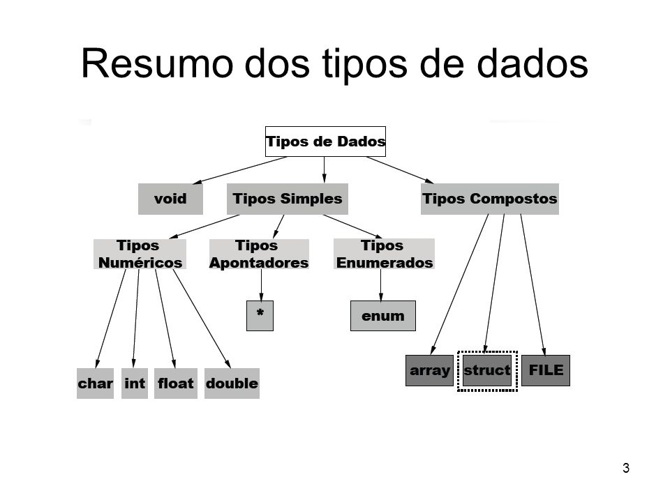
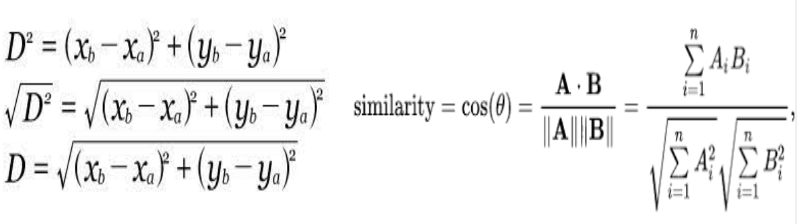

# **LÓGICA DE PROGRAMAÇÃO**

1. ## **PSEUDOCÓDIGOS**

* Pseudocódigo é um método de descrever um processo ou escrever código de programação e algoritmos usando uma linguagem natural \[português, inglês, etc\].  
* Descrição/passo a passo do código em si.  
* Não segue uma estrutura e sintaxe rígidos.  
* É um método GENÉRICO de escrever um algoritmo.  
* **Principais comandos \-** escreva(“”); leia(); início; fimAlgoritmo; var; \+-\< \>; real; \<-;  
* **Tipos de variáveis em um pseudocódigo \-** Numéricas \[Inteiras ou reais\], Caracteres, Lógicas \[Armazenam somente dados lógicos que podem ser Verdadeiro ou Falso ou 0 e 1\].

2. ## **ALGORITMOS**

* Um algoritmo é um procedimento para resolver um problema.   
  * Em outras palavras, é uma sequência de passos para resolver um determinado problema.   
  * Pode conter sequências, iterações, seleção, etc.  
* Em programação, trata-se de uma sequência de passos que o computador compreende, por meio de uma linguagem de programação. Eles são usados para otimizar processos e resolver problemas complexos.  
* Este algoritmo depois de gerado, pode ser usado para mais de uma linguagem de programação, mas não pode mudar sua identidade.  
* Trata-se da estrutura principal da ciência da computação e programação.  
  * É composto por três elementos principais: entrada, processamento e saída.  
  * Lógica; Sequência; Organização  
* Um algoritmo é a ***representação*** de uma solução para um problema;   
  * A lógica de programação é a ***habilidade*** de construir algoritmos eficientes e bem estruturados.

3. ## **ESTRUTURAS BÁSICAS**

1. ### **Variáveis**

* **Variáveis:** nome de valores que podem mudar (numbers ou strings).  
* Estes valores são manipulados pelos programas durante a sua operação.  
* **Diferentes tipos de variáveis nas linguagens de programação**  
* *int*: definem números inteiros, positivos ou negativos  
* *float*: armazena números reais com até duas casas decimais.  
* *double*: armazenam números reais, com ponto flutuante, mas tem o dobro de precisão em relação à float \[dobro da capacidade\].  
* *char*: armazena um único caractere. O software lê como uma letra, então não pode ser utilizado em operações matemáticas.  
* *string*: armazenam valores de tipo texto.  
* *boolean*: interpretam valores por meio de verdadeiro ou falso \[1 ou 0\]. 

2. ### **Constantes**

* **Constantes:** não podem ser alteradas, uma vez atribuídas com algum valor. É possível criá-las com *const*  
* São espaços reservados na memória onde armazenamos uma informação dentro do nosso código.  
* Utilizar sempre nomes intuitivos e valores literais.  
* **Diferentes tipos de constantes na programação \-**   
* *inteira*: definem valores inteiros \[longos, octais, hexadecimais, etc\]  
* *float*: armazena valores reais.  
* *char*: armazena um único caractere. O software lê como uma letra, então não pode ser utilizado em operações matemáticas.  
* *string*: armazenam cadeiras de valores de tipo texto.  
* *boolean*: interpretam valores por meio de verdadeiro ou falso \[1 ou 0\]. 

3. ### **Funções**

* They are reusable blocks of code that you can write once and run again and again, saving the need to keep repeating code all the time.  
* **Functions declaration \-** function name (parâmetros opcionais){}  
- É possível declarar outras funções dentro de funções.  
- Para chamá-las, é necessário usar o nome dela \+ ()  
* **Functions expression \-** const XXXX \= function(){}  
- É com as funções de declaração, mas tem como diferença estar sendo atribuída para uma variável, onde não definimos o **nome da função** e sim o **nome da variável** que irá referenciar a mesma.  
* **Arrow Functions \-** const numeroAleatorio \= () \=\> Math.random()  
- Elas permitem a criação de funções de maneira resumida, menos verbosas. São simplificações das functions expressions.  
* **Functions constructor**  
- São declaradas com o nome maiúsculo, e criam um objeto. Para serem chamadas, elas diferem das outras.  
* **Generator Functions** \- function\* ola(parâmetros opcionais) {}  
- A diferença está na adição do \*  
- A execução desta função não pode ser controlada, mas pode ser interrompida durante a invocação, por meio do comando *yield*.

4. ## **TIPOS DE DADOS**

* **int \[integers\]**: definem números inteiros, positivos ou negativos  
* Usados para contar quantidades.  
* **float**: armazena números reais com até duas casas decimais.  
* **double**: armazenam números reais, com ponto flutuante, mas tem o dobro de precisão em relação à float \[dobro da capacidade\].  
* **char**: armazena um único caractere. O software lê como uma letra, então não pode ser utilizado em operações matemáticas.  
* Representam caracteres alfabéticos ou símbolos especiais,  
* **string**: armazenam valores de tipo texto.  
* Cada caractere dentro de uma string é armazenado como um character separado na memória.  
* **boolean**: interpretam valores por meio de verdadeiro ou falso \[1 ou 0\].  
* Representar condições.  
* **arrays:** usados para armazenar uma coleção de valores do mesmo tipo.   
* Eles podem ser unidimensionais (uma única linha de valores) ou multidimensionais (matrizes de valores organizados em várias dimensões). 

****

5. ## **OPERADORES**

* Operadores são comandos que aplicamos as expressões que escrevemos em nossos programas para executar uma ação.  
* **Operadores matemáticos \-**   
* Soma (+)  
* Subtração (-)  
* Multiplicação (\*)  
* Divisão (/)  
* Resto (%)  
* **Operadores de comparação \-** Analisam dois itens e retornam um valor 1 ou 0 (os booleans) caso a comparação seja atendida ou não.  
* ***Relacionais***  
- Maior que (\>) || Menor que (\<)  
- Maior ou igual (\>=) || Menor ou igual (\<=)  
* ***Igualdade***  
- Valor igual a (==)  
- Valor igual e de mesmo tipo (===)  
- Valor diferente (\!=)  
- Valor diferente e do mesmo tipo (\!==)  
* **Operadores condicionais \-**   
* *If, else if, else*  
* *switch, case, default:* Situação em que existem muitos ifs e else ifs  
- Testa o valor contido em uma variável, realizando uma comparação com cada uma das opções.   
- Cada uma dessas possíveis opções é delimitada pela instrução case.  
* **Operadores lógicos \-** são utilizados em conjunto com os operadores condicionais.  
* Or (||): sempre retorna a condição verdadeira se ALGUMA das premissas o for.  
* And (&&): apenas retorna true se TODAS as premissas forem verdadeiras.  
* No (\!): inverte o valor boolean ao qual for atribuído.  
- Se recebermos um true e utilizar o operador \!\!, então esse true vira um false e vice-versa.

6. ## **ESTRUTURAS DE REPETIÇÃO**

* São utilizadas para executar repetidamente uma instrução ou bloco de instrução enquanto determinada condição estiver sendo satisfeita  
* **As principais estruturas de repetição \-**   
* *for(*variável de controle, análise da variável de controle, incremento da variável de controle*){}*  
- Seu ciclo será executado por um tempo ou condição pré-determinados e em uma quantidade de vezes que determinamos.  
* *while(*condição*){}*  
- Utilizamos o while quando não sabemos exatamente quantas vezes o código será repetido.

7. ## **Curso 1 \- JavaScript e HTML: desenvolva um jogo e pratique lógica de programação**

* O problema do HTML é que ele é estático, não é dinâmico.  
* A tag \<script\>\</script\> serve para programar JS inline no html   
* *string* é um nome muito comum para dados do tipo TEXTO  
* Uma convenção muito utilizada é criar arquivos com letras minúsculas e se houver mais de uma palavra usamos um "\_" como separador; não é costume utilizar acentuação  
* Um *alert();* precisa receber um parâmetro dentro das chaves, que são as instruções.   
* Se esse parâmetro for uma string (TIPO texto), é necessário aspas.  
* Para escrever um comando HTML no “mundo JavaScript”, é necessário utilizar o comando *document.write();*  
* A vantagem é que com document.write podemos passar as coisas de maneira dinâmica, já que o mundo HTML não é capaz de realizar operações matemáticas.  
* Podemos transformar o ano \[2016\] em uma variável, para acompanhar a passagem do tempo:

*var* ano \= 2016 → \[variável ano *recebe* 2016\].

* Você só utiliza var quando está declarando a variável pela PRIMEIRA VEZ;   
* Para reatribuir o valor da variável, é só mudá-la sem o var  
* Atribuir variáveis é também uma questão de melhorar a legibilidade do código.  
* No JS, basta você criar uma função com () para ela ser chamada; não é sempre que existem parâmetros dentro do ().  
* A função é sempre um verbo, uma ação que será executada. Os comandos são passados dentro das chaves da função.  
* Uma função fica “guardada”, e seus comandos só são executados quando ela é chamada, a partir do ().  
* Nos casos de uma função que recebe parâmetros, estes parâmetros agem como se fossem **variáveis**.   
- Dentro das chaves de uma função, ela pode executar outras funções.  
- Quando uma função TEM um parâmetro dentro dela, e você a chama com () vazio, dá erro *undefined*.  
* Em funções que recebem dois parâmetros, é necessário especificar qual vai ser a ORDEM dos parâmetros que estão sendo passados.  
* **Retorno de funções \-**   
  var imcAnna \= calculaImc(75, 1.69) → aqui, estou dizendo que a variável imcAnna RECEBE como retorno o resultado do cálculo IMC.   
* Para isso funcionar, ao chamar a função mostra(imcAnna), a função de cálculo precisa ter um RETURN \[ter sido chamado o retorno\].  
* Tudo o que está dentro da função só existe dentro da função, a não ser que se escreva um return fora da função.

* A função prompt do JS sempre retorna o que foi escrito como uma STRING.   
* Para conseguir converter esse valor para um número, é necessário utilizar uma função que já é do JS \- *parseInt();*  
- Ele sempre arredonda o número para um inteiro.  
* Para que as casas decimais sejam mantidas, usamos o método *parseFloat();*  
* **Estruturas de repetição \-** while, for  
- Para saber se um valor é NaN \[Not a Number\] precisamos usar uma função específica, a *isNaN().* Essa função recebe um parâmetro e retorna true ou false caso o valor seja NaN ou não.  
* O comando *break;* quebra os looping de repetição, caso a instrução já tenha sido concluída.  
* A *tag*  HTML \<input\>\<input\> cria um campo para o usuário digitar.   
* Quando se trata de funções, escrever *verificaInput()* significa CHAMAR/EXECUTAR a função,  
* Escrever apenas *verificaInput* significa ACESSAR o código da função.  
* A *tag*  HTML \<button\>\</button\> abre um botão.  
* No JS, o *document.querySelector*(“”) pega uma variável que está em HTML e executa ela em JavaScript.  
* Para uma variável que guarda uma LISTA de valores, utilizamos o comando *array\[\]*  
* Para criar um array é preciso utilizar o \[\]  
  var segredo \= \[\];  
* O conteúdo de um array sempre estará entre vírgulas:  
  var segredos \= \[5,6,7,8\];  
* **Documentação \-** canvas 2d api  
* Para desenhar **várias** vezes a mesma estrutura, com *alguns* componentes diferentes, é possível criar uma *função genérica*.  
  * Quando queremos passar uma função como parâmetro para outra, precisamos omitir seus parênteses (), chamamos isso de *callback* em programação

8. ## **Aditya Y. Bhargava \- Entendendo Algoritmos**

1. ### **Introdução a algoritmos \[19 \- 38\]**

* Um algoritmo é um conjunto de instruções, que realizam uma tarefa.  
  * Para uma boa compreensão de algoritmos, é necessário um bom conhecimento sobre álgebra básica.  
* **Pesquisa binária \-** Trata-se de um algoritmo de solução para um problema de busca.  
  * Tem sempre como entrada uma lista ORDENADA de elementos.   
    - Se o elemento estiver na lista, a pesquisa binária retorna a sua localização.  
  * Uma pesquisa binária é diferente de uma pesquisa simples, pois a pesquisa simples passa por TODOS os elementos da lista \[a cada tentativa, você está eliminando apenas um número\].   
    - A pesquisa binária elimina METADE das opções a cada tentativa ao chutar um número intermediário. Em resumo, ***para uma lista de n números, a pesquisa binária precisa de log2 npara retornar o valor correto, enquanto a pesquisa simples precisa de n etapas.***  
* **Tempo de execução e notação Big O \-** diferenças entre o tempo *linear* e o tempo *logarítmico*   
  * A notação Big O diz o quão rápido é um algoritmo; é importante que, na escolha dos algoritmos, este seja tanto rápido quanto correto.  
  * Quando falamos de notação Big O e ***logaritmos***, sempre se considera que log se refere à  log2.  
  * O tempo de execução da pesquisa simples e da pesquisa binária cresce com taxas diferentes.   
    - Ou seja, você precisa saber se o tempo de execução aumenta conforme a lista aumenta, e é aí que a notação Big O entra.  
    - Ela permite que você compare o *número de operações* para a pior das hipóteses, sendo importante, também, considerar o tempo de execução para o caso médio.  
  * Cinco tipos de tempos de execução mais comuns: O (log n), O (n), O (n \* log n), O (n²), O (n\!)

2. ### **Ordenação por seleção \[39 \- 55\]**

* O computador se parece com um grande conjunto de gavetas, e cada gaveta tem o seu endereço: *slots* na memória.  
* **Duas formas de armazenamento de múltiplos items \-**   
1) ***Arrays***  
* Usar um array significa que todos os seus itens são armazenados contiguamente na memória.  
* A leitura deste é mais rápida: O(1).  
* A inserção de um item é lenta: O(n).   
* A eliminação é lenta, também: O(n)  
* Os elementos em um array são numerados por meio do *index*.  
* Para inserir algo no meio da lista, é necessário mover todos os itens que estão abaixo do endereço de inserção.  
* No quesito das eliminações, as arrays acessam os elementos de maneira aleatória.  
* Todos os elementos de um array devem ser do mesmo tipo.  
2) ***Listas.***  
* Armazena os itens de maneira aleatória na memória do computador, e cada item contém o endereço do próximo item.  
* A leitura deste é mais lenta: O(n).  
* A inserção deste é mais rápida, por causa dos endereços aleatórios: O(1).   
* A eliminação também é rápida: (1).  
* Para inserir algo no meio da lista, é necessário mudar o endereço para o qual o elemento anterior está apontando.  
* No quesito das eliminações, as listas acessam os elementos de maneira sequencial.  
* **Ordenação por seleção O(n²)-** trata-se de um algoritmo bom, mas não é muito rápido. Tem como alternativa o *Quicksort.*

3. ### **Recursão \[56 \- 68\]**

* **Conceito \-** Quando uma função chama a si mesma.  
  * Analogia das caixas.  
  * É usada para tornar a resposta mais clara, e não existe benefício quanto ao desempenho.  
* **Caso-base e caso recursivo \-** É muito fácil escrever uma função recursiva que termina em um loop infinito.  
  * Esse é o motivo de existirem duas partes desta: o caso recursivo é quando a função chama a si mesma,   
  * O caso-base é a “condição”, quando a função não chama a si mesma novamente.  
* **A pilha de chamada \-** Quando você insere (push) um item, ele é colocado no topo da lista, e quando você remove um item (pop) ele é retirado do topo também,  
  * Trata-se de uma estrutura de dados simples.  
  * A memória do computador funciona como uma pilha de chamada: cada vez que você faz uma chamada de função, o computador salva na memória os valores para todas as variáveis, como se fossem caixas.  
  * Quando você chama uma função a partir de outra, a chamada de função fica pausada em um estado **parcialmente completo**.  
* **A pilha de chamada com recursão \-** As funções recursivas também utilizam a pilha de chamada.  
  * Usar a pilha é bom, mas existe um custo: salvar toda essa informação pode ocupar muita memória.

4. ### **Quicksort \[69 \- 90\]**

* Um algoritmo que consegue resolver apenas um tipo de problema não é muito útil.  
  * O algoritmo quicksort é muito mais rápido que o algoritmo por seleção do capítulo 2\.  
* **Divide and Conquer \-** São algoritmos recursivos, ou seja, para a resolução de um problema, é necessário seguir os seguintes passos:  
1. Descubra o caso-base, que deve ser o caso mais simples possível.  
2. Divida ou diminua o seu problema até que ele se torne o caso-base.  
   * O algoritmo DC trata-se de uma *maneira* de pensar sobre um problema, não apenas um algoritmo para UM problema.  
   * Lembrar que a recursão possui memória dos estados anteriores.  
   * Algumas linguagens de programação não possuem loops, como a programação funcional.  
* **Quicksort \-** trata-se de um algoritmo de ordenação de arrays.   
  * O caso-base do quicksort consegue ordenar arrays de dois elementos e também arrays vazios.   
  * Para arrays maiores que isso, é necessário encontrar/especificar um elemento pivô do array.   
  * Os passos estão abaixo:  
1. Encontre um pivô  
2. Particione o array em dois subarrays, separando-se entre elementos menores do que o pivô e elementos maiores do que o pivô.  
3. Execute o quicksort recursivamente em ambos os subarrays.  
* **Notação Big O revisada \-** o Quicksort é único porque a sua velocidade depende do pivô escolhido.   
  * Você pode obter o melhor caso de forma consistente, contanto que você sempre escolha um elemento aleatório como o pivô.  
  * No pior caso, ele possui tempo O (n²); no caso médio, possui tempo O (n \* log n).  
  * É importante lembrar que a prática e a teoria da notação Big O são diferentes, e podemos observar isso por meio do Merge Sort x QuickSort.

5. ### **Tabelas Hash \[91 \- 113\]**

* Pesquisa simples O(n); pesquisa binária O(log n).  
* Uma **função hash** é aquela em que você insere uma string e, depois disso, a função retorna um número ⇒ Mapeamento de strings e as relaciona a números O(1).  
  * Mapeia consistentemente um nome para o mesmo índice.   
  * Mapeia diferentes strings para diferentes índices.  
  * Tem o conhecimento sobre o tamanho do seu array e retorna apenas índices válidos.  
  * Uma boa função hash: distribui os valores no array simetricamente.  
* Ao juntar uma função hash à um array, é criado uma estrutura de dados que se chama **Tabela Hash.**  
  * Uma tabela hash possui chaves e valores ⇒ Mapeia chaves e valores.  
  * As tabelas hash são ótimas opções quando:  
    - Você deseja mapear algum item com relação a outro \[1\];   
    - Você precisa pesquisar algo \[2\];   
    - Como cache \- os dados do *caching* são armazenados em uma tabela hash \[3\].  
  * É necessário evitar entradas duplicadas.  
* **Colisões \-** é o termo para quando duas chaves são indicadas para o mesmo espaço, e é um problema.  
  * Uma possível solução é iniciar uma lista encadeada neste espaço. Isso torna o tempo de resposta da pesquisa mais lento.  
  * Para evitar colisões, é necessário um baixo fator de carga (nº itens na T.H./nº total espaços).   
    - Para evitar crescimentos exagerados, é necessário realizar o redimensionamento.

|  | T. Hash \[c. m.\] | T. Hash \[p. c.\] | Arrays | L. Encadeadas |
| ----- | :---: | :---: | :---: | :---: |
| **Busca** | O(1) | O(n) | O(1) | O(n) |
| **Inserção** | O(1) | O(n) | O(n) | O(1) |
| **Remoção** | O(1) | O(n) | O(n) | O(1) |

6. ### **Pesquisa em largura \[115 \- 136\]**

* A pesquisa em largura permite encontrar o menor caminho entre dois objetos. O algoritmo que resolve problemas de caminho mínimo é a pesquisa em largura.  
  * **Grafos \-** um modelo de grafos é um conjunto de conexões. Cada grafo é constituído de vértices e arestas, e um vértice pode ser diretamente conectado a muitos outros vértices, por isso os chamamos de vizinhos.  
    - Você preferiria uma conexão de primeiro grau a uma de segundo grau, e uma de segundo grau a uma de terceiro, e aí por diante.  
    - É necessário pesquisar os elementos na ordem que eles foram adicionados, ou seja, por meio de filas.  
    - Existem dígrafos e grafos não direcionados.  
* **Tempo de execução \-** É, no mínimo, O (Vértices \+ Arestas).  
* **Filas \-** funcionam como filas na vida.   
  * Apenas possui duas operações: enqueue (enfileirar) e dequeue (desenfileirar).   
    - Também é possível encontrar os termos push e pop.  
  * Listas são uma estrutura de dados FIFO (First In, First Out). A pilha é uma estrutura de dados LIFO (Last In, First Out).  
* Uma estrutura de dados que permite expressar relações é uma tabela hash, portanto elas são importantes para a implementação dos grafos.  
  * Não importa em que ordem você adiciona os pares chave/valor.  
  * Importante se atentar para o fato de o elemento já ter sido verificado ou não, correndo o risco de recair em loop infinito.  
* Ordenação topológica, árvores.

7. ### **Algoritmo de Dijkstra \[137 \- 165\]**

* Ao invés de simplesmente encontrar o caminho mais curto entre dois pontos, será adicionado um “peso” a cada segmento do grafo (grafos ponderados).   
  * O algoritmo irá encontrar o menor peso total.  
  * **Quatro etapas \-**   
    - Encontre o vértice mais barato \[1\],   
    - Atualize o custo dos vizinhos desse vértice \[2\],   
    - Repita até que você tenha feito isso para cada vértice do grafo \[3\],   
    - Calcule o caminho final \[4\].  
  * Para um bom funcionamento, é bom construir uma tabela na qual, em uma coluna existem todos os vértices e, em uma segunda coluna “pai” ao lado.  
  * É possível que grafos contenham ciclos, e nestes casos, o algoritmo não irá funcionar.  
  * Também não é possível utilizar o algoritmo se houver arestas com pesos negativos (a alternativa seria o algoritmo Bellman-Ford).

8. ### **Algoritmos Gulosos \[166 \- 187\]**

* A cada etapa, deve-se escolher o movimento ideal.  
  * São simples de escrever e chegam muito perto da resolução perfeita.  
  * **Cobertura de conjuntos \-** Utilizar algoritmos de aproximação.  
  * União (A U B); intersecção (A ∩ B); diferença (A \- B)  
* **Problemas NP-completos \-** Problemas nos quais calcula-se todas as opções possíveis e escolhe-se a menor.   
  * Difíceis de resolver, como os do caixeiro viajante e o da cobertura de conjuntos.   
  * Não existe uma maneira 100% correta de descobrir quais problemas são NP-completos, mas existem alguns indicativos.

9. ### **Programação Dinâmica \[188 \- 214\]**

* Começa com a resolução de subproblemas e vai escalando-os até resolver o problema geral.  
  * Só funciona quando os seus subproblemas são discretos, ou seja, quando eles não são dependentes entre si.  
  * O valor das colunas nunca pode diminuir.  
  * A ordem das linhas não importa.  
  * Não é possível levar frações de um valor, é tudo ou nada.  
* Quando você tem espaços sobrando, é possível utilizar as respostas dos subproblemas para descobrir o que colocar no espaço livre.  
  * Não existe uma fórmula única para calcular uma solução em programação dinâmica.  
* **Maior substring comum \-** a programação dinâmica é útil quando você está tentando otimizar em relação a um limite.  
  * Toda solução envolve uma tabela.  
  * Os valores nas células são os que você está tentando otimizar.  
  * Cada célula é um subproblema.  
  * Neste caso, é necessário comparar substrings.

10. ### **K-Vizinhos mais próximos \[215 \- 230\]**

* É possível que, em alguns casos, seja necessário olhar para os vizinhos do que se está tentando classificar para poder realizar a classificação ou a regressão.  
  * Muito utilizado no sistema de recomendações.  
* **Como fazer para descobrir quão semelhantes dois usuários são?** É necessário medir a distância entre dois pontos, porque esta irá informar a similaridade entre os conjuntos medidos.   
  * Quanto mais avaliações \[pontos para medir a distância\], maior a precisão. Em casos específicos, é possível realizar a normalização de uma conta ou atribuir pesos diferentes a avaliações diferentes.  
  * Para tal, podemos utilizar tanto o teorema de Pitágoras quanto a similaridade de cosseno.

****

* **Regressão \-** quando você precisa adivinhar uma resposta, baseado em um número.  
* **Escolhendo boas características \-** São sempre as características diretamente correlacionadas e as características imparciais.   
  * Contudo, é sempre importante levar em consideração todos os diferentes contextos.  
* **Aprendizado de máquina \-** o k-vizinhos mais próximos é um ótimo algoritmo para o aprendizado de máquina.  
  * Pode ser útil para a criação de um filtro de spam.

11. ### **Próximos Passos \[231 \- 249\]**

* **Árvore Binária de Busca \-** Inserir um novo elemento diretamente no slot correto do array, sem haver a necessidade de reordenação do array \[contexto da pesquisa binária\].  
  * Tem como desvantagem o fato de que não é possível utilizar o acesso aleatório.

|  | ARRAY | ÁRV. BUSCA BINÁRIA |
| :---: | :---: | :---: |
| **BUSCA** | O(log n) | O(log n) |
| **INSERÇÃO** | O(n) | O(log n) |
| **REMOÇÃO** | O(n) | O(log n) |

* **Índices Invertidos \-** Uma hash que mapeia palavras para lugares onde elas aparecem.  
* **A transformada de Fourier \-** “Dado uma música, a transformada de Fourier irá separá-la em frequências individuais.”  
* **Algoritmos Paralelos \-** Tratam da escalabilidade e da manipulação de uma grande quantidade de dados.  
  * Gerenciamento do paralelismo e balanceamento de carga.  
* **MapReduce \-** É um algoritmo distribuído do Apache Hadoop. Utiliza dois conceitos simples para executar consultas de dados em diversas máquinas.  
  * *Função map:* pega um array e aplica a mesma função para cada um dos itens.  
  * *Função reduce:* Reduz uma lista inteira para apenas um item.  
* **Filtro de Bloom \-** Resolve o problema de quando você possui um conjunto muito grande.  
  * São estruturas de dados probabilísticas que fornecem uma resposta que pode estar errada, mas que provavelmente estará correta.  
  * São bons pois ocupam pouco espaço, diferente de uma hash muito grande.  
* **HyperLogLog \-** Assim como o de cima, resolve o problema de quando você possui um conjunto muito grande.  
  * Aproxima o número de elementos únicos em um conjunto.  
* **Algoritmos SHA \[Secure Hash Algorithm\] \-** Dada uma string, o SHA retorna uma hash para esta string, ou seja, faz uma ligação string-string.  
  * Isto é diferente de uma função hash, que faz uma ligação string-índice de arrays.   
* **Hash Sensitivo Local \-** O algoritmo SHA é localmente insensitivo, diferentemente da Simhash.  
  * Caso você faça uma pequena mudança na string, o Simhash criará uma hash que é apenas *levemente* diferente.  
* **Troca de Chaves de Diffie-Hellman \-** resolve o problema de encriptação de mensagens.  
  * A troca de chaves contém duas chaves: uma chave pública e uma chave privada.  
  * Uma mensagem encriptada \[com uma chave pública\] apenas pode ser decodificada com uma chave privada.  
* **Programação linear \-** Usada para maximizar algo em relação a um limite.

12. ### **Apêndice dos Códigos dos algoritmos utilizados**

1. #### *Binary Search Algorithm JavaScript*

function binary\_search(list, item) {  
    let low \= 0;  
    let high \= list.length \- 1;  
   
    while (low \<= high) {  
      const mid \= Math.floor((low \+ high) / 2);  
      const guess \= list\[mid\];  
   
      if (guess \=== item) {  
        return mid;  
      } else if (guess \> item) {  
        high \= mid \- 1;  
      } else {  
        low \= mid \+ 1;  
      }  
    }  
   
    return null;  
  }

2. #### *Selection Sort Algorithm JAVA*

   import java.util.Arrays;  
   public class SelectionSort2 {  
       public static void selectionSort(int\[\] arr) {  
           for (int i \= 0; i \< arr.length\-1; i\++) {  
               for (int j \= i\+1; j \< arr.length; j\++) {  
                   if (arr\[j\] \< arr\[i\]) {  
                       int temp \= arr\[i\];  
                       arr\[i\] \= arr\[j\];  
                       arr\[j\] \= temp;  
                   }  
               }  
           }  
       }  
       public static void main(String\[\] args) {  
           int\[\] arr \= {5, 3, 6, 2, 10};  
           *selectionSort*(arr);  
           System.***out***.println(Arrays.*toString*(arr));  
       }  
   }

#### 

3. #### *Quicksort Algorithm JAVA*

   import java.util.\*;  
   public class Quicksort {  
       public static void main(String\[\] args) {  
           System.***out***.println(*quicksort*(Arrays.*asList*(10, 5, 2, 3))); // \[2, 3, 5, 10\]  
       }  
       private static List\<Integer\> quicksort(List\<Integer\> list) {  
           if (list.size() \< 2) {  
               // base case, arrays with 0 or 1 already "sorted"  
               return list;  
           } else {  
              // recursive case  
               Integer pivot \= list.get(0);  
             // sub-array of all the elements less than the pivot  
               List\<Integer\> less \=  
   		    list.stream().skip(1).filter(el \-\> el \<= pivot)  
                              .collect(Collectors.toList());  
            // sub-array of elements greater than the pivot  
          List\<Integer\> greater \=  
            list.stream().skip(1).filter(el \-\> el \> pivot)  
                              .collect(Collectors.toList());  
               return Stream.of(  
                    *quicksort*(less).stream(),  
                    Stream.of(pivot),  
                    *quicksort*(greater).stream())                   
                    .flatMap(Function.identity())  
                    .collect(Collectors.toList());  
           }  
       }  
   }

4. #### *Hash Tables Algorithm JavaScript*

const HashTable \= function(obj) {  
  let length \= 0;  
  this.\_items \= (function(obj) {  
    let items \= {};  
    for (let p in obj) {  
      items\[p\] \= obj\[p\];  
      length\++;  
    }  
    return items;  
  })(obj);

#### 

5. #### *Breadth-first Search Algorithm JAVA*

   import java.util.\*;  
   public class BreadthFirstSearch {  
       private static Map\<String, List\<String\>\> *graph* \= new HashMap\<\>();  
       private static boolean search(String name) {  
           Queue\<String\> searchQueue \= new ArrayDeque\<\>(*graph*.get(name));  
           // This list is how you keep track of which people you've searched before.  
           List\<String\> searched \= new ArrayList\<\>();  
           while (\!searchQueue.isEmpty()) {  
               String person \= searchQueue.poll();  
               // Only search this person if you haven't already searched them  
               if (\!searched.contains(person)) {  
                   if (*person\_is\_seller*(person)) {  
                       System.*out*.println(person \+ " is a mango seller\!");  
                       return true;  
                   } else {  
                       searchQueue.addAll(*graph*.get(person));  
                       // Marks this person as searched  
                       searched.add(person);  
                   }  
               }  
           }  
           return false;  
       }  
       private static boolean person\_is\_seller(String name) {  
           return name.endsWith("m");  
       }  
       public static void main(String\[\] args) {  
           *graph*.put("you", Arrays.*asList*("alice", "bob", "claire"));  
           *graph*.put("bob", Arrays.*asList*("anuj", "peggy"));  
           *graph*.put("alice", Arrays.*asList*("peggy"));  
           *graph*.put("claire", Arrays.*asList*("thom", "jonny"));  
           *graph*.put("anuj", Collections.*emptyList*());  
           *graph*.put("peggy", Collections.*emptyList*());  
           *graph*.put("thom", Collections.*emptyList*());  
           *graph*.put("jonny", Collections.*emptyList*());  
           *search*("you");  
       }  
   }

6. #### *Dijkstra's Algorithm JAVA*

   public class DijkstrasAlgorithm {  
   private static Map\<String, Map\<String, Double\>\> *graph* \=  
       new HashMap\<\>();  
   private static List\<String\> *processed* \= new ArrayList\<\>();  
   private static String findLowestCostNode( Map\<String,  
   Double\> costs) {  
   Double lowestCost \= Double.*POSITIVE\_INFINITY*;  
           String lowestCostNode \= null;  
           // Go through each node  
           for (Map.Entry\<String, Double\> node : costs.entrySet()) {  
   Double cost \= node.getValue();  
   if (cost \< lowestCost &&  
       \!*processed*.contains(node.getKey())) {  
   lowestCost \= cost;  
   lowestCostNode \= node.getKey();  
               }  
           }  
           return lowestCostNode;  
       }  
       public static void main(String\[\] args) {  
           *graph*.put("start", new HashMap\<\>());  
           *graph*.get("start").put("a", 6.0);  
           *graph*.get("start").put("b", 2.0);  
           *graph*.put("a", new HashMap\<\>());  
           *graph*.get("a").put("fin", 1.0);  
           *graph*.put("b", new HashMap\<\>());  
           *graph*.get("b").put("a", 3.0);  
           *graph*.get("b").put("fin", 5.0);  
           *graph*.put("fin", new HashMap\<\>());  
           // The costs table  
           Map\<String, Double\> costs \= new HashMap\<\>();  
           costs.put("a", 6.0);  
           costs.put("b", 2.0);  
           costs.put("fin", Double.*POSITIVE\_INFINITY*);  
           // the parents table  
           Map\<String, String\> parents \= new HashMap\<\>();  
           parents.put("a", "start");  
           parents.put("b", "start");  
           parents.put("fin", null);  
           String node \= *findLowestCostNode*(costs);  
           while (node \!= null) {  
   Double cost \= costs.get(node);  
                Map\<String, Double\> neighbors \= *graph*.get(node);  
               for (String n : neighbors.keySet()) {  
                   double newCost \= cost \+ neighbors.get(n);  
                   if (costs.get(n) \> newCost) {  
                       costs.put(n, newCost);  
                       parents.put(n, node);  
                    }  
                }  
               *processed*.add(node);  
               node \= *findLowestCostNode*(costs);  
           }  
           System.*out*.println("Cost from the start to each node:");  
           System.*out*.println(costs); // { a: 5, b: 2, fin: 6 }  
       }  
   }

### 