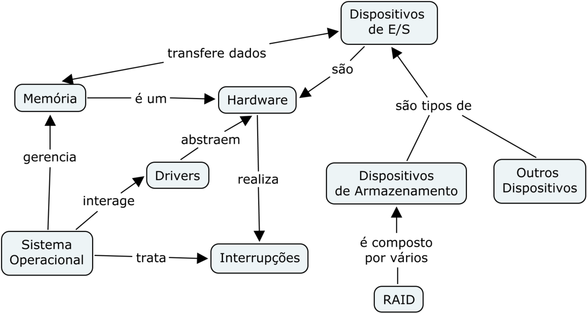
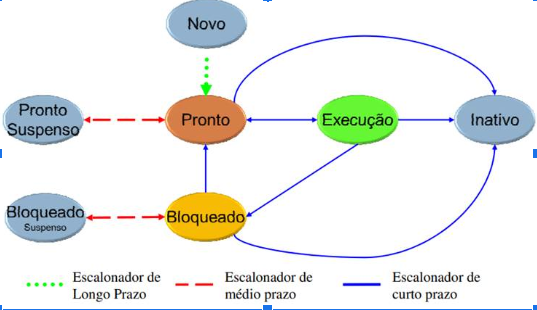
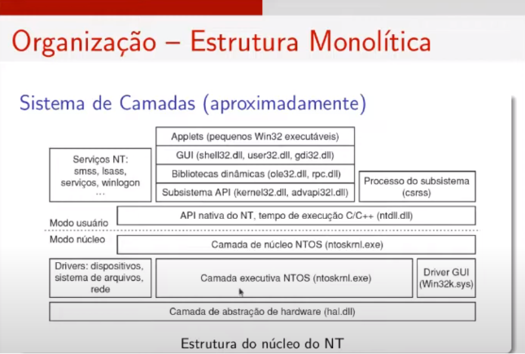
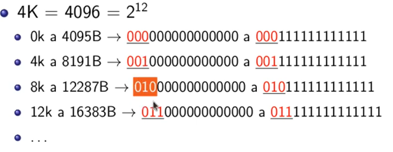

1. **AULA 1 \- CONCEITOS BÁSICOS**  
* **Sistema computacional \-** possui um ou mais computadores, memória principal, discos/impressoras/teclado/etc.  
  * Os programas precisam saber lidar com todos estes elementos.  
  * A necessidade de terceirização desta parte de gerenciamento foi o motivo pelo qual o S.O. surgiu.  
* **O sistema com S.O. \-** Possui maior racionalidade, maior dedicação aos problemas de alto nível e maior portabilidade.  
* **Máquina multinível \-**   
  * Base, com os dispositivos físicos, que possuem uma microarquitetura \[escrita em código de máquina\],   
  * O S.O. está logo acima desta.  
* **Definição de Sistema operacional \-** Programa, ou conjunto de programas, interrelacionados, cuja finalidade é agir como  
  * \[1\] intermediário entre o usuário e o hardware;   
  * \[2\] gerenciador de recursos.  
  * A ideia do S.O. é isolar o seu programa do hardware.  
  * ***Vantagens que o S.O. apresenta:*** máquina mais flexível;   
    - Uso eficiente e controlado dos componentes de hardware;   
    - Uso compartilhado e protegido dos diversos componentes de hardware e software.  
  * ***Funções:*** fornecer uma interface aos programas do usuário.  
  * ***Interação:*** por meio de maneira direta \[linguagem de comandos\]; ou por meio de interface textual; ou por interface gráfica (GUI).  
    - Os programas de usuário invocam os serviços de S.O. por meio das chamadas ao sistema operacional.  
  * ***Processamento:*** pode processar por meio da forma   
    - Serial \[recursos alocados a um único programa\], ou  
    - Concorrente \[recursos dinamicamente associados entre uma coleção de programas em diferentes estágios\].  
* **Memória \-** vários níveis \[RAM, Disco rígido, Fita magnética/disco óptico\].  
  * Cabe ao S.O. abstrair a hierarquia de memória em um modelo útil e, então, gerenciá-la.  
  * Registradores são um modo de você se comunicar com o hardware;  
  * Cache funciona de forma a, quando um endereço de memória é buscado, os vizinhos são trazidos para o cache também, alguns programas \[matriz\] podem usar isto a seu favor.  
    - No cache \- C, a maneira que a CACHE armazena os chaveamentos enfileirados gera menos idas à RAM, e armazena mais na cache.  
* *Boot-up → BIOS → POST*  
  * Assim que ligado, o processador roda a BIOS \[cegamente\]  
* **Dispositivos de E/S \-** o controle é feito por meio de uma interface/Driver.  
  * O S.O. manipula as controladoras, via driver.  
  * ***Software:*** diferentes controladoras e diferentes sistemas operacionais utilizam diferentes drivers.

****

2. **AULA 2 \- TIPOS E ESTRUTURA DE UM SISTEMA OPERACIONAL**  
* A maneira de agrupar depende do critério utilizado.  
* **Quanto ao compartilhamento do Hardware \-**   
1. ***Monoprogramado \[DOS\]***  
* Todos os recursos da máquina (processador, memória, etc) estão dedicados a uma tarefa só, ou seja, faz com que os recursos sejam mal utilizados.  
* \[1\] Carga do código na memória → \[2\] Carga dos dados na memória → \[3\] Processamento, consumindo dados e produzindo resultados → \[4\] Ao término da execução, a descarga dos resultados no disco  
2. ***Multiprogramado \[UNIX, VMS, Windows\]***  
* Produz a ilusão de paralelismo (pseudoparalelismo).  
* Demanda mecanismos de trocas rápidas de processos.  
* Vários programas compartilham os recursos do sistema.  
* As tarefas existem em um dos seguintes estados: 

****

* Quando dois ou mais processos estão simultaneamente no estado “pronto”, eles “competem” pela utilização da CPU  
* ***Escalonamento \-*** Quando cabe ao S.O. escolher qual dos dois processos irá utilizar.  
  * Surtos de uso da CPU.  
  * A ideia do multitarefa é criar um balanceamento entre processos CPU-bound e I/O-bound.  
  * O S.O. entrega o controle para o aplicativo de sua escolha, que então é executado.  
  * O Aplicativo pode ser interrompido quando:   
    - O serviço é terminado,   
    - É detectado algum tipo de erro,   
    - É requisitada uma operação I/O,   
    - Termina o tempo alocado a ele  
  * Toda entrada e saída é feita por meio de chamadas ao sistema.  
* ***Classificações de interação com o usuário \-***   
1. ***Sistemas em Batch:*** consistia de submeter ao computador um lote de programas {jobs} de uma só vez, por meio de uma fita magnética.  
* Os jobs dos usuários são submetidos em ordem sequencial para a execução, e não existe interação entre o job e o usuário durante a sua execução.  
* Os scripts .batch do linux são espécies de batch.  
2. ***Sistemas de Tempo Compartilhado:*** o sistema permite que os usuários interajam com suas computações   
* Pode usar conceitos de multiprogramação ou time-sharing.  
3. ***Sistemas de Tempo Real:*** servem aplicações que atendem processos externos, e que possuem tempos de respostas limitados.   
* Divide-se em Sistema de tempo real crítico (Hard Real Time) e Sistema de tempo real não crítico (Soft Real Time).  
* Sinais de interrupções comandam a atenção do sistema.  
* Tempo trata-se de um fator crítico.  
* ***Estruturas de Permissão de Hardware \-*** Modo usuário não tem acesso ao conjunto inteiro de instruções da máquina.  
  * Modo núcleo (kernel) contém todo o conjunto de instruções da máquina. S.O. possui, então, acesso às instruções privilegiadas.   
  * Hardware ajudando o software a ser mais seguro.  
* ***Organização Interna \-***   
1. ***Monolítica:*** escrito como uma coleção de procedimentos; todos os procedimentos são visíveis uns aos outros; o S.O inteiro trabalha no espaço de núcleo.  
* O desempenho é muito bom, mas é de difícil manutenção.  
* Sistema de camadas foi uma maneira de tentar organizar os monólitos.  
  - Tem como princípios modularizações e “Informação Escondida”.

2. ***Micro-núcleo:*** Busca tornar o S.O. o menor possível.   
* Tudo são serviços que rodam em modo usuário.  
* O MicroKernel incorpora somente as funções de baixo nível mais vitais.  
* Melhor confiabilidade e escalabilidade.  
* Grande complexidade para implementação e baixo desempenho.  
3. ***Máquina virtual:*** você possui o Hardware, e então o gerenciador da máquina virtual (não é exatamente um S.O. da maneira que conhecemos).  
* Pode rodar diferentes S.O.s em máquinas diferentes.  
* Oferece uma cópia virtual do hardware para o Sistema Operacional.  
* Muito utilizado em nuvem.  
* Cria isolamento total de cada Virtual Machine; Grande complexidade.  
4. ***Cliente-servidor:*** implementa o máximo do S.O. como processos de usuários.  
     
   

3. **AULA 3 \- CHAMADAS AO SISTEMA E INTERRUPÇÕES**  
* **Chamadas TRAP \-** programa faz chamadas ao sistema por meio de instruções especiais.  
  * Elas transferem o controle para o S.O. \[Interrupção de software ou exceção\].  
  * Após terminadas, o S.O. transfere o controle para a instrução seguinte à chamada.  
  * Cada trap tem um número, e este realiza um chaveamento.  
    - \[1\] Aplicativo faz chamada ao sistema TRAP → \[2\] Através de uma tabela, o S.O. determina o endereço da rotina de serviço → \[3\] Rotina de serviço é acionada → \[4\] Serviço solicitado é executado e o controle retorna ao programa aplicativo.  
  * A rotina de serviço salva somente os registrados que irá modificar. O local que isso será salvo depende do hardware.  
  * *Exemplo:* read(fd, buffer, nbytes)  
    - 1-3 O programa armazena os parâmetros;   
    - 4- chama o procedimento read da biblioteca;   
    - 5 \- read coloca o número da chamada do so em um registrador específico;   
    - 6 \- read executa uma instrução trap;   
    - 7 \- o kernel busca os parâmetros, verificando o número da chamada ao SO e chamando o procedimento para seu tratamento;   
    - 8 \- procedimento de tratamento da chamada é executado;   
    - 9 \- o controle pode retornar à instrução seguinte à TRAP;   
    - 10 \- Read então retorna ao programa do usuário;   
    - 11 \- o programa limpa a pilha após a chamada do procedimento.  
      1. Existem partes do S.O. que não foram mostradas nesta sequência \[interrupções no passo 9\]

* **Por que é necessário escrever uma chamada para sair da chamada?** O programa ainda detém tempo de CPU.  
1. ***Primeiro ciclo de clock:*** A instrução é buscada na memória; 4 bytes são somados ao pc e armazenados nele  
2. ***Segundo ciclo de clock:*** Nova instrução é buscada na memória, mas, se não deveria ter nada na memória, o que o registrador irá buscar?  
* Pode ser uma instrução que não deveria ser feita \[pouco provavél\], ou pode ser uma instrução desconhecida/ilegal.  
* Por conta disso, compiladores sempre incluem um exit() ao final do código compilado, se o programador não o fizer explicitamente.  
* **Interface das Chamadas ao Sistema (Wrappers) \-** Interface de programação fornecida pelo S.O., geralmente escrita em linguagem de alto nível.  
  - Mais utilizadas \- Win32 API; POSIX API; Java API.  
* **Interrupções \-** Como é possível que o escalonador interrompa um determinado processo se ele mesmo não está rodando?  
  * Porque isto ocorre via uma interrupção de hardware \[externo ao processador\].  
  * As causas são dispositivos de entrada e saída ou clocks.  
  * Isso significa que, de tempos em tempos, a CPU é interrompida, para causar o pseudoparalelismo.  
  * Quando o S.O. inicia, ele instala um tratador de interrupções em um endereço específico da memória, definida pelo hardware.  
  * Cria, também, um arranjo de interrupções.  
* **Interrupções X Traps \-** Evento externo ao processador; podem não estar relacionadas ao processo que está rodando \[interrupções\];  
  * Evento inesperado vindo de dentro do processador; causadas pelo processo corrente no processador \[traps\].  
* **Informação salva (temporariamente) pelo hardware antes de iniciar a rotina de serviços \-**   
  * No mínimo o contador de programa;  
  * Em último caso, todos os registradores gerais e alguns internos;  
  * ***Não há solução perfeita a respeito de onde rodar:*** pode ser nos registradores internos; na pilha do programa; na pilha Kernel.  
  * A cada ciclo de clock, o sinal de interrupção é exibido; nesta situação, a CPU:  
    - \[1\] verifica se existe interrupção, se não busca a próxima instrução  
    - \[2\] Se existir interrupção pendente, realiza uma série de passos.

4. **AULA 4 \- PROCESSOS E ESCALONAMENTO**  
* **Processo \-** Trata-se de um conceito central do S.O.  
  * Caracterizado por um programa em execução.  
  * É a forma pela qual o S.O. vê um programa e possibilita sua execução.  
  * **Diferença entre processo e programa \-** o programa é o código que foi escrito para rodar algo, e o processo se caracteriza por um, ou mais, programas, rodando continuamente até o seu fim.  
  * Processos em Primeiro Plano: Interagem com o usuário;  
  * Processos em Segundo Plano: Independem do usuário, *daemons.*  
  * Cada processo possui: programa; Espaço de endereçamento \[Texto, dados, pilhas de execução\]; Contextos de Hardware \[informações de registradores, ProgramCounter, ponteiro da pilha, registradores de uso geral, etc.\]; Contextos de Software \[variáveis, lista de arquivos, alarmes pendentes, processos relacionados\]  
  * Subrotinas e a Pilha de Execução  
  * Processos precisam ser criados e finalizados a todo momento: processos são criados por outros processos.  
    - Inicialização do sistema,  
    - Execução de uma chamada de sistema para criação de processos;  
    - Requisição de usuário para criar um novo processo  
    - Inicialização de um processo em batch  
    - Unix: Fork \[existe uma hierarquia\].

    i. Todos os processos são descendentes de init

    - Windows: CreateProcess \[todos os processos são iguais\]  
* Término normal; término por erro; término com erro fatal; término causado por algum outro processo.  
* ***Existem três estados dos processos:*** executando, finalizado, bloqueado.  
  * No LINUX, existe o estado zumbi, também.  
* ***Implementação de processos:*** todo controle de processos é feito por uma tabela, a tabela de processos  
  * O BCP só não guarda o conteúdo do espaço de endereçamento do processo.  
  * O S.O. atribui um identificador único PID ao processo; aloca uma entrada na tabela; aloca espaço p/ o processo na memória; etc.

5. **AULA 5 \- ESCALONAMENTO DE PROCESSOS I**  
* Mudança de contexto é quando há mudança de um processo para outro.  
  * Uma das preocupações do escalonador, neste caso, é a eficiência da CPU.  
  * Trata-se de uma tarefa cara.   
  * É necessário salvar as informações do processo que está deixando a CPU em seu BCP e, depois, carregar as informações do processo que será colocado na CPU.  
  * Uma mudança de contexto total é feita a cada vez que se interrompe a CPU (mesmo que parcialmente).  
  * *Interrupt handler* é importante nesta tarefa.  
  * Não existe resposta a respeito de qual seria a melhor maneira de fazer isso.  
* **Componentes envolvidos \-**   
  * ***Dispatcher (processo relativamente rápido):*** Armazena e recupera o contexto; Atualiza as informações no BCP.  
  * ***Scheduler (parte mais demorada):*** Escolhe a próxima tarefa.  
* **Situações nas quais o escalonamento é necessário \-** quando um processo é iniciado, termina ou é bloqueado.   
  * Ocorre, também, quando há uma interrupção de E/S.  
  * ***Preempção:*** quando um processo pode, por algum motivo, perder seu uso da CPU.  
  * Tempo de execução de um processo é imprevisível; e a decisão depende do algoritmo de escalonamento.

* **Algoritmos que existem \-** Existem os preemptivos ou os Não-Preemptivos (não precisa chamar o escalonador)  
  * ***Objetivos comuns a todos os sistemas:*** Fairness; balanceamento; cumprimento das políticas do sistema  
  * ***Categorias:***   
1. Sistemas em Batch \[lote\]: objetivos são vazão; tempo de espera e eficiência.  
- Conceito importante é o *Mean TurnAround Time* \[minimizar o tempo médio entre a entrada e término\]  
2. Sistemas Interativos: objetivos são tempo de resposta; proporcionalidade  
3. Sistemas em Tempo Real: objetivos são o cumprimento dos prazos e a previsibilidade.  
* **Algoritmos de Sistemas em Batch \-**   
1) First-Come First-Served (FIFO, não preemptivo))  
* Processos são executados na CPU seguindo a ordem de requisição.  
* A vantagem é a facilidade de entender e de programar.  
* As desvantagens é o fato de que não leva em conta a prioridade dos processos.  
2) Shortest Job First (SJF, não preemptivo)  
* Supõe que se sabe de antemão o tempo de execução de todos os processos, a maior desvantagem é essa.  
* Processos precisam estar disponíveis simultaneamente, o que pode ocasionar problemas.  
3) Shortest Remaining Time Next (SRTN, preemptivo)  
* O próximo processo a rodar é aquele que tiver menos tempo faltando para terminar.   
* Assim como o SJF, é necessário saber previamente os tempos dos processos.  
* Uma desvantagem é o fato de que os processos que consomem mais pode sofrer de starvation esperando.

6. **AULA 6 \- ESCALONAMENTO DE PROCESSOS II**  
* **Algoritmos de Sistemas Interativos (todos são preemptivos) \-**  
1) ***Round-robin:*** Mais antigo. Cada processo recebe uma fatia de tempo de execução chamado *quantum*, e são, então, colocados em uma fila circular.  
* Se o hardware do clock permitir a programação de tempo, o S.O. pode estabelecer um novo quantum para o novo processo. A interrupção do *clock* será gerada somente após esse tempo passar.  
* Se o hardware do clock NÃO permitir isso, o S.O. não tem controle sobre as interrupções do clock. O processo é escalonado e será interrompido quando vier a interrupção do clock.  
* Problemas são   
  - Tempo de chaveamento de contexto;   
  - Processos I/O bound são prejudicados.  
2) ***Prioridade:*** Cada processo possui uma prioridade, estas podem ser atribuídas estática ou dinamicamente.  
* Uma variação seria se vários processos tiverem a mesma prioridade.   
  - Uma possível solução seria a de classes de prioridades e, dentro de cada classe, utiliza-se o round-robin.  
* No Linux existem duas escalas e no Windows existem 6 classes.  
3) ***Múltiplas Filas (IBM 7094):*** Útil quando se tem pouca memória; define classes de prioridade.   
* Cada classe de prioridade terá um *quantum* diferente.  
* Processos na classe mais alta rodam um *quantum* (evoluindo com o dobro).  
* Isso reduz o número de trocas de processo \[poucos chaveamento de disco\].  
4) ***Shortest Process Next:*** Executa-se a tarefa mais curta primeiro.  
* Em processos interativos não é possível saber o tempo necessário para execução. Utiliza-se então uma ESTIMATIVA de tempo.  
5) ***Garantido:*** Garantias são dadas aos processos.  
6) ***Lottery:*** Cada processo recebe “bilhetes” que lhe dão direito a recursos do sistema \[inclusive processador\]. Mantém duas listas.  
7) ***Fair-share:*** O tempo de CPU é alocado ao usuário \[diferente dos outros processos\]; Extensão de um algoritmo garantido.

7. **AULA 7 \- ESCALONAMENTO E THREADS**  
* **Algoritmos de Sistemas em Tempo Real \-** precisa ser previsível e, para isso, o programa deve ter processos pequenos.  
  * Guiado a eventos/interrupções, que podem ser periódicos e periódicos.  
  * Os algoritmos também podem ser   
    - Estáticos, não tomam nenhuma decisão enquanto o sistema está rodando ou   
    - Dinâmicos, sempre que aparece uma requisição, o escalonador irá, de fato, decidir o que fazer por meio de cálculos.   
  * Independente de qual seja o algoritmo, é necessário saber qual o trabalho que deverá ser feito e qual o prazo para tal.  
1) ***Rate Monotonic Scheduling:*** algoritmo de escalonamento estático \[útil para processos periódicos e preemptivos\].  
* Nenhum processo é dependente do outro.  
* Atribua a cada processo uma prioridade fixa igual à frequência de ocorrência de seu evento de disparo.   
* Execute o processo que estiver pronto e com maior prioridade.  
2) ***Earliest Deadline First \[analogia da geladeira\]:*** algoritmo para escalonamento dinâmico; não requer que os processos sejam periódicos.  
* **Threads \-** São as entidades que são efetivamente escalonadas para execução na CPU.   
  * Um espaço de endereçamento e múltiplas linhas de controle.  
  * Subtarefas de uma mesma tarefa, em COOPERAÇÃO.  
  * Permitem múltiplas execuções no mesmo ambiente do processo.  
  * Possuem ProgramCounter, registradores, pilhas e estado.  
  * ***Vantagens:*** em muitas aplicações, há múltiplas atividades ao mesmo tempo, e é possível, e até vantajoso, decompor as atividades paralelamente.  
    - Mesmo espaço de endereçamento.  
  * ***Desvantagens:*** não há proteção de threads; há também a necessidade de sincronizá-las.  
    - Cada thread possui o seu próprio estado \[executando, bloqueado ou pronto\].  
* ***Modo de Implementação:*** pode ser no espaço do usuário, no kernel, ou hibridamente.  
1) ***Modo de Implementação no Espaço do Usuário:*** é realizado por meio de uma biblioteca de implementação.   
* Modelo N:1  
* Criação e escalonamento são realizados sem o conhecimento do kernel (ou seja, o programador precisa gerenciar \[runtime environment\]).  
  - Cada runtime environment terá uma tabela de threads, controlando apenas as propriedades da thread específica.  
* Seguem o modelo de N para 1 em relação ao modo núcleo.  
* O bloqueio local é feito por um procedimento do runtime environment chamado pela própria thread.  
* ***Vantagens:*** É rápida; permite que cada processo possa ter seu próprio processo de escalonamento.  
* ***Desvantagens:*** não há interrupções de relógio; se uma thread executa, nenhuma outra naquele processo executará, a menos que a primeira abra mão da CPU.

8. **AULA 8 \- THREADS E COMUNICAÇÃO INTERPROCESSOS**  
* **Threads \-**   
2) ***Modo de Implementação no Espaço no Núcleo:*** Suportadas diretamente pelo S.O.  
* Modelo 1:1  
* Criação, escalonamento e gerenciamento são feitos pelo kernel.  
* Quando uma thread deseja criar ou destruir outra, faz chamada ao núcleo, gerando mudança de contextos \[parcial\].  
* Quando o escalonamento acontece, o núcleo escolhe a thread diretamente, sendo esta quem recebe o *quantum.*  
  - Permite múltiplas threads em paralelo.  
* O núcleo costuma não destruir nada, apenas reciclar threads.  
* Quando uma thread bloqueia, o kernel pode rodar outra thread do mesmo processo, ou uma de outro processo  
  - Isso não era possível na implementação em modo usuário.  
3) ***Modo de Implementação Híbrido:*** O núcleo saberia apenas sobre as threads de núcleo.  
* Seguem o modelo N para M, no qual N threads são mapeadas em M\<=N threads de núcleo.  
* Passam por uma biblioteca antes de chegarem no núcleo.  
* **Comunicação Interprocessos \-** frequentemente processos precisam se comunicar.  
  * Três aspectos importantes:  
1.  Como um processo passa informação para outro processo?  
2. Como garantir que processos não invadam espaço uns dos outros, nem entrem em conflito?  
3. Qual a sequência adequada quando existe dependência entre processos.  
* ***Race Conditions:*** Situação na qual dois ou mais processos acessam recursos compartilhados concorrentemente.  
  - Print Spooler  
  - Vaga em Avião  
* ***Exclusão mútua e Região crítica:*** uma solução para as condições de corrida é impedir que mais de um processo leia e escreva em uma variável compartilhada \[região crítica\] ao mesmo tempo.  
  - Existem algumas regras para uma boa programação concorrente  
* Soluções possíveis de exclusão mútua:  
  - Espera ocupada  
  - Primitivas Sleep/Wakeup  
  - Semáforos  
  - Monitores  
  - Troca de Mensagem  
* **Espera ocupada \-** consiste geralmente na constante checagem de uma variável até que algum valor apareça.  
  * Desabilitar interrupções é a solução mais simples, com um único processador.  
    - Viola diversas condições \[regras\].  
  * Lock variables é o “problema de espaço na geladeira”.  
    - Basicamente: trave o recurso antes de usar, destrave depois de usar e não use se estiver travado.  
  * Strict alternation surge para criar um problema no lock variables.  
  * A solução de Peterson combina as idéias das variáveis de travamento com chaveamento obrigatório.  
    - Uma variável é utilizada para bloquear a entrada de um processo na região crítica quando um outro processo está na região.

**G. L. Peterson: “Myths About the Mutual Exclusion Problem”, Information Processing Letters 12(3) 1981, 115-116.**

9. **AULA 9 \- COMUNICAÇÃO INTERPROCESSOS I**  
* **Test and Set Lock (TSL) \-** foi uma solução para o problema da aula anterior que envolve o hardware.  
  * Este irá armazenar o conteúdo de lock (memória) no registrador RX; na sequência, armazena um valor diferente de zero em lock.  
    - Isso cria uma operação indivisível.  
    - Lock deve ser uma variável compartilhada  
  * Este código utiliza um modelo de espera ocupada.  
  * **Exchange XCHG (Intel x86) \-** alternativa ao modelo TSL  
    - Quando um processo deseja entrar na sua região crítica, ele verifica se a entrada é permitida  
    - Se não for, o processo ficará em um loop de espera, repetindo esta verificação até poder entrar.  
    - Um problema é que isto desperdiça CPU.  
    - Pode causar ***deadlock*** \[um conjunto de processos está em deadlock se cada processo no conjunto estiver esperando por um evento que somente outro processo no conjunto pode causar\].  
  * **Intel x86 (XCHG) \-** Troca os conteúdos de duas posições atomicamente.  
* **Primitivas Sleep/Wakeup \-** solucionam o problema de espera e de deadlocks.  
  * *Sleep* bloqueia quem a chama; *wakeup* tem um parâmetro: o processo a ser rodado.  
    - Problema do produtor consumidor; gera o problema do acesso irrestrito à variável count  
* **Semáforos (Dijkstra) \-** solução para os problemas criados em sleep/wakeup  
  * Variável inteira utilizada para controlar o acesso a recursos compartilhados.  
  * Proposta para contar o número de wakeups utilizadas.  
    - Operações de Down ou Wait \[semáforos\]  
  * Estas operações também devem ser atomicas.   
  * Geralmente implementadas como chamadas ao sistema.  
  * ***Dois tipos de semáforos:*** counting semaphore e mutex \[semáforo binário\].  
  * São úteis para sincronização de processos e threads.

10. **AULA 10 \- COMUNICAÇÃO INTERPROCESSOS II**  
* Até o momento, só foram vistos soluções de exclusão mútua.  
* **Monitores \-** Basicamente o esquema do Mutex, mas chamados pelo monitor, visando evitar a inversão de downs pelo programador.  
  * É uma biblioteca, e o compilador faz todo o trabalho após a definição do código.  
  * Dependem da linguagem de programação (algumas não possuem isso).  
  * Quando feita uma chamada a uma rotina, outros processos não podem acessar as estruturas internas desse monitor a partir de procedimentos declarados fora dele.  
  * É garantido que dentro do monitor apenas um processo está rodando, todos os outros estão bloqueados.  
* Para solucionar alguns dos problemas existentes, existe a solução das Condition Variables (as básicas são WAIT e SIGNAL)  
  * **Como evitar que dois processos permaneçam no monitor ao mesmo tempo?** É necessário que exista alguma regra que diga o que acontece após o signal.  
  * Via de regra, as Variáveis de condição são utilizadas por meio de Mutex. Uma Thread trava um mutex.  
* **Limitações de Semáforos e Monitores \-** Poucas linguagens suportam monitores  
  * Ambos precisam de memória compartilhada (TSL);  
  * Nenhuma das soluções provê troca de informações entre processo que estão em diferentes máquinas. Para isso, surge a solução das mensagens.  
  * ***Mensagens:*** Permite que se mande mais do que apenas o sinal para sinalização. Permite a comunicação inter processos.  
    - Envia (send) e recebe (receive).  
    - As primitivas podem ser de dois tipos \- as bloqueantes e as não bloqueantes. É possível fazer uma combinação de primitivas.  
    - Uma solução para eventuais perdas de mensagem é colocar um id em cada ACK \[acknowledge\].  
* ***Comunicação Síncrona \-*** rendez-vous \[a place appointed for assembling or meeting, at a determined time and place\].   
  * Troca de mensagem de maneira síncrona.  
  * *Rendez-vous Estendido* permite que se execute uma ação após ter recebido um canal de comunicação, mas antes de deixar o outro processo continuar.  
  * Remote Procedure Call (RPC) apresenta uma estrutura de comunicação na qual um processo pode comandar a execução de um procedimento situado em outro processador.  
  * Existe o RMI para Java, que tem como diferença ser Orientado a Objetos.

11. **AULA 11 \- COMUNICAÇÃO INTERPROCESSOS E PROBLEMAS CLÁSSICOS**  
* **Outros mecanismos das mensagens \-**   
  * ***Caixas Postais:*** Estruturas de dados; são filas de mensagens não associadas, a princípio, com nenhum processo.  
    - Vários processos podem enviar e receber mensagens das caixas postais, independente do processo ser produtor ou consumidor.  
  * ***Portas:*** Computadores em geral tem uma única conexão de rede. Como o computador sabe a que aplicação enviar os dados que chegam?   
    - A resposta é a utilização de portas, um identificador que transmite os dados acompanhados por um endereço que identifica o IP (é tudo abstrato, não existe de forma concreta).  
* **Outros mecanismos de Comunicação \-**   
  * ***Pipes:*** fluxo de bytes de mão única entre processos (nasceu no UNIX).  
    - Podem ser consideradas arquivos abertos sem imagem correspondente no sistema de arquivo.  
    - O maior problema com pipe é que não tem como abrir uma pipe já existente. Extensão FIFO \[named pipe\] soluciona isso.  
  * ***Sinais (Linux e UNIX);***  
  * ***Barreiras:*** Sincronização de múltiplos processos. Algumas aplicações podem ser divididas em fases, e nenhum processo pode avançar para as próximas fases até todos terem chegado na barreira.  
    - Chama via sistema.  
* **Problemas Clássicos \- *Jantar dos filósofos:***  
  * Sem deadlocks ou starvation;  
  * Com o máximo de paralelismo para um número arbitrário de filósofos.  
  * Usar um arranjo \- estado \- para identificar se um filósofo está comendo, pensando ou faminto. Usar um arranjo de semáforos para cada filósofo.

12. **AULA 12 \- PROBLEMAS CLÁSSICOS, MULTIPROGRAMAÇÃO E MEMÓRIA**  
* O problema dos Leitores e Escritores \- É possível fazer com que, quando um leitor chegar e um escritor estiver esperando, o leitor é suspenso também, em vez de ser admitido imediatamente  
  * Escritores precisam esperar apenas leitores ativos completarem  
  * A desvantagem é que há menor desempenho.  
* **O Barbeiro Sonolento \-** Tem o código e toda a explicação nos slides.  
* **Gerenciamento de Memória \-** Lei de Parkinson: “Os programas se expandem para preencher a memória disponível para eles”.  
  * Cabe a este gerenciar a hierarquia de memória.  
  * Controlar as partes da memória que estão em uso e quais não estão, para diversas atividades.  
* **Multiprogramação e Memória \-** Melhora o uso da CPU, dependendo da quantidade de E/S está sendo feito.  
  * Considerando a Utilização da CPU como a fração do tempo dos programas em que não estão esperando E/S ao mesmo tempo, temos:  
    - Utilização da CPU \= 1 \- p^n  
    - Isso significa que quanto maior a memória, melhor o aproveitamento da CPU, mas isso não acontece de maneira linear.  
* **Abstrações de Memória \-** Antigamente, a memória era vista sem nenhum tipo de abstração, o que já não é mais válido atualmente, apesar de ainda ser vista dessa forma pelos programas.  
  * Os sistemas assim eram monousuários, rodando apenas um processo por vez.  
  * Até dá para existir multiprogramação neste modelo, mas o desempenho cai absurdamente.  
    - Possibilidade de violação do espaço da memória. Uma possível solução seria a realocação estática, extremamente demorada e trabalhosa.  
  * Realocação e proteção: permite que múltiplas aplicações estejam na memória.   
    - Com o endereçamento direto, a multiprogramação fica difícil.  
  * Uma solução para ambos os problemas, seria a abstração do espaço de endereçamento.  
    - Conjunto de endereços que um processo usa para endereçar memória.  
    - Para tal, é feita a realocação dinâmica (com base e limite).  
  * Quando há troca de contexto, o escalonador armazena a base e o limite no BCP do processo interrompido.  
13. **AULA 13 \- MEMÓRIA VIRTUAL E PAGINAÇÃO**  
* **Como o SO abstrai a memória?** O que acontece quando a memória disponível não é suficiente para todos os processos?  
  * ***Existem dois métodos:*** o Swapping e a memória virtual.  
  * O swapping, significa “da memória para o disco e vice-versa”  
    - Com este processo ocorre uma sobrecarga de memória, por causa da grande quantidade de acessos ao disco.  
    - Os endereços dos processos são realocados de maneira estática ou dinâmica.  
  * Cria muitos buracos na memória (fragmentação externa)  
    - Uma possível solução é a compactação de memória de tempos em tempos, o que consome muita CPU. Essa técnica não costuma ser utilizada mais.  
  * A alocação de memória muda à medida em que os processos chegam à memória \[1\] e saem da memória \[2\].  
  * Quando se atribui memória dinamicamente, o SO deve gerenciá-la, seja por meio de   
    - Mapa de Bits  
    - ***Lista Ligada:*** First fit (primeiro encaixe); next fit; Best fit; worst fit; quick fit.  
  * Principais consequências: o melhor encaixe deixa espaços muito pequenos, o worst fit deixa espaços razoáveis, mas come a possibilidade de encaixe de processos muito grandes.   
    - Em geral, o First Fit costuma ser sempre o melhor.  
* **Memória virtual \-** registradores base e limite criam a abstração de espaço de endereço.  
  * Swap trata do problema de não termos memória suficiente para todos os processos.  
    - E com relação aos Bloatware?  
  * Método para alocação de processos na memória que usa duas técnicas principais: paginação ou segmentação.  
1. ***Paginação:*** a ideia básica é que cada programa tenha seu próprio espaço de endereçamento, que é dividido em blocos de tamanho fixo chamados páginas;  
   - Cada página é uma série contígua de endereços, mapeada na memória física.   
   - Nem todas precisam estar na memória física para executar o programa.  
   - Tudo isso depende do Hardware.  
   - Com multiprogramação, a memória contém partes de diferentes programas (páginas).  
   - O mapeamento é realizado pela tabela de páginas, responsável por armazenar informações sobre as páginas virtuais e que é gerenciado pela MMU.  
     

14. **AULA 14 \- PAGINAÇÃO**  
* Páginas são unidades de tamanho fixo.  
* A MMU verifica que a página não está mapeada através do bit na tabela.  
  * Isso força o desvio da CPU para o S.O. \[page fault\].  
  * O S.O. toma uma moldura pouco usada e escreve seu conteúdo no disco.  
  * Carrega a página recém referenciada no frame recém liberado.  
    - Atualiza o mapeamento na tabela de páginas e reinicia a instrução aprisionada na *trap*.  
* O endereço físico é o endereço real que você sabe que está na RAM; o endereço virtual é o endereço que você acha que está acessando na memória virtual.  
* **Como fazer uma tabela de páginas mais útil?** Use tamanhos de página que sejam potência de 2\.  
  * Os Bits mais significativos são o número da página.

****

* Para mapear os endereços dentro da página, use os bits além do limite da página.  
* **O endereço virtual é, então, dividido em \-**   
  * ***Número de página (p):*** usado como índice para a tabela de páginas, que contém o endereço da base da moldura correspondente na memória física.  
  * ***Deslocamento de página (d):*** combinado com o endereço da base para definir o endereço de memória física, que é enviado ao barramento de memória.  
* **Paginação, em suma \-**   
  1. Divida a memória física em blocos de tamanho fixo, denominados molduras.  
  2. Divida a memória lógica em blocos do mesmo tamanho, denominados páginas.  
  3. Acompanhe todas as molduras livres.  
  4. Configure uma tabela de páginas para traduzir de endereços lógicos para físicos  
* **Problemas que a paginação acarreta \-**   
  * Fragmentação interna; definição do tamanho das páginas.  
* Cada processo tem sua própria tabela, com seu próprio espaço de endereçamento e cada um acha que começa em uma mesma posição.  
  * Deve residir no BCP do processo.  
  * Uma vez que a tabela reside no espaço do processo, e o mapeamento é feito pela MMU, como se dá a ligação entre eles?  
    - Uma possibilidade é ter a tabela na forma de um arranjo de registradores.

15. **AULA 15 \- TLB, ALOCAÇÃO E TROCA DE PÁGINAS**  
* **O gerenciamento da TLB pode ser \-**   
  * ***Por software \[Spark, MIPS\]:*** usa a memória, portanto é mais lento.  
  * Existem dois tipos de ausências:  
    - Soft miss (quando a página não está referenciada na TLB, mas está na física)  
    - Hard miss (a página em si não está na memória física nem na TLB).  
  * TLBs aceleram a tradução entre endereços virtuais e reais.  
    - Como organizar a tabela de páginas? Paginação hirarquica; tabelas de páginas invertidas e tabelas de páginas invertidas de hash.  
  * ***Tabelas de páginas Multinível:*** a ideia é evitar manter na memória todas as tabelas de página o tempo todo.  
    - Um endereço lógico é dividido em um número de página contendo 20bits e um deslocamento de página contendo 12 bits.  
    - Como a tabela de página é paginada, o número de páginas é dividido ainda em outras coisas.  
  * ***Tabelas de Páginas Invertidas:*** mapeia do físico para o virtual, ao invés de ter uma tabela em RAM indexada pelo endereço virtual, a tabela invertida é indexada pela moldura física.  
    - Ela armazenará o número da página virtual e o número do processo.  
    - Poupam muito espaço quando o espaço virtual é muito maior que o físico.  
  * ***Tabelas de Páginas Invertidas em Hash:*** Todas as páginas virtuais atualmente presentes na memória e que tiverem o mesmo valor de hash serão encadeadas juntas  
    - Se a tabela hash tiver o mesmo número de entradas que o de molduras, o comprimento médio de cada lista será de somente um par página/moldura.  
* **Políticas de substituição do S.O.: Que página devemos substituir?**  
  * ***Política de substituição local:*** somente páginas dos próprios processos são utilizadas na troca.  
  * ***Política de substituição global:*** Páginas de todos os processos são utilizadas na troca.  
* **Quantas molduras alocar?**  
  * Alocação variável ou dinâmica; Alocação fixa ou estática.  
* **Algoritmos de troca de páginas:** ótimo; Not Recently Used; FIFO; Segunda Chance; Relógio; Least Recently Used; Working Set; WSClock.  
16. **AULA 16 \- TROCA DE PÁGINA E IMPLEMENTAÇÃO DE PAGINAÇÃO**  
* **First-in First-Out (FIFO) \-** SO mantém uma fila das páginas atualmente na memória;  
  * A página no início da fila é a mais antiga e a página no final é a mais nova.  
  * A implementação do bit R faz com que se evite de jogar uma página intensamente usada  
* **Segunda chance \-** Melhoria do FIFO que resolve o seu problema de jogar fora páginas que possam ser intensamente utilizadas.  
  * A implementação do bit R faz com que se evite de jogar uma página intensamente usada  
* **Melhoria do Relógio \-** praticamente um “segunda chance”, mas com a adição de uma fila circular.  
  * Lista circular com ponteiro apontando para a página mais antiga, na forma de um relógio.  
* **Least Recently Used (LRU) \-** Páginas que foram muito usadas nas últimas instruções serão provavelmente usadas novamente nas próximas.  
  * Troca a página que permaneceu em desuso pelo maior tempo (tempo de última referência mais antigo).  
  * Hardware: Após cada referência à memória, o valor atual de C é armazenado na entrada correspondente à página usada na tabela de páginas.  
    - Em um page fault, o S.O. examina todas as entradas na tabela, para encontrar a com menor C.  
  * ***Alternativamente:*** se o computador tem n molduras, o hardware de LRU mantém uma matriz de n x n bits, inicialmente zero.  
* **Not Frequently Used (NFU) \-** Quando o algoritmo é implementado em software, não em hardware.  
  * Para cada página, existe um contador, iniciado com Zero; a cada interrupção do clock, o S.O. varre todas as páginas da memória.  
  * Para cada página, adiciona o bit R ao contador correspondente; Em um page fault, escolhe a página com o menor contador.  
    - O problema é que não funciona. O algoritmo não se esquece de nada, páginas intensamente acessadas em uma porção pequena do código, mas que não mais serão acessadas futuramente, terão o contador alto e não serão candidatas a remoção.  
  * A solução seria o *aging.*  
* **Working Set (WS) \-** w(k, t) é o conjunto que consiste, em um dado instante t, de todas as páginas usadas pelas *k* referências mais recentes à memória.  
  * O objetivo principal é reduzir o page fault.  
  * Precisa do bit R e M, dados pelo hardware.  
* **WSClock \-** Uma mudança do WS, com a implementação do Clock.

17. **AULA 17 \- PAGINAÇÃO, SEGMENTAÇÃO**  
* **Partição de swap \-** A área de troca é gerenciada como uma lista de espaços disponíveis.  
  * Associado a cada processo está o endereço no disco de sua área de swap  
  * Antes de um processo iniciar, a área de swap deve ser inicializada.  
  * Possibilidades: swap estático (1 para 1); nada é alocado antecipadamente \[quem está na memória não está no swapping e vice-versa\];  
* **E quando não podemos ter partição de swap?** Podemos usar um ou mais arquivos grandes de swap.  
  * A problemática é em caso de falta de energia: o sistema de arquivos pode ficar inconsistente.  
  * A paginação surge para você poder armazenar programas maiores do que a RAM.  
* **Segmentação \-** É quando a paginação apresenta problemas.  
  * Como compartilhar partes do código.  
  * A ideia é separar espaços de endereçamentos pequenos, independentes e separados.  
  * São unidades lógicas imaginadas pelo programador.  
  * Diferem-se da paginação em que os segmentos não possuem tamanho fixo, enquanto que páginas possuem.  
  * Para implementar, utilizam-se tabelas de segmentos com n linhas, cada qual apontando para um segmento de memória.  
    - Cada segmento tem um limite claro, diferente das páginas.  
  * É a MMU que mapeia entre os endereços lógicos e físicos.  
  * ***Problema:*** embora haja espaço na memória, não há espaço contíguo.  
    - Não possui fragmentação interna, mas sofre muito de fragmentação externa.  
  * Facilita a proteção dos dados.  
  * Espaço lógico é formado por segmentos;  
    - Cada segmento é dividido em páginas lógicas  
    - Cada segmento possui uma tabela de páginas, usada para mapear o endereço da página lógica do segmento em endereço de página física.  
  * Ao referenciar um endereço de memória:

Endereço virtual: Número do segmento \+ Número da Página \+ Deslocamento  

* **Entrada e Saída \-**   
  * Funções específicas do S.O.:  
    - Enviar sinais para os dispositivos;  
    - Atender interrupções;  
    - Gerenciar comandos aceitos e funcionalidades;  
    - Tratar possíveis erros e prover interface entre os dispositivos e os sistemas.  
  * ***Classificação quanto ao tipo de transferência:*** dispositivos de bloco; dispositivos de caracteres  
  * ***Modos de execução de E/S:*** E/S programada; E/S via interrupções e E/S via acesso direto à memória.

18. **AULA 18 \- DISPOSITIVOS DE ENTRADA E SAÍDA I E  II**  
* **E/S via interrupção \-**   
* **E/S via DMA (Direct Memory Access) \-** A CPU não é perturbada, mas o DNA costuma ser mais lento que a CPU.  
  * É necessário um registrador de endereço de memória, ou seja, onde armazenar ou de onde ler os dados.  
  * Roubo de ciclos: durante o acesso à memória, o DMA acessa o barramento, ou seja, se a CPU quiser usar, terá que esperar.  
  * Existem alternativas, mas todas têm os seus próprios problemas  
    - Burst Mode e Fly-by mode.  
* **Camadas de Software de E/S \-** Organizar o software como uma série de camadas facilita a independência dos dispositivos.  
  * Cada controladora de dispositivo possui registradores, usados para a comunicação com a CPU  
    - O número de registradores, e sua função, varia conforme o hardware.  
  * Os drivers, em geral, fazem parte do kernel do SO.  
    - Existem diversas formas de colocar o driver dentro do kernel do S.O.  
  * ***Funções do SO:*** definir um modelo do que um driver deve fazer e de como deve interagir com o resto do S.O.  
    - Carregar os drivers dinamicamente, durante a execução.  
  * ***Funções do Driver:*** Aceitar pedidos abstratos de leitura/escrita do software independente de dispositivos e cuidar para que sejam executados;  
    - Inicializar o dispositivo; gerenciar as necessidades energéticas do dispositivos; criar um log de eventos.  
  * ***Drivers e a reentrância:*** os drivers devem supor que podem ser chamados uma segunda vez, antes que a primeira tenha sido concluída.  
* **Software Independente de Dispositivo \-** Algumas partes do software de E/S são específicas e outras independentes de dispositivo.  
  * Sua principal função é executar comandos de E/S comuns a todos os dispositivos.

19. **AULA 19 \- HARDWARE DE DISCO E RELÓGIO**  
* **Hardware de disco \-** consiste de um ou mais pratos metálicos;  
  * Um braço que percorre o disco;  
  * Cada superfície de cada prato é dividida em trilhas;  
    - Uma trilha é um agrupamento circular de setores; contudo, quando se pensa em 3D, um conjunto de trilhas em diferentes pratos é um cilindro.  
  * O disco apresenta uma geometria virtual ao S.O., que esconde os detalhes de quantos setores há em cada trilha.  
  * Antes que possa ser usado, recebe uma formatação de baixo nível feita por software.  
    - Existe o preâmbulo, os dados e o ECC (Error Correction Code).  
    - Existe algo que se chama Cylinder Skew para o mapeamento lógico do setores.  
  * ***Particionamento:*** Setor 0 do disco chama-se master boot record (MBR).  
    - Código de boot;  
    - Tabela de partições, ao final do MBR, com o setor de início e o tamanho de cada partição.  
    - A tabela de partição, em geral, possui espaço para 4 partições.  
  * ***Formatação de alto nível:*** Define o bloco de boot; lista ou bitmap de blocos livres no disco; diretório raiz; sistemas de arquivos vazios.  
  * ***Drivers de Disco:*** fatores que influenciam tempo para leitura/escrita no disco são (1) tempo de posicionamento \[bom lugar para reduções\]; (2) atraso rotacional; (3) tempo de transferência real de dados.  
    - Algoritmos de escalonamento do braço \- FCFS; SSF; Elevador  
* **Relógios (clock) \-** Possui, como qualquer outro dispositivo, o hardware e o software.  
  * O hardware apenas gera interrupções em intervalos conhecidos  
  * ***Frequência de clock:*** Número de vezes que o pulso se repete por segundo (HZ)  
    - Dois tipos, que é o básico (cada oscilação de rede é uma interrupção) e o com 3 componentes (programável)  
    - Os três componentes são o oscilador de cristal, o contador e o registrador de apoio.  
    - Podem operar em dois modos, o one-shot mode e o square-wave mode.  
  * ***Software:*** todo o resto depende do driver do clock, ou seja, o software.  
20. **AULA 20 E 21 \- SISTEMA DE ARQUIVOS I E II**  
* Arquivos são gerenciados pelo S.O.  
  * Manipulados por System Calls  
* **Podem ser estruturados de diferentes maneiras \-**  
  * Pode ser uma sequência não estruturada de bytes  
  * Pode ser uma sequência de registros de tamanho fixo  
  * Pode ser uma árvore de registros.  
*  **Tipos de arquivos \-**   
  * Arquivos regulares;  
  * Diretórios;   
    - Existe o diretório raiz e o working directory (wd)  
    - Existe um caminho absoluto e um caminho relativo  
    - Existe o . e o ..  
    - Operação em diretórios, assim como as outras coisas, depende de S.O. para S.O;   
    - No Unix existe o Create, Delete, Opendir, Closedir, Readdir. Rename, Link e Unlink  
  * Arquivos especiais de Caracteres;   
  * Arquivos especiais de bloco.  
* **Implementação de Sistemas de Arquivos \-**   
  * ***Bloco de inicialização***  
  * ***Superbloco:*** Contém os parâmetros-chave sobre o sistema de arquivos, sendo lido pela memória quando o computador inicia ou o sistema de arquivos é manipulado pela primeira vez.  
  * ***Gerenciamento de Espaço Livre:*** informação sobre os blocos livres no sistema de arquivos.  
  * ***I-Nodes:*** Estruturas de dados que o UNIX usa para gerenciar os arquivos.  
  * ***Diretório-Raiz:*** Contém o topo da árvore do sistema de diretórios.  
  * ***Arquivos e diretórios:*** a função do diretório é mapear o nome do arquivo à informação necessária para localizar os dados.  
* **Tipos de alocação \-** Alocação contígua; Alocação com Lista Encadeada (não é mais utilizada);   
  * ***Lista Encadeada com Tabela na Memória (FAT):***  
    - O bloco inteiro está disponível para o dados (não guarda mais o ponteiro)  
    - Toda a cadeia pertencente a um arquivo está na memória.  
  * ***I-nodes:*** Associa-se a cada arquivo uma estrutura de dados chamada index-node  
    - Dado o i-node de um arquivo, é possível encontrar todos os blocos desse arquivo.  
    - Só é carregada na memória quando o seu respectivo arquivo estiver aberto  
    - O comando ls \-i mostra o número do i-node.  
    - I-node especial contém o major device number; o minor device number.  
    - Duas estratégias são possíveis para armazenar um arquivo de *n* bytes \-  
      1. São alocados ao arquivo n bytes consecutivos do espaço disponível em disco  
      2. Arquivo é quebrado em um número de blocos não necessariamente contíguos.  
* **Arquivos compartilhados \-** Normalmente o sistema de arquivos e implementado como uma árvore  
  * Quando existem arquivos compartilhados, o grafo se torna um grafo acíclico.   
  * Existe o Hard Link (no momento em que B faz a ligação com o arquivo compartilhado, o i-node está registrando que o dono do arquivo é C)  
  * Existe o Soft Link (ligação simbólica).  
    - B se liga ao arquivo de C criando um arquivo do tipo link e inserindo esse arquivo em seu diretório.  
  * Um dos problemas de arquivos compartilhados é um arquivo que pode ter 2 ou mais caminhos, correndo o risco de se tornar um grafo sem direção.  
  * ***Blocos:*** fsck (blocos livres e blocos em uso)

21. **AULA 22 \- SEGURANÇA**  
* **Tipos de ameaças \-**   
  * Exposições de dados confidenciais;  
  * Manipulação de dados, ameaçando sua integridade;  
  * Disponibilidade do sistema;  
  * Controle do sistema por softwares invasores (sistemas zumbis).  
* **Tipos invasores \-** Passivos e ativos.  
* **Criptografia \-** função que depende de parâmetros chamados chaves.  
  * A ida tem que ser fácil (criptar) e a volta (decriptação) difícil.  
  * C \= E(P, Ke)  
  * Existe a cifragem de chave secreta e a cifragem de chave pública.  
  * Existem também as funções de via única  
* **Ataques dentro do sistema \-** Bombas lógicas; alçapões (trapdoor, backdoor); login spoofing; explorar erros de código; buffer overflow; injeção de código  
* **Malware (Malicious Software) \-** quando um computador é infectado, instala-se um software.  
  * ***Cavalo de tróia:*** programa embutido em algum outro programa útil.  
  * ***Vírus:*** Programas capazes de se replicar, anexando seu código a outros programas. Existem diferentes tipos  
    - Companheiro; De programa executável; De memória; de Setor de inicialização; De driver de dispositivo; de macro; de código-fonte; de BIOS.  
* **Browser \-** Quando fazemos requisições a algum site, nosso browser envia algumas informações via variáveis de ambiente.  
  * Suas informações podem ser usadas em Phishing
